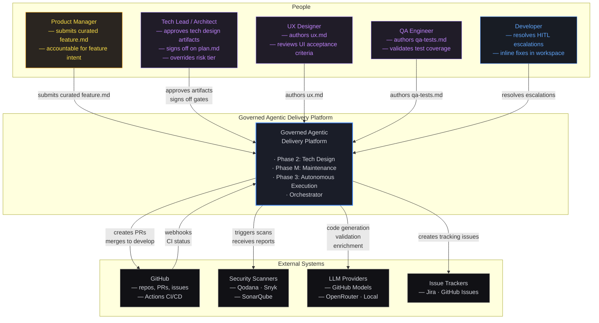
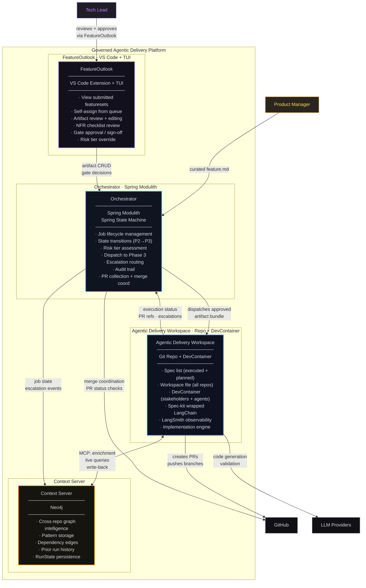
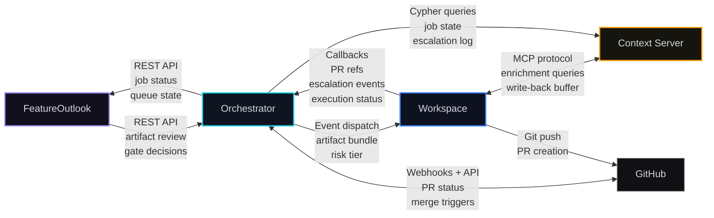
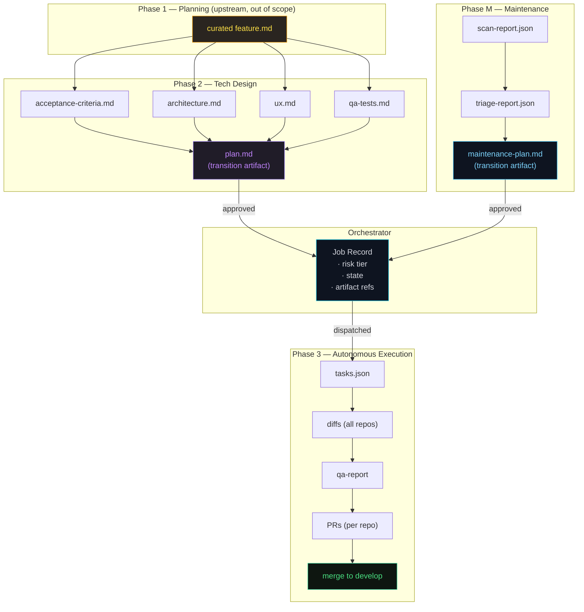

# Governed Agentic Delivery Model — C4 Architecture

**Version:** 1.1 · **March 2026**
**Scope:** From curated `feature.md` submission through merge to `develop`

---

## Navigation

| Document | Scope |
|----------|-------|
| **You are here** | L1 System Context · L2 Container |
| [Phase 2 — Tech Design](./phase-2-tech-design/README.md) | L3 Component · L4 Code |
| [Phase M — Maintenance](./phase-m-maintenance/README.md) | L3 Component · L4 Code |
| [Phase 3 — Autonomous Execution](./phase-3-execution/README.md) | L3 Component · L4 Code |
| ↳ [Phase 3a — Agent Execution](./phase-3-execution/phase-3a-agent-execution.md) | L3 Component · L4 Code |
| ↳ [Phase 3b — Integration & Preview](./phase-3-execution/phase-3b-integration.md) | L3 Component · L4 Code |
| **Components** | |
| ↳ [Orchestrator](components/orchestrator/README.md) | L3 Component · L4 Code |
| ↳ [FeatureOutlook](components/feature-outlook/README.md) | L3 Component · L4 Code |
| ↳ [Delivery Workspace](components/delivery-workspace/README.md) | L3 Component · L4 Code |
| ↳ [Execution Environment](components/execution-environment/README.md) | L3 Component · L4 Code |
| ↳ [Context Server](components/context-server/README.md) | L3 Component · L4 Code |
| ↳ [Context Edge](components/context-edge-server/README.md) | L3 Component · L4 Code |
| ↳ [Maintenance Agent](components/agent-maintenance/README.md) | L3 Component · L4 Code |
| ↳ [Platform CLI](components/platform-cli/README.md) | L3 Component · L4 Code |

---

## System Overview

The Governed Agentic Delivery Model is a phased pipeline that moves work from human-governed meaning (planning) through human-led technical design, into agent-governed autonomous execution. Three principles define it:

1. **Humans govern meaning** — product intent, scope decisions, and risk assessment stay with humans
2. **Agents execute within approved scope** — autonomous work happens only after explicit human sign-off on execution-safe artifacts
3. **Escalation is a first-class path** — when agents hit ambiguity or risk boundaries, work routes back to humans rather than guessing

The system begins at the point where a **curated `feature.md`** has been submitted by the Planning Agent (Phase 1). Everything upstream of that submission — discovery, distillation, specification, clarification — is out of scope for this architecture. Everything downstream — from tech design through merge to `develop` — is in scope.

### Key Systems

| System | Technology | Role |
|--------|-----------|------|
| **Orchestrator** | Spring Modulith + Spring State Machine | Central brain — job lifecycle, state transitions, dispatch, escalation routing, audit trail |
| **FeatureOutlook** | VS Code Extension + TUI | Human review interface — view submitted/assigned featuresets, self-assign from queue, approve artifacts, sign off on gates |
| **Agentic Delivery Workspace** | Git repo + DevContainer (one per product) | Product-scoped execution environment — each product gets its own workspace with tailored repos, conventions, agent context, and constitution. Used by both humans and agents to create and enhance the product. Contains spec-kit wrapped LangChain + LangSmith implementation engine. |
| **Context Server** | PostgreSQL + Neo4j | Project registry + multi-tenancy (PostgreSQL, RLS) · Fleet-wide graph intelligence — cross-repo patterns, dependencies, prior run history (Neo4j) |

### Phase Flow

```
curated feature.md
        │
        ▼
┌─ Phase 2: Tech Design ─────────────────────────────┐
│  FeatureOutlook + spec-kit                          │
│  Human-led, agent-assisted                          │
│  Output: plan.md (execution-safe artifact)          │
└─────────────────────┬───────────────────────────────┘
                      │
                      │  ┌─ Phase M: Maintenance ──────────────┐
                      │  │  Scheduled scan → triage → approval  │
                      │  │  Output: maintenance-plan.md         │
                      │  └───────────────┬─────────────────────┘
                      │                  │
                      ▼                  ▼
              ┌─ Orchestrator ─────────────────┐
              │  Spring Modulith               │
              │  Dispatches approved artifacts  │
              └───────────────┬────────────────┘
                              │
                              ▼
              ┌─ Phase 3: Autonomous Execution ────────┐
              │  3a: Agent Execution (per-repo tasks)   │
              │  3b: Integration & Preview (cross-repo) │
              │  Output: PRs merged to develop          │
              └─────────────────────────────────────────┘
```

---

## L1 — System Context

Who interacts with the Governed Agentic Delivery Platform, and what external systems does it depend on?



### Context Boundaries

| Boundary | Inside | Outside |
|----------|--------|---------|
| **Upstream** | Receives curated `feature.md` | Planning Agent discovery, distillation, specification, clarification (Phase 1) |
| **Downstream** | Merges PRs to `develop` | Release management, production rollout, rollback, compliance approvals |
| **Lateral** | Orchestrates across repos in scope | Fleet-wide infrastructure, unrelated repos, shared platform services |

---

## L2 — Container Diagram

The platform is composed of four major deployable units plus external integrations. Each container is a separate runtime with distinct technology and lifecycle.



### Container Responsibilities

#### Orchestrator (Spring Modulith)

The central nervous system. Every phase transition flows through the Orchestrator. It does not generate code or review artifacts — it manages the lifecycle of jobs as they move through phases.

- **Technology:** Spring Boot 3.x, Spring Modulith (module boundaries), Spring State Machine (job lifecycle)
- **Persistence:** PostgreSQL (job state, audit log), Redis (queue, locks)
- **APIs:** REST (FeatureOutlook integration), WebSocket (real-time status), Webhooks (GitHub events)
- **Key invariant:** Every state transition is logged with actor, timestamp, and evidence. The audit trail is append-only.

#### FeatureOutlook (VS Code Extension + TUI)

The human interface for Phase 2. Tech leads and specialists use it to review artifacts, run NFR checklists, and approve gates. It reads from and writes to the Orchestrator.

- **Technology:** VS Code Extension API, Ink (TUI), TypeScript
- **Data:** Reads artifact bundles from Orchestrator API, writes approval decisions back
- **Key invariant:** No artifact reaches Phase 3 without an explicit approval event recorded through FeatureOutlook

#### Agentic Delivery Workspace (Repo + DevContainer · one per product)

A product-scoped Git repository and execution environment. **Each product gets its own workspace**, customized with the product's repos, coding standards, agent context files, constitution rules, and tech stack. Both humans and agents use the same workspace to create and enhance the product.

- **Spec registry:** All specifications for this product — planned, in-progress, completed, failed
- **Workspace file:** Multi-root VS Code workspace referencing this product's repos
- **Agent context:** Product-tailored `AGENTS.md` behavioral rules per agent type
- **Constitution:** Product-specific governance rules
- **DevContainer:** Primes the working environment for two audiences:
  - **Stakeholders** reviewing autonomously curated artifacts (read-only context, review tools)
  - **Implementation agents** executing the spec-kit wrapped LangChain + LangSmith pipeline
- **Implementation engine:** LangChain orchestrator (decision loop) + OpenCode CLI (code generation) with spec-kit agent framework

#### Context Server (PostgreSQL + Neo4j)

Project registry and fleet-wide graph intelligence. Uses polyglot persistence: PostgreSQL for tenant management, project registration, and access control; Neo4j for cross-repo graph intelligence (patterns, dependencies, run history).

- **Technology:** PostgreSQL (project registry, multi-tenancy via RLS), Neo4j (graph intelligence), MCP interface (for Workspace access)
- **Data:** Tenants, projects, repo membership, API keys (PostgreSQL) · Module graph, dependency edges, code patterns, run history, RunState (Neo4j)
- **Key invariant:** The Context Server is the source of truth for cross-repo intelligence and project ownership. The Workspace operates on tenant-scoped snapshots. Row-level security ensures tenant isolation at the database level.

### Inter-Container Communication



### Deployment View

```
┌─────────────────────────────────────────────────────────────┐
│  Infrastructure                                             │
│                                                             │
│  ┌──────────────────────┐   ┌───────────────────────────┐   │
│  │  Orchestrator         │   │  Context Server           │   │
│  │  Spring Boot JAR      │   │  Neo4j Instance           │   │
│  │  PostgreSQL           │   │  MCP endpoint             │   │
│  │  Redis                │   │                           │   │
│  │  Always running       │   │  Always running           │   │
│  └──────────┬───────────┘   └───────────────────────────┘   │
│             │                                               │
│             │ dispatches                                     │
│             ▼                                               │
│  ┌──────────────────────────────────────────────────────┐   │
│  │  Agentic Delivery Workspace (ephemeral per job)      │   │
│  │  DevContainer · Docker                               │   │
│  │  Spawned on dispatch · destroyed on completion       │   │
│  │  One workspace per feature/maintenance job           │   │
│  └──────────────────────────────────────────────────────┘   │
│                                                             │
│  ┌──────────────────────┐                                   │
│  │  FeatureOutlook       │  ← runs on developer machines    │
│  │  VS Code Extension    │                                  │
│  │  + standalone TUI     │                                  │
│  └──────────────────────┘                                   │
└─────────────────────────────────────────────────────────────┘
```

---

## Cross-Phase Data Flow

This diagram shows how artifacts flow between phases, with the Orchestrator mediating every transition.



---

## Risk Tier Model

The Orchestrator assigns a risk tier at job registration. The tier controls autonomy level, gate intensity, and review depth throughout Phase 3.

| Tier | Criteria | Autonomy | Gate Intensity |
|------|----------|----------|----------------|
| **Low** | Isolated low-risk repo, no customer-facing or security surface | Autonomous execution allowed | Standard quality gates, normal preview window |
| **Medium** | Cross-service changes, shared libraries, moderate customer impact | Autonomous with elevated review depth | Extra reviewer assigned, stronger E2E gate, extended preview |
| **High** | Payments path, auth surface, production schema change, data exposure | Autonomous execution blocked pending human approval | Architect + tech lead sign-off required at every gate |

**Scoring dimensions:** repo criticality · customer impact · data/security surface · cross-service change · migration risk

The risk tier is evaluated by the Orchestrator on job registration and is overridable by the Tech Lead via FeatureOutlook.

---

## Drill-Down Index

Each phase and the Orchestrator have dedicated documentation with L3 (Component) and L4 (Code) diagrams:

- **[Phase 2 — Tech Design](./phase-2-tech-design/README.md):** FeatureOutlook internals, spec-kit artifact pipeline, NFR review flow, gate approval mechanics
- **[Phase M — Maintenance](./phase-m-maintenance/README.md):** Scanner orchestration, triage engine, maintenance-plan generation, approval gate
- **[Phase 3 — Autonomous Execution](./phase-3-execution/README.md):** Team Agent Workspace architecture, sub-agent coordination, quality gates
  - **[Phase 3a — Agent Execution](./phase-3-execution/phase-3a-agent-execution.md):** LangChain + LangSmith engine, spec-kit agent framework, per-repo task execution
  - **[Phase 3b — Integration & Preview](./phase-3-execution/phase-3b-integration.md):** PR collection, cross-repo preview environment, merge coordination
### Components

- **[Orchestrator](components/orchestrator/README.md):** Spring Modulith module map, Spring State Machine lifecycle, event handling, escalation routing
- **[FeatureOutlook](components/feature-outlook/README.md):** VS Code extension + TUI architecture, shared core, Orchestrator API client, spec-kit bridge
- **[Delivery Workspace](components/delivery-workspace/README.md):** Product-scoped Git repo — spec registry, workspace file, agent context files, constitution, configuration
- **[Execution Environment](components/execution-environment/README.md):** DevContainer runtime — spec-kit + LangChain + LangSmith engine, OpenCode, plugins, dual-mode (drafting + implementing), dual-audience (agent + human)
- **[Context Server](components/context-server/README.md):** PostgreSQL project registry + multi-tenancy, Neo4j fleet graph, tenant-scoped snapshot export, sync protocol
- **[Context Edge](components/context-edge-server/README.md):** Kuzu embedded graph (in-container), MCP server, write buffer, seeder, degradation modes, ContextProvider interface
- **[Maintenance Agent](components/agent-maintenance/README.md):** Standalone CLI for scheduled scanning — scanner adapters, triage engine, spec-kit maintenance bundle generation
- **[Platform CLI](components/platform-cli/README.md):** Interactive CLI for developers/Tech Leads — `workspace` (product lifecycle), `feature` (state transitions), `pipeline` (Harness management)
