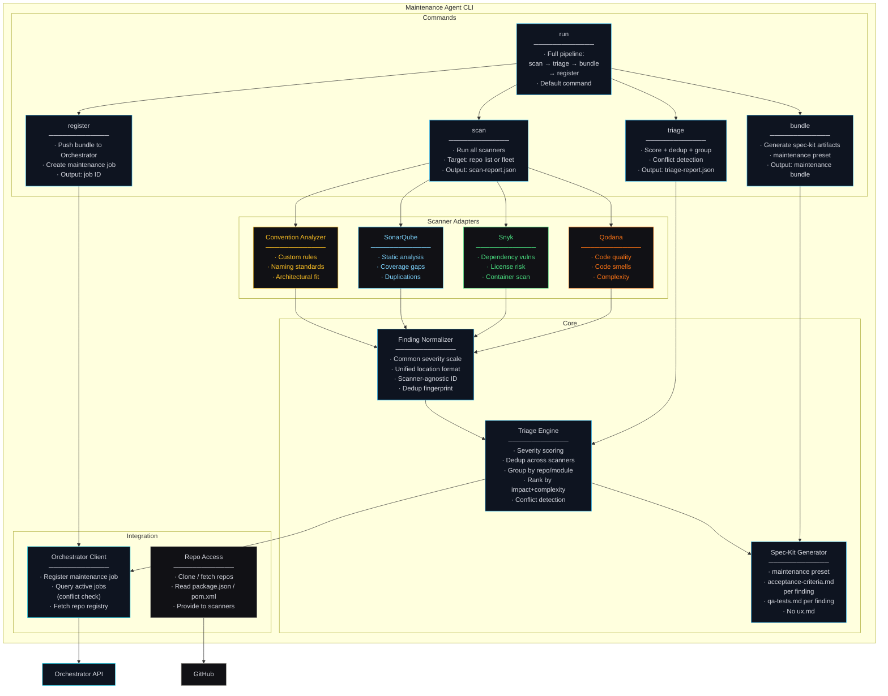
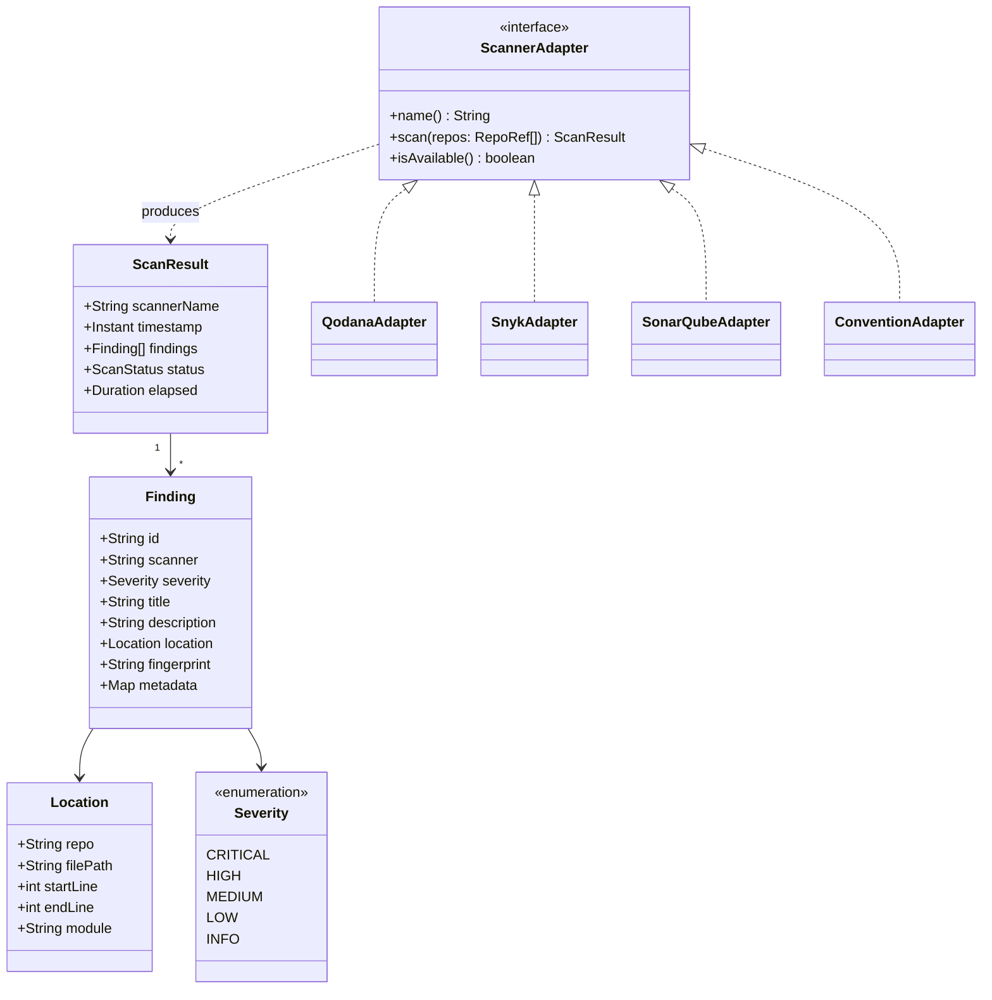
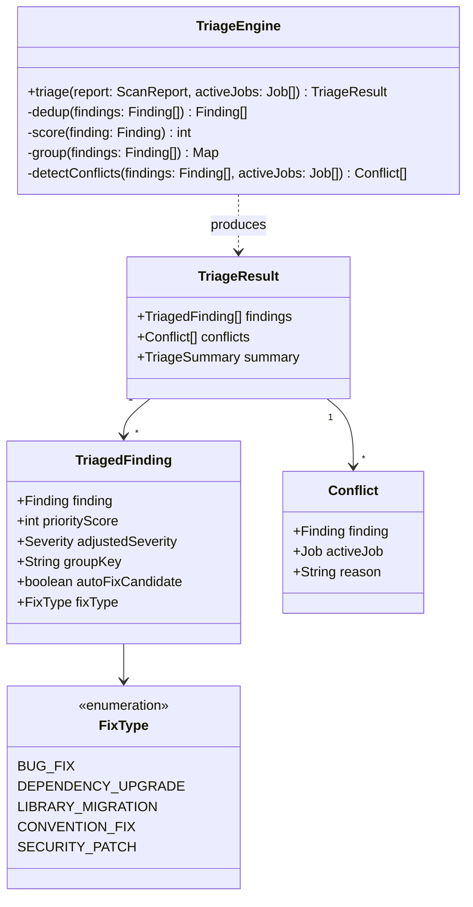

# Maintenance Agent · Component Drill-Down

**Type:** Standalone CLI tool — scheduled execution
**Technology:** CLI (Node/Python), scanner adapters, spec-kit maintenance preset
**Lifecycle:** Invoked on schedule (cron / Harness pipeline / Orchestrator trigger) — runs, produces bundle, exits
**Deployment:** Installed as a CLI tool; executed as a scheduled job
**Role:** Scans codebase for health issues, triages findings, generates spec-kit maintenance bundles for human approval

[← Back to System Overview](../../README.md) · [Phase M flow context](../../phase-m-maintenance/README.md)

---

## Overview

The Maintenance Agent is a **standalone CLI tool** — similar in spirit to tools like [Janitor](https://github.com/nicholasgasior/janitor) — that scans codebases for health issues, triages findings, and produces spec-kit maintenance bundles. It is not a long-running service. It runs, does its work, registers results with the Orchestrator, and exits.

### Execution Model

```
┌──────────────┐     ┌──────────────────────┐     ┌──────────────┐
│  Scheduler    │     │  Maintenance Agent    │     │ Orchestrator │
│              │     │  (CLI)                │     │              │
│  cron        │────▶│  scan → triage →      │────▶│  Registers   │
│  Harness     │     │  bundle → register    │     │  maintenance │
│  Orchestrator│     │  → exit               │     │  job         │
└──────────────┘     └──────────────────────┘     └──────────────┘
```

The CLI can be invoked by:
- **Cron job** — `0 2 * * 1` (weekly Monday 2am)
- **Harness pipeline** — scheduled pipeline step
- **Orchestrator trigger** — on-demand via API (e.g., after a critical CVE disclosure)
- **Manual** — developer runs `maintenance-agent scan --repos api-gateway,web-app`

### What It Produces

The Maintenance Agent does not fix anything. It **discovers, triages, and packages**. The output is a spec-kit maintenance bundle — a set of artifacts that describe what needs fixing, with acceptance criteria and test expectations. Humans approve the bundle in FeatureOutlook before any autonomous execution happens.

---

## L3 — Component Diagram

### CLI Architecture



### CLI Commands

```
maintenance-agent <command> [options]

Commands:
  scan        Run scanners against target repos
  triage      Triage scan results (score, dedup, group, conflict-check)
  bundle      Generate spec-kit maintenance bundle from triaged findings
  register    Register bundle with Orchestrator as a maintenance job
  run         Full pipeline: scan → triage → bundle → register (default)

Options:
  --repos <list>          Target repos (comma-separated, or "all")
  --scanners <list>       Scanners to run (default: all available)
  --severity <min>        Minimum severity to include (default: medium)
  --output <dir>          Output directory for reports/bundle
  --orchestrator <url>    Orchestrator API URL
  --dry-run               Generate bundle but don't register with Orchestrator
  --config <path>         Config file path (default: .maintenance-agent.json)
```

### Full Pipeline Sequence

```mermaid
sequenceDiagram
    participant SCHED as Scheduler (cron / Harness)
    participant CLI as Maintenance Agent CLI
    participant SCAN as Scanner Adapters
    participant ORCH as Orchestrator
    participant GH as GitHub

    SCHED->>CLI: maintenance-agent run --repos all

    rect rgb(15, 18, 32)
    Note over CLI: scan
    CLI->>GH: Fetch/clone target repos
    CLI->>SCAN: Run Qodana, Snyk, SonarQube, Convention Analyzer
    SCAN-->>CLI: Raw scan results per scanner
    CLI->>CLI: Normalize findings (common severity, dedup fingerprint)
    CLI->>CLI: Write scan-report.json
    end

    rect rgb(30, 25, 15)
    Note over CLI: triage
    CLI->>ORCH: GET /api/jobs?status=active (conflict check)
    ORCH-->>CLI: Active job list
    CLI->>CLI: Dedup across scanners
    CLI->>CLI: Score by impact + complexity
    CLI->>CLI: Group by repo / module
    CLI->>CLI: Flag conflicts with active jobs
    CLI->>CLI: Write triage-report.json
    end

    rect rgb(15, 22, 16)
    Note over CLI: bundle
    CLI->>CLI: Generate spec-kit artifacts per finding
    CLI->>CLI: maintenance preset (acceptance-criteria.md + qa-tests.md)
    CLI->>CLI: Package as maintenance bundle
    end

    rect rgb(20, 15, 25)
    Note over CLI: register
    CLI->>ORCH: POST /api/jobs/maintenance (bundle + triage summary)
    ORCH->>ORCH: Create maintenance job (SCAN_COMPLETE state)
    ORCH->>ORCH: Assign risk tier per finding
    ORCH-->>CLI: Job ID
    CLI->>CLI: Log: "Registered maintenance job {id}, awaiting approval"
    end

    CLI->>CLI: Exit 0

    Note over ORCH: Human reviews in FeatureOutlook<br/>Approves/rejects per finding<br/>Approved findings → Phase 3
```



---

## L4 — Code Level

### Scanner Adapter Interface

All scanners implement the same interface. New scanners (Trivy, Semgrep, etc.) plug in without changing the CLI core.



### Triage Engine



### Spec-Kit Bundle Generation

The bundle generator produces one spec-kit maintenance artifact set per triaged finding:

```
maintenance-bundle/
├── metadata.json                      # Bundle summary, severity breakdown, conflict flags
├── findings/
│   ├── snyk-CVE-2026-1234/
│   │   ├── acceptance-criteria.md     # "Dependency X upgraded to >= 2.1.0, CVE resolved"
│   │   └── qa-tests.md               # "npm audit shows no findings for CVE-2026-1234"
│   ├── qodana-complexity-auth-middleware/
│   │   ├── acceptance-criteria.md     # "Cyclomatic complexity of handleAuth reduced to <= 10"
│   │   └── qa-tests.md               # "Qodana reports no complexity warning for handleAuth"
│   └── convention-naming-user-service/
│       ├── acceptance-criteria.md     # "All exported functions use camelCase"
│       └── qa-tests.md               # "Convention analyzer reports 0 naming violations"
└── summary.md                         # Human-readable overview for FeatureOutlook review
```

Each finding's acceptance criteria is **verifiable** — it describes a condition that can be mechanically checked after the fix. The qa-tests describe how to verify the fix was applied (often re-running the scanner that found it).

### SLA Configuration

```json
{
  "sla": {
    "critical": { "responseHours": 48, "escalateAfterHours": 24 },
    "high":     { "responseDays": 5 },
    "medium":   { "target": "next-sprint" },
    "low":      { "target": "backlog" }
  },
  "scanners": {
    "qodana":     { "enabled": true },
    "snyk":       { "enabled": true, "severityThreshold": "medium" },
    "sonarqube":  { "enabled": true, "qualityGate": "default" },
    "convention": { "enabled": true, "rulesPath": ".convention-rules.json" }
  },
  "scheduling": {
    "cadence": "weekly",
    "day": "monday",
    "hour": 2
  }
}
```

### Key Design Decisions

**Why a CLI (not a long-running service)?**
The Maintenance Agent has no state between runs. It scans, triages, bundles, registers, and exits. A long-running service would idle between scheduled runs, consuming resources for no benefit. A CLI is simpler to deploy, version, test, and debug. It's also composable — you can run `scan` and `triage` independently, pipe outputs, or invoke it from any scheduler.

**Why does it register with the Orchestrator (not dispatch directly to Phase 3)?**
The Maintenance Agent discovers issues — it doesn't decide what to fix. Humans must approve each finding before autonomous execution begins. By registering a maintenance job with the Orchestrator, the bundle enters the standard approval flow: it shows up in FeatureOutlook, the Tech Lead reviews per-finding, and only approved findings get dispatched to Phase 3. This preserves the governance model.

**Why conflict detection against active jobs?**
If a feature job is actively modifying `auth-service/src/middleware.ts` and a maintenance scan flags complexity in the same file, the maintenance fix could create a merge conflict or invalidate the feature work. The CLI queries the Orchestrator for active jobs and flags overlaps, letting the Tech Lead decide whether to defer the maintenance fix.

**Why spec-kit maintenance preset (not full artifact set)?**
Maintenance fixes don't need `ux.md`, `architecture.md`, or `feature.md` — they're scoped changes to existing code with known root causes (a CVE, a lint violation, a complexity spike). The maintenance preset includes only `acceptance-criteria.md` and `qa-tests.md`, which is sufficient for the agent to know what to fix and how to verify it. This reduces the approval burden on Tech Leads.

**Why one acceptance-criteria + qa-tests per finding (not per bundle)?**
Granular artifacts enable per-finding approval. A Tech Lead might approve the critical security patches immediately, defer the convention fixes to next sprint, and reject the low-priority style issues entirely. If the bundle had one monolithic acceptance-criteria, the only choice would be approve-all or reject-all.
