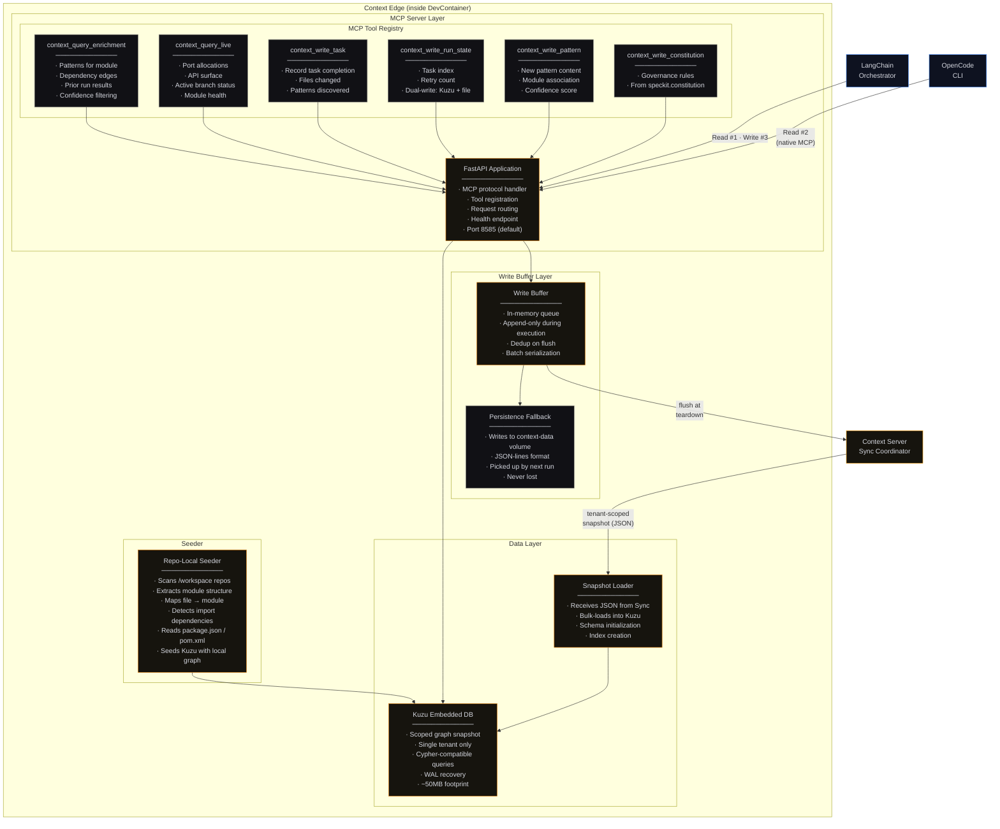
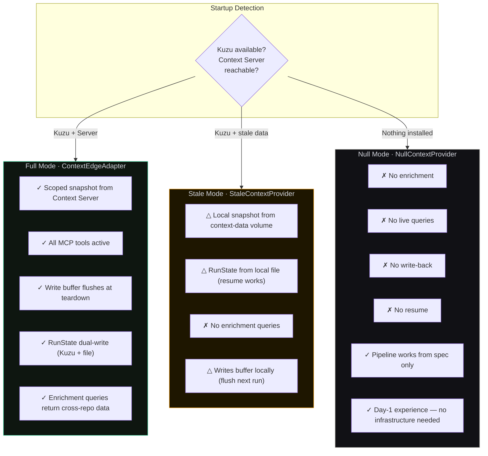
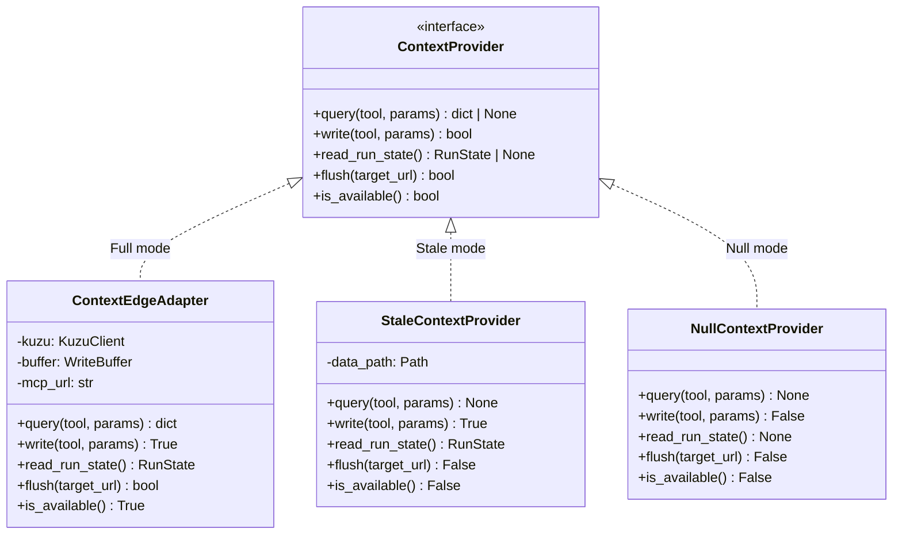
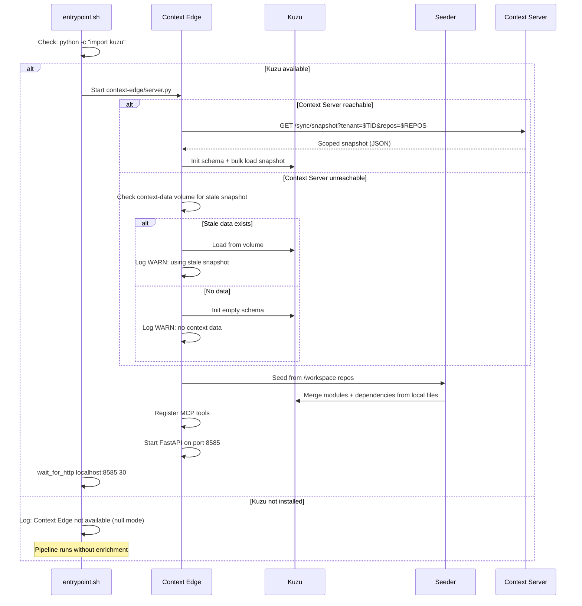

# Context Edge · Component Drill-Down

**Type:** In-container graph intelligence sidecar
**Technology:** Kuzu embedded database, FastAPI (MCP server), Python
**Lifecycle:** Ephemeral — one instance per DevContainer, destroyed on teardown
**Deployment:** Runs as a sidecar process inside the Agentic Delivery Workspace DevContainer
**Role:** Fast local graph queries during agent execution via MCP protocol; buffers writes for flush to Context Server

[← Back to System Overview](../../README.md) · [Context Server (fleet)](../context-server/README.md) · [Phase 3a flow context](../../phase-3-execution/phase-3a-agent-execution.md)

---

## Overview

The Context Edge is the **local intelligence layer** inside each DevContainer. It exists because the implementation engine (LangChain + OpenCode) needs sub-millisecond graph queries during code generation — querying the fleet-wide Context Server over the network would add latency and create a hard runtime dependency.

The Edge operates in three phases:

1. **Provision** — pulls a tenant-scoped snapshot from the Context Server into a local Kuzu database; runs the seeder to extract repo-local graph structure
2. **Execution** — serves MCP tool calls from LangChain (Read #1, Write #3) and OpenCode (Read #2) against the local Kuzu store; buffers all writes locally
3. **Teardown** — flushes the write buffer back to the Context Server; if unreachable, persists to the `context-data` volume for the next run

### Context Edge vs Context Server

| Aspect | Context Server | Context Edge |
|--------|---------------|-------------|
| **Location** | Always running (fleet) | Inside DevContainer (per-job) |
| **Database** | PostgreSQL + Neo4j | Kuzu embedded |
| **Data scope** | Full fleet, all tenants | Scoped snapshot, single tenant |
| **Lifecycle** | Persistent | Ephemeral (provision → execute → teardown) |
| **Writes** | Immediate to Neo4j | Buffered locally, flushed at teardown |
| **MCP tools** | Not exposed | Full MCP server for agent consumption |
| **Tenant isolation** | RLS (PG) + label filter (Neo4j) | Pre-filtered at snapshot export — single tenant only |
| **Network** | Accessible from Orchestrator + Edge | Localhost only (inside container) |

### Why Kuzu (not Neo4j embedded or SQLite)?

Kuzu is purpose-built for embedded analytical graph workloads:
- **No server process** — loads as a library, zero network latency
- **Columnar storage** — fast aggregations across patterns and dependencies
- **Cypher-compatible** — same query language as Neo4j, minimal translation
- **WAL recovery** — survives container restarts within a job
- **Small footprint** — ~50MB binary, loads scoped snapshots in seconds

SQLite could store the data but can't express graph traversals natively. Neo4j embedded requires a JVM — the implementation engine is Python.

---

## L3 — Component Diagram

### Internal Architecture



### Three-Touchpoint Integration

The Context Edge is consumed at three distinct moments during agent execution:

```mermaid
sequenceDiagram
    participant LC as LangChain Orchestrator
    participant SK as speckit.implement
    participant OC as OpenCode CLI
    participant CE as Context Edge (MCP)
    participant KUZU as Kuzu DB
    participant BUF as Write Buffer

    Note over CE: Startup: snapshot loaded, seeder complete

    rect rgb(30, 25, 15)
    Note right of LC: Read #1 — Enrichment (LangChain initiative)
    LC->>CE: MCP: context_query_enrichment(module, repo)
    CE->>KUZU: Cypher: MATCH patterns, deps, prior runs
    KUZU-->>CE: Graph results
    CE-->>LC: Enrichment payload
    Note over LC: LangChain adds cross-repo context<br/>to the prompt (strictly additive<br/>to what OpenCode sees locally)
    end

    LC->>SK: Build enriched prompt

    rect rgb(15, 18, 32)
    Note right of OC: Read #2 — Live Query (OpenCode initiative)
    SK->>OC: Send enriched prompt
    OC->>CE: MCP: context_query_live(module, "api_surface")
    CE->>KUZU: Cypher: MATCH ports, API contracts
    KUZU-->>CE: Live data
    CE-->>OC: API surface, port allocations
    Note over OC: OpenCode calls this on its own<br/>initiative via native MCP support —<br/>LangChain doesn't mediate
    OC-->>LC: Generated code + tests
    end

    rect rgb(15, 22, 16)
    Note right of LC: Write #3 — Write-back (LangChain initiative)
    LC->>CE: MCP: context_write_task(task_id, status, patterns)
    CE->>KUZU: INSERT task result + patterns
    CE->>BUF: Append to write buffer
    CE-->>LC: ack

    LC->>CE: MCP: context_write_run_state(task_index, retry_count)
    CE->>KUZU: UPSERT RunState
    CE->>BUF: Append to write buffer
    CE->>CE: Also write RunState to file (dual-write)
    CE-->>LC: ack
    end
```



---

## L4 — Code Level

### Directory Structure

```
context-edge/                          # Lives inside Agentic Delivery Workspace repo
├── server.py                          # FastAPI app + MCP protocol handler
├── sync/
│   ├── pull.py                        # Snapshot pull from Context Server
│   ├── push.py                        # Write buffer flush to Context Server
│   └── scope.py                       # Scope request (repos, tenant)
├── backend/
│   ├── kuzu_client.py                 # Kuzu connection + query execution
│   ├── schema.py                      # Cypher DDL for Kuzu initialization
│   └── loader.py                      # Snapshot JSON → Kuzu bulk load
├── tools/
│   ├── enrichment.py                  # context_query_enrichment tool
│   ├── live_query.py                  # context_query_live tool
│   ├── write_task.py                  # context_write_task tool
│   ├── write_run_state.py             # context_write_run_state tool
│   ├── write_pattern.py               # context_write_pattern tool
│   └── write_constitution.py          # context_write_constitution tool
├── buffer/
│   ├── writer.py                      # In-memory write buffer
│   ├── serializer.py                  # Buffer → JSON-lines for flush/persist
│   └── fallback.py                    # Persist to context-data volume on flush failure
├── seed/
│   ├── seeder.py                      # Repo-local graph extraction
│   ├── node_scanner.py                # package.json → Module + Dependency
│   ├── java_scanner.py                # pom.xml → Module + Dependency
│   └── import_resolver.py             # Source imports → DEPENDS_ON edges
└── config.py                          # Port, paths, Context Server URL
```

### MCP Server Implementation

```python
# server.py — simplified
from fastapi import FastAPI
from contextlib import asynccontextmanager

@asynccontextmanager
async def lifespan(app: FastAPI):
    # Startup
    kuzu_client = KuzuClient(db_path=config.kuzu_path)
    kuzu_client.init_schema()

    if config.context_server_url:
        snapshot = await pull_snapshot(
            server_url=config.context_server_url,
            tenant_id=config.tenant_id,
            repos=config.spec_repos,
        )
        kuzu_client.bulk_load(snapshot)

    seeder = RepoLocalSeeder(workspace_path="/workspace")
    seeder.seed(kuzu_client)

    write_buffer = WriteBuffer()

    app.state.kuzu = kuzu_client
    app.state.buffer = write_buffer

    yield  # Server runs

    # Teardown
    if config.context_server_url:
        success = await flush_writes(
            buffer=write_buffer,
            server_url=config.context_server_url,
            tenant_id=config.tenant_id,
        )
        if not success:
            write_buffer.persist_to_volume(config.context_data_path)

    kuzu_client.close()

app = FastAPI(lifespan=lifespan)

# MCP tool registration
@app.post("/mcp/tools/context_query_enrichment")
async def query_enrichment(params: EnrichmentParams):
    results = app.state.kuzu.query(
        "MATCH (p:Pattern)-[:APPLIES_TO]->(m:Module {name: $module}) "
        "RETURN p ORDER BY p.confidence DESC",
        module=params.module_name,
    )
    deps = app.state.kuzu.query(
        "MATCH (m:Module {name: $module})-[:DEPENDS_ON]->(d:Module) "
        "RETURN d",
        module=params.module_name,
    )
    runs = app.state.kuzu.query(
        "MATCH (r:Run)-[:EXECUTED]->(t:Task) "
        "WHERE t.specId CONTAINS $repo "
        "RETURN r ORDER BY r.timestamp DESC LIMIT 10",
        repo=params.repo,
    )
    return EnrichmentResult(patterns=results, dependencies=deps, prior_runs=runs)

@app.post("/mcp/tools/context_write_task")
async def write_task(params: WriteTaskParams):
    app.state.kuzu.execute(
        "CREATE (t:Task {id: $id, type: $type, title: $title, "
        "status: $status, specId: $specId})",
        **params.dict(),
    )
    app.state.buffer.append("context_write_task", params.dict())
    return {"success": True}

@app.post("/mcp/tools/context_write_run_state")
async def write_run_state(params: RunStateParams):
    # Dual-write: Kuzu + file
    app.state.kuzu.execute(
        "MERGE (rs:RunState {id: 'current'}) "
        "SET rs.task_index = $idx, rs.retry_count = $retry, "
        "rs.updated_at = timestamp()",
        idx=params.task_index, retry=params.retry_count,
    )
    app.state.buffer.append("context_write_run_state", params.dict())

    # File fallback for resume (survives container restart)
    Path(config.context_data_path / "run_state.json").write_text(
        json.dumps(params.dict())
    )
    return {"success": True}

@app.get("/health")
async def health():
    return {"status": "ok", "tools": len(REGISTERED_TOOLS)}
```

### Write Buffer

```python
class WriteBuffer:
    """Append-only buffer for writes during execution.

    All writes go to Kuzu immediately (for local query consistency)
    AND to this buffer (for eventual flush to Context Server).
    """
    def __init__(self):
        self._entries: list[BufferEntry] = []

    def append(self, tool: str, params: dict):
        self._entries.append(BufferEntry(
            tool=tool,
            params=params,
            timestamp=datetime.utcnow(),
        ))

    def drain(self) -> list[BufferEntry]:
        """Returns all entries and clears the buffer."""
        entries = self._entries.copy()
        self._entries.clear()
        return entries

    def persist_to_volume(self, path: Path):
        """Fallback: write to context-data volume as JSON-lines.

        Next container run can pick up unflushed writes
        via StaleContextProvider.
        """
        outfile = path / "unflushed_writes.jsonl"
        with outfile.open("a") as f:
            for entry in self._entries:
                f.write(json.dumps(entry.to_dict()) + "\n")

    def dedup(self, entries: list[BufferEntry]) -> list[BufferEntry]:
        """Dedup before flush — keep latest write per entity."""
        seen: dict[str, BufferEntry] = {}
        for entry in entries:
            key = f"{entry.tool}:{entry.params.get('id', entry.params.get('task_id', ''))}"
            seen[key] = entry  # Last write wins
        return list(seen.values())
```

### Repo-Local Seeder

The seeder extracts graph structure from the workspace repos. This ensures the Kuzu database has accurate module/dependency data even if the Context Server snapshot is stale or unavailable.

```python
class RepoLocalSeeder:
    """Extracts module graph from workspace repos.

    Scans package.json (Node), pom.xml (Java), and source imports
    to build Module nodes and DEPENDS_ON / USES edges.
    """
    def __init__(self, workspace_path: str):
        self.workspace = Path(workspace_path)
        self.scanners = [
            NodeScanner(),    # package.json → modules + deps
            JavaScanner(),    # pom.xml → modules + deps
        ]

    def seed(self, kuzu: KuzuClient):
        for repo_dir in self.workspace.iterdir():
            if not repo_dir.is_dir() or repo_dir.name.startswith('.'):
                continue

            for scanner in self.scanners:
                if scanner.can_scan(repo_dir):
                    modules = scanner.extract_modules(repo_dir)
                    dependencies = scanner.extract_dependencies(repo_dir)

                    for module in modules:
                        kuzu.merge_module(module)
                    for dep in dependencies:
                        kuzu.merge_dependency(dep)
                        kuzu.merge_edge("USES", module=dep.module, dependency=dep.name)

        # Import-based DEPENDS_ON edges
        resolver = ImportResolver(self.workspace)
        for edge in resolver.resolve_all():
            kuzu.merge_edge("DEPENDS_ON", source=edge.source, target=edge.target)
```

### Degradation Modes

The Context Edge has three operational modes. The pipeline code never checks which mode is active — it calls the `ContextProvider` interface, and the provider handles the response.



### ContextProvider Interface

All three modes implement the same interface. The implementation engine is completely decoupled from which mode is active.



| Method | ContextEdgeAdapter | StaleContextProvider | NullContextProvider |
|--------|-------------------|---------------------|---------------------|
| `query()` | Kuzu query → result | `None` | `None` |
| `write()` | Kuzu + buffer → `True` | Buffer to volume → `True` | `False` |
| `read_run_state()` | Kuzu → RunState | File → RunState | `None` |
| `flush()` | HTTP POST → Context Server | Persist to volume | `False` |
| `is_available()` | `True` | `False` | `False` |

### Startup Sequence



### Key Design Decisions

**Why a sidecar process (not in-process with LangChain)?**
The Context Edge serves two consumers: LangChain (Read #1, Write #3) and OpenCode (Read #2). OpenCode runs as a separate HTTP server with native MCP support — it needs an addressable MCP endpoint to call. An in-process library would only be accessible to LangChain. The sidecar (FastAPI on localhost:8585) is accessible to both.

**Why dual-write RunState (Kuzu + file)?**
RunState is the most critical piece of data for resume. If the container crashes between tasks, the next container needs to know which task to resume from. Kuzu's WAL provides some protection, but a corrupted WAL means lost RunState. The file fallback (`run_state.json`) is a simple, reliable backup that survives any Kuzu failure.

**Why the seeder (not just the snapshot)?**
The snapshot from the Context Server may be stale — it was pulled at provision time, and the workspace repos may have been updated since. The seeder scans the actual workspace repos and merges fresh module/dependency data into Kuzu. This ensures the graph reflects the current state of the code, not just the last time the Context Server was updated.

**Why dedup on flush (not on write)?**
During execution, the same RunState is written after every task. Deduping on write would require checking the buffer for existing entries on every write — unnecessary overhead. Deduping on flush is a single pass over the buffer before sending to the Context Server. Since the flush is batch anyway, the dedup cost is negligible.

**Why JSON-lines for the persistence fallback?**
JSON-lines (one JSON object per line) is append-friendly, human-readable, and trivially parseable. The fallback file may accumulate writes across multiple failed flushes from different container runs. JSON-lines handles this naturally — each line is independent, and the next container can parse and replay them in order.

**Why localhost only (not exposed outside the container)?**
The Context Edge contains tenant-scoped data. Exposing it outside the container would require authentication, TLS, and access control — complexity that belongs in the Context Server, not the Edge. The Edge is a private sidecar: only processes inside the same DevContainer can reach it.
