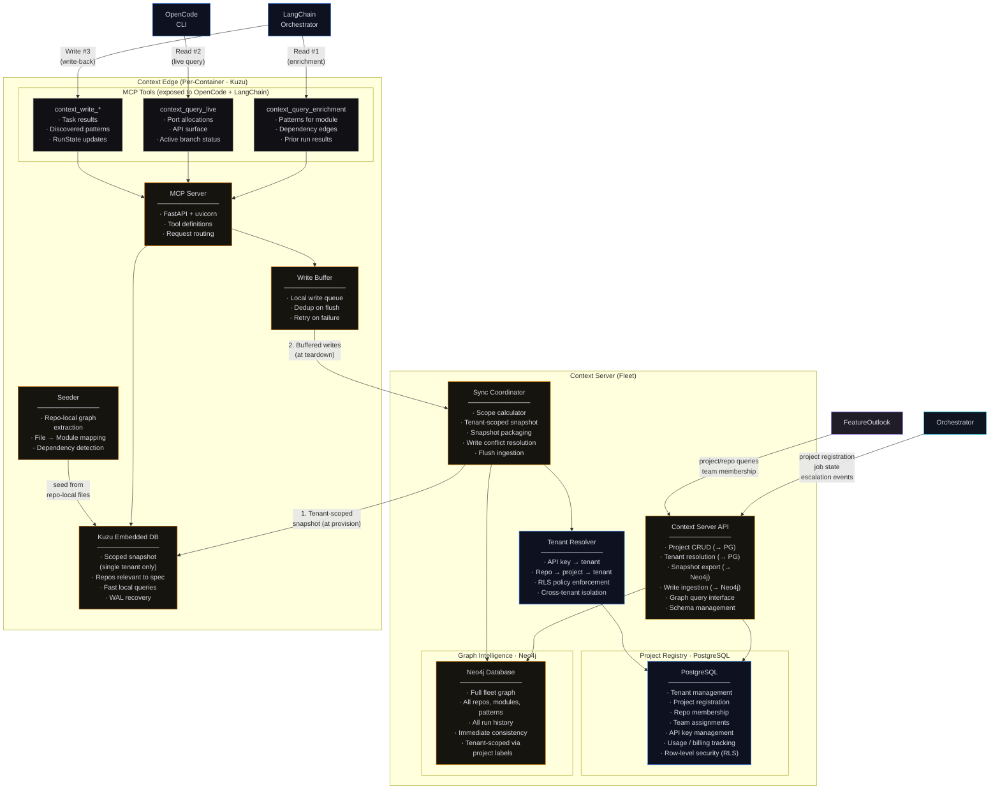
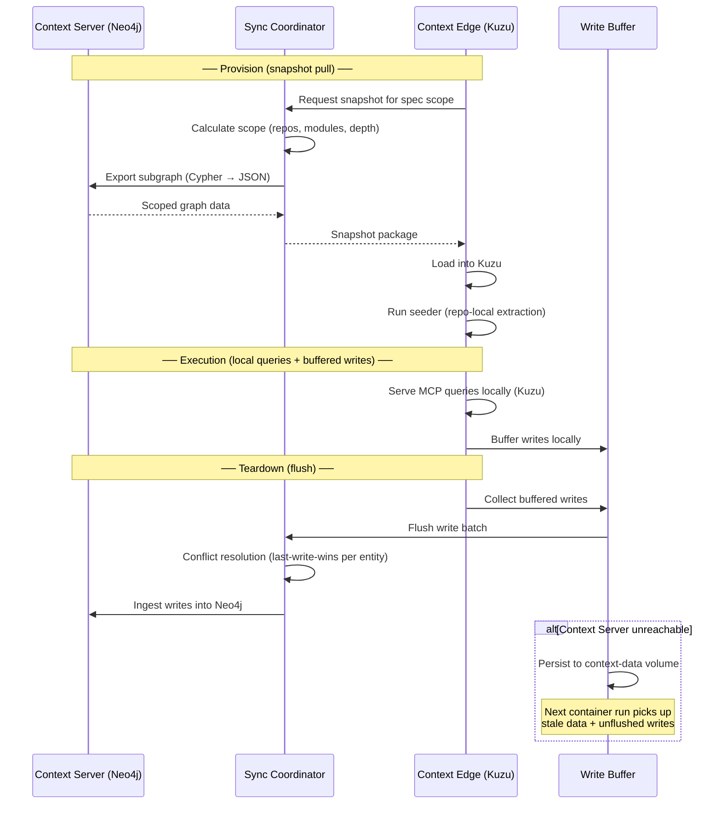
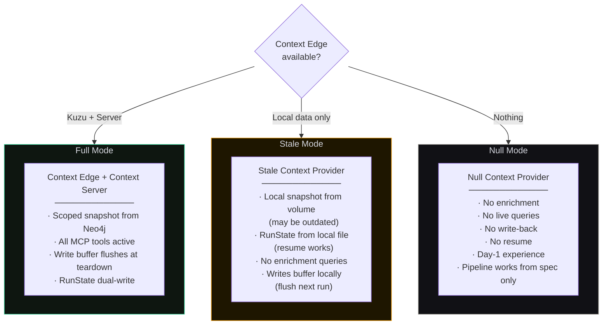
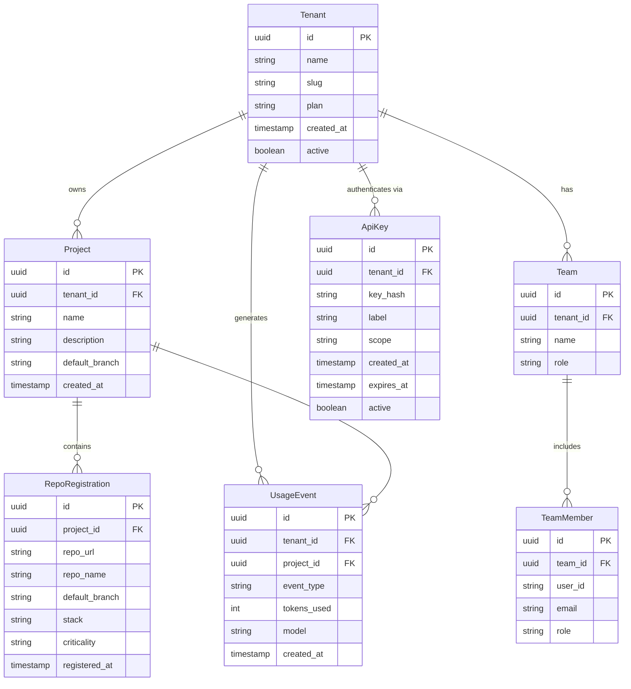
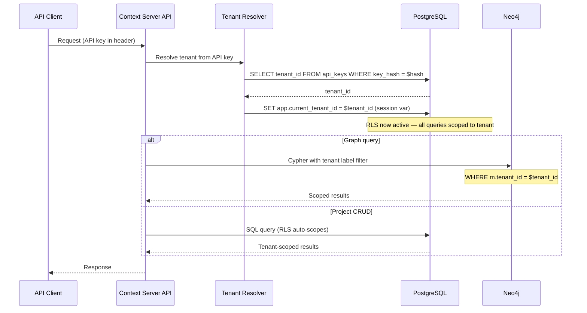
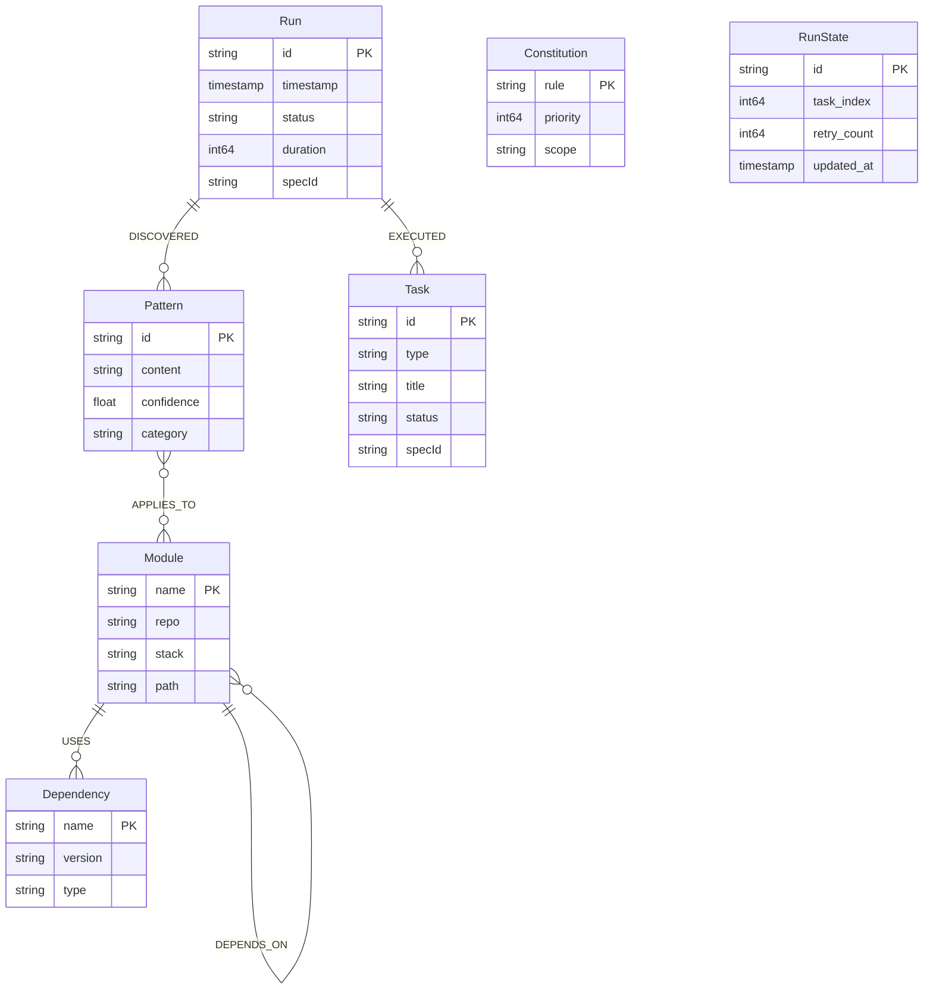

# Context Server · Component Drill-Down

**Type:** Graph intelligence layer + project registry — fleet-wide + per-job
**Technology:** PostgreSQL (project registry, tenancy), Neo4j (graph intelligence), Kuzu embedded (per-container Context Edge), MCP protocol
**Lifecycle:** Always-running fleet service
**Role:** Project/tenant management, cross-repo graph intelligence — patterns, dependencies, prior runs, RunState persistence

[← Back to System Overview](../../README.md) · [Context Edge (in-container)](../context-edge-server/README.md) · [Phase 3a flow context](../../phase-3-execution/phase-3a-agent-execution.md)

---

## Overview

The Context Server is the system's **long-term memory** and **project registry**. It has two distinct data domains:

1. **Project Registry (PostgreSQL)** — relational data: tenant management, project registration, repo membership, team assignments, access control, API key management, and billing/usage tracking. This is the administrative backbone that answers "who owns what" and "who can access what."

2. **Graph Intelligence (Neo4j)** — cross-repo intelligence that individual repos and containers don't have: which patterns work across services, how modules depend on each other, what previous runs discovered, and where port allocations live.

This polyglot persistence design uses each database for what it does best: PostgreSQL for relational/transactional concerns with row-level security for tenant isolation; Neo4j for graph traversals across the code intelligence layer.

The architecture has three tiers:

### Project Registry (PostgreSQL)
- **Technology:** PostgreSQL with row-level security (RLS)
- **Location:** Always running alongside the Orchestrator
- **Scope:** All tenants, projects, repos, teams, API keys
- **Role:** Administrative source of truth — who owns what, who can access what, usage tracking
- **Multi-tenancy:** Row-level security per tenant; each query is scoped automatically

### Graph Intelligence (Neo4j)
- **Technology:** Neo4j
- **Location:** Always running alongside the Orchestrator
- **Scope:** Full fleet graph — every repo, every module, every pattern, every run (tenant-scoped via project labels)
- **Writes:** Immediate consistency
- **Role:** Source of truth for cross-repo code intelligence

### Context Edge (Per-Container)
- **Technology:** Kuzu embedded database
- **Location:** Inside each DevContainer, ephemeral per job
- **Scope:** Scoped snapshot — only the repos/modules relevant to the current spec (single tenant)
- **Writes:** Buffered locally, flushed to Context Server at teardown
- **Role:** Fast local queries during agent execution via MCP protocol

The Context Edge exists because the DevContainer should not make live network calls to the Context Server during code generation — that would add latency and create a hard dependency. Instead, the Edge pulls a scoped snapshot at provision time, serves local queries, buffers writes, and flushes back at teardown. The Edge only ever receives data for its own tenant — tenant isolation is enforced at the snapshot export boundary.

---

## L3 — Component Diagram

### Three-Tier Architecture



### Data Domain Split — PostgreSQL vs Neo4j

| Concern | Store | Rationale |
|---------|-------|-----------|
| Tenant registration | PostgreSQL | Relational CRUD, RLS isolation, ACID transactions |
| Project definitions | PostgreSQL | Foreign keys to tenant, structured metadata |
| Repo → project membership | PostgreSQL | Many-to-many relational join |
| Team assignments | PostgreSQL | User/role management, access control |
| API key management | PostgreSQL | Encrypted storage, tenant scoping |
| Usage tracking / billing | PostgreSQL | Append-only metered events, aggregation queries |
| Module dependency graph | Neo4j | Graph traversal (N-hop neighbor queries) |
| Code patterns | Neo4j | Pattern → module relationship traversal |
| Run history | Neo4j | Run → task → pattern discovery chains |
| Cross-repo intelligence | Neo4j | Subgraph export for Context Edge snapshots |
| Constitution rules | Neo4j | Graph-linked governance (rule → module scope) |
| RunState | Neo4j + file | Dual-write for resume reliability |

### Snapshot Sync Protocol



### Degradation Modes



---

## L4 — Code Level

### Project Registry Schema (PostgreSQL)

The relational layer manages tenants, projects, repos, and access control. Row-level security (RLS) ensures every query is automatically scoped to the caller's tenant.



### PostgreSQL DDL (key tables)

```sql
-- Tenant isolation via RLS
CREATE TABLE tenants (
    id          UUID PRIMARY KEY DEFAULT gen_random_uuid(),
    name        TEXT NOT NULL,
    slug        TEXT UNIQUE NOT NULL,
    plan        TEXT NOT NULL DEFAULT 'starter',
    created_at  TIMESTAMPTZ NOT NULL DEFAULT now(),
    active      BOOLEAN NOT NULL DEFAULT true
);

CREATE TABLE projects (
    id              UUID PRIMARY KEY DEFAULT gen_random_uuid(),
    tenant_id       UUID NOT NULL REFERENCES tenants(id),
    name            TEXT NOT NULL,
    description     TEXT,
    default_branch  TEXT NOT NULL DEFAULT 'main',
    created_at      TIMESTAMPTZ NOT NULL DEFAULT now(),
    UNIQUE (tenant_id, name)
);

CREATE TABLE repo_registrations (
    id              UUID PRIMARY KEY DEFAULT gen_random_uuid(),
    project_id      UUID NOT NULL REFERENCES projects(id),
    repo_url        TEXT NOT NULL,
    repo_name       TEXT NOT NULL,
    default_branch  TEXT NOT NULL DEFAULT 'main',
    stack           TEXT,          -- 'node', 'java', 'python', etc.
    criticality     TEXT NOT NULL DEFAULT 'standard',  -- 'low', 'standard', 'high', 'critical'
    registered_at   TIMESTAMPTZ NOT NULL DEFAULT now(),
    UNIQUE (project_id, repo_name)
);

CREATE TABLE api_keys (
    id          UUID PRIMARY KEY DEFAULT gen_random_uuid(),
    tenant_id   UUID NOT NULL REFERENCES tenants(id),
    key_hash    TEXT NOT NULL,       -- bcrypt hash, never store plaintext
    label       TEXT NOT NULL,
    scope       TEXT NOT NULL DEFAULT 'full',  -- 'full', 'read', 'ci'
    created_at  TIMESTAMPTZ NOT NULL DEFAULT now(),
    expires_at  TIMESTAMPTZ,
    active      BOOLEAN NOT NULL DEFAULT true
);

CREATE TABLE usage_events (
    id          UUID PRIMARY KEY DEFAULT gen_random_uuid(),
    tenant_id   UUID NOT NULL REFERENCES tenants(id),
    project_id  UUID REFERENCES projects(id),
    event_type  TEXT NOT NULL,       -- 'codegen', 'enrichment', 'validation', 'scan'
    tokens_used INT,
    model       TEXT,
    created_at  TIMESTAMPTZ NOT NULL DEFAULT now()
);

-- Row-Level Security
ALTER TABLE projects ENABLE ROW LEVEL SECURITY;
ALTER TABLE repo_registrations ENABLE ROW LEVEL SECURITY;
ALTER TABLE api_keys ENABLE ROW LEVEL SECURITY;
ALTER TABLE usage_events ENABLE ROW LEVEL SECURITY;

CREATE POLICY tenant_isolation_projects ON projects
    USING (tenant_id = current_setting('app.current_tenant_id')::uuid);

CREATE POLICY tenant_isolation_repos ON repo_registrations
    USING (project_id IN (
        SELECT id FROM projects
        WHERE tenant_id = current_setting('app.current_tenant_id')::uuid
    ));

CREATE POLICY tenant_isolation_keys ON api_keys
    USING (tenant_id = current_setting('app.current_tenant_id')::uuid);

CREATE POLICY tenant_isolation_usage ON usage_events
    USING (tenant_id = current_setting('app.current_tenant_id')::uuid);
```

### Tenant Resolution Flow



### Graph Schema (Kuzu / Neo4j)

Both graph tiers use the same schema. Neo4j nodes carry a `tenant_id` property for tenant isolation. Kuzu snapshots are pre-filtered to a single tenant — no tenant_id needed in Kuzu queries.



### Cypher Schema DDL (Neo4j — tenant-scoped)

All node tables include `tenant_id` for tenant isolation. Queries from the Context Server API always filter by the resolved tenant.

```cypher
CREATE NODE TABLE Module(name STRING, repo STRING, stack STRING, path STRING, tenant_id STRING, PRIMARY KEY(name));
CREATE NODE TABLE Pattern(id STRING, content STRING, confidence FLOAT, category STRING, tenant_id STRING, PRIMARY KEY(id));
CREATE NODE TABLE Task(id STRING, type STRING, title STRING, status STRING, specId STRING, tenant_id STRING, PRIMARY KEY(id));
CREATE NODE TABLE Run(id STRING, timestamp TIMESTAMP, status STRING, duration INT64, specId STRING, tenant_id STRING, PRIMARY KEY(id));
CREATE NODE TABLE Constitution(rule STRING, priority INT64, scope STRING, tenant_id STRING, PRIMARY KEY(rule));
CREATE NODE TABLE RunState(id STRING, task_index INT64, retry_count INT64, updated_at TIMESTAMP, tenant_id STRING, PRIMARY KEY(id));
CREATE NODE TABLE Dependency(name STRING, version STRING, type STRING, tenant_id STRING, PRIMARY KEY(name));

CREATE REL TABLE DEPENDS_ON(FROM Module, TO Module);
CREATE REL TABLE APPLIES_TO(FROM Pattern, TO Module);
CREATE REL TABLE EXECUTED(FROM Run, TO Task);
CREATE REL TABLE USES(FROM Module, TO Dependency);
CREATE REL TABLE DISCOVERED(FROM Run, TO Pattern);

-- All queries include tenant filter:
-- MATCH (m:Module {tenant_id: $tenantId}) WHERE m.repo IN $repos RETURN m
```

### Context Edge (In-Container)

The Context Edge is a separate component that runs inside each DevContainer. It pulls a tenant-scoped snapshot from this Context Server, serves MCP queries locally via Kuzu, and flushes buffered writes back at teardown.

For full details on the Context Edge's internal architecture — MCP tool definitions, write buffer, seeder, degradation modes, and ContextProvider interface — see the dedicated component doc:

**[→ Context Edge Component](../context-edge-server/README.md)**

### Scope Calculator (Tenant-Aware)

When the Context Edge requests a snapshot, the Sync Coordinator resolves the tenant from the API key, then calculates what to include — scoped to that tenant only.

```python
class ScopeCalculator:
    def calculate(self, spec: Spec, tenant_id: str,
                  context_server: Neo4jClient) -> Scope:
        # 1. Direct repos from the spec (validated against tenant's registered repos)
        direct_repos = spec.repos  # e.g., ["api-gateway", "web-app"]

        # 2. Dependency neighbors (1-hop, tenant-scoped)
        dep_repos = set()
        for repo in direct_repos:
            deps = context_server.query(
                "MATCH (m:Module {repo: $repo, tenant_id: $tid})"
                "-[:DEPENDS_ON]->(d:Module {tenant_id: $tid}) "
                "RETURN DISTINCT d.repo",
                repo=repo, tid=tenant_id
            )
            dep_repos.update(deps)

        # 3. All modules in scoped repos (tenant-scoped)
        all_repos = direct_repos | dep_repos
        modules = context_server.query(
            "MATCH (m:Module {tenant_id: $tid}) "
            "WHERE m.repo IN $repos RETURN m",
            repos=list(all_repos), tid=tenant_id
        )

        # 4. Patterns that apply to any scoped module (tenant-scoped)
        patterns = context_server.query(
            "MATCH (p:Pattern {tenant_id: $tid})-[:APPLIES_TO]->"
            "(m:Module {tenant_id: $tid}) "
            "WHERE m.repo IN $repos RETURN p",
            repos=list(all_repos), tid=tenant_id
        )

        # 5. Recent runs (tenant-scoped)
        runs = context_server.query(
            "MATCH (r:Run {tenant_id: $tid})-[:EXECUTED]->(t:Task) "
            "WHERE t.specId CONTAINS ANY(repo IN $repos) "
            "RETURN r ORDER BY r.timestamp DESC LIMIT 50",
            repos=list(all_repos), tid=tenant_id
        )

        return Scope(tenant_id=tenant_id, repos=all_repos,
                     modules=modules, patterns=patterns, runs=runs)
```

### Key Design Decisions

**Why PostgreSQL + Neo4j (polyglot persistence)?**
Tenant management, project registration, and access control are inherently relational: foreign keys, unique constraints, row-level security, ACID transactions. Neo4j would require workarounds for all of these. Conversely, graph traversals ("find all modules 2 hops from api-gateway that use Spring Security") are Neo4j's strength — PostgreSQL's recursive CTEs work but are slower and harder to express. Each database handles what it's best at. The Context Server API is the facade that routes to the right store.

**Why PostgreSQL RLS for tenant isolation (not application-level filtering)?**
Application-level `WHERE tenant_id = ?` is fragile — a missing filter in one query leaks data across tenants. RLS enforces isolation at the database level: every query is automatically scoped by `SET app.current_tenant_id`. Even a bug in the API layer cannot bypass RLS. This is the same pattern used by Supabase, Neon, and other multi-tenant SaaS platforms.

**Why tenant_id on Neo4j nodes (not separate databases)?**
Separate Neo4j instances per tenant would provide the strongest isolation but at significant operational cost (N databases to manage, no cross-tenant analytics). A shared database with `tenant_id` labels on every node provides sufficient isolation for the Context Server's use case — code patterns and dependency graphs don't contain PII or financial data. The Sync Coordinator always filters by tenant_id before exporting snapshots.

**Why scoped snapshot export (not full graph access)?**
A DevContainer running for 30 minutes doesn't need — and shouldn't query — the full fleet. The Sync Coordinator exports a tenant-scoped subgraph (direct repos + 1-hop dependency neighbors) as JSON. This keeps the Context Edge lightweight while providing sufficient cross-repo awareness. For details on the Edge's internal architecture, see [Context Edge Component](../context-edge-server/README.md).

**Why 1-hop dependency neighbors in the snapshot?**
If `api-gateway` depends on `shared-lib`, and the spec modifies `api-gateway`, the agent needs to know `shared-lib`'s API surface to generate correct code. The 1-hop neighbor expansion ensures the snapshot contains enough context without pulling the entire fleet graph.

**Why last-write-wins conflict resolution on flush?**
Multiple DevContainers may write to the same pattern or module concurrently. Sophisticated conflict resolution (CRDTs, vector clocks) adds complexity for low payoff — the writes are typically pattern discoveries and run results, where the latest observation is the most relevant.

### Multi-Tenancy Boundaries

```
┌─────────────────────────────────────────────────────────────┐
│  Tenant A (Acme Corp)                                       │
│                                                             │
│  PostgreSQL (RLS)          Neo4j (tenant_id label)          │
│  ┌──────────────────┐     ┌──────────────────────────┐      │
│  │ projects          │     │ Module {tenant_id: "A"}  │      │
│  │ repo_registrations│     │ Pattern {tenant_id: "A"} │      │
│  │ teams             │     │ Run {tenant_id: "A"}     │      │
│  │ api_keys          │     │                          │      │
│  │ usage_events      │     │ (graph traversals only   │      │
│  └──────────────────┘     │  see tenant A nodes)     │      │
│                           └──────────────────────────┘      │
│                                                             │
│  Context Edge (Kuzu) ← snapshot contains only tenant A data │
└─────────────────────────────────────────────────────────────┘

┌─────────────────────────────────────────────────────────────┐
│  Tenant B (Widgets Inc)                                     │
│  (same databases, different RLS scope / tenant_id label)    │
│  Complete isolation — tenant A cannot see tenant B's data   │
└─────────────────────────────────────────────────────────────┘
```
