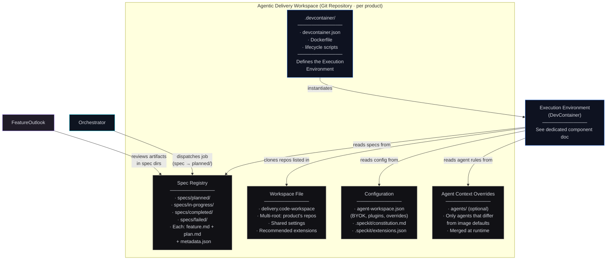
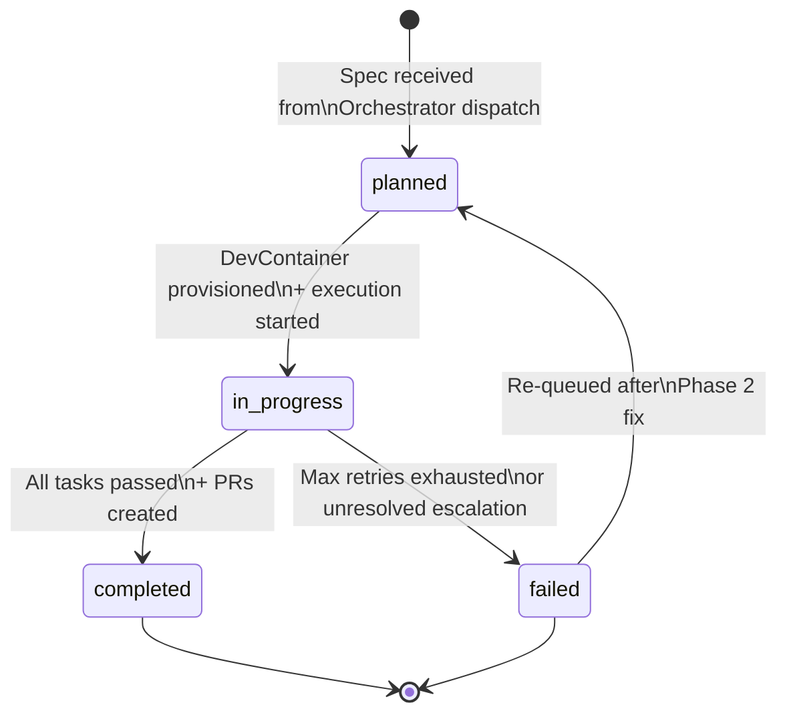

# Agentic Delivery Workspace · Component Drill-Down

**Type:** Product-scoped Git repository
**Technology:** Git, VS Code multi-root workspace, spec-kit, markdown
**Lifecycle:** Persistent — one per product, lives as long as the product exists
**Role:** Product's development identity — configuration, spec history, agent context, constitution, and workspace file. Hosts the `.devcontainer/` definition that the Execution Environment instantiates.

[← Back to System Overview](../../README.md) · [Execution Environment (DevContainer)](../execution-environment/README.md) · [Phase 3 flow context](../../phase-3-execution/README.md)

---

## Overview

The Agentic Delivery Workspace is a **product-scoped Git repository** — the persistent identity of a product within the governed delivery platform. **Each product gets its own workspace**, customized with the product's repos, coding standards, agent behavioral rules, constitution, and tech stack configuration.

The workspace does not execute anything itself. It is the **configuration and history layer** that the [Execution Environment (DevContainer)](../execution-environment/README.md) reads from at runtime. The relationship:

```
Delivery Workspace (Git repo)          Execution Environment (DevContainer)
─────────────────────────────          ─────────────────────────────────────
· Persistent                           · Ephemeral (per job)
· Configuration + history              · Runtime + execution
· Defines what the product is          · Does the work
· Checked out by the DevContainer      · Instantiated from .devcontainer/
· Humans commit config changes         · Agents and humans use it to build
```

### One Workspace Per Product

A workspace is not generic infrastructure — it is the **product's development identity**. When a new product is defined in the platform, a Delivery Workspace is created for it:

```
Organization
├── product-a-workspace/               # Workspace for Product A
│   ├── delivery.code-workspace        # References Product A's repos
│   ├── .speckit/constitution.md       # Product A governance rules
│   ├── agents/                        # Product A agent overrides (optional)
│   ├── agent-workspace.json           # Product A build config + stack
│   └── specs/                         # Product A spec history
│
├── product-b-workspace/               # Workspace for Product B
│   ├── delivery.code-workspace        # References Product B's repos
│   ├── .speckit/constitution.md       # Product B governance rules (may differ)
│   ├── agents/                        # Product B agent overrides (optional)
│   └── ...
│
└── shared-platform-workspace/         # Workspace for shared infrastructure
    └── ...
```

Both humans and agents use the same workspace. A developer opening the DevContainer gets the same primed environment an agent gets — same repos, same tools, same context. A human can pick up where an agent left off (or vice versa) without environment setup.

---

## L3 — Component Diagram

### Repository Contents



### Directory Structure

```
agentic-delivery-workspace/            # Git repository root (per product)
├── .devcontainer/
│   ├── devcontainer.json              # DevContainer configuration
│   ├── Dockerfile                     # Multi-runtime image
│   └── lifecycle/
│       ├── on-create.sh               # Clone repos, install deps
│       ├── post-start.sh              # Start OpenCode, Context Edge
│       └── post-attach.sh             # Stakeholder-mode setup
│
├── specs/                             # Spec Registry (persistent)
│   ├── planned/
│   │   ├── feat-user-dashboard/
│   │   │   ├── feature.md
│   │   │   ├── plan.md
│   │   │   └── metadata.json
│   │   └── maint-snyk-2026-03/
│   │       ├── maintenance-plan.md
│   │       └── metadata.json
│   ├── in-progress/
│   ├── completed/
│   └── failed/
│
├── agents/                            # Product overrides ONLY (optional)
│   ├── execution-agent/               # Example: tighten code gen rules for this product
│   │   └── AGENTS.md                  # Overrides image default
│   └── ...                            # Only include agents you want to customize
│
├── delivery.code-workspace            # Multi-root workspace file
├── agent-workspace.json               # BYOK, plugins, overrides config
├── .speckit/
│   ├── constitution.md                # Product governance rules
│   └── extensions.json                # Extension model config
│
└── docker-compose.yml                 # Local dev (optional)

# Note: src/, context-edge/, scripts/ live in the Execution Environment
# Docker image — NOT in the generated workspace repo. The workspace
# only contains product-specific configuration. See Execution Environment doc.
```

The workspace is **generated** by the [Platform CLI](../platform-cli/README.md) (`workspace init`). It contains only product-specific configuration — no engine source code. The engine, Context Edge, and lifecycle scripts are baked into the Execution Environment image that the `.devcontainer/` definition references.

```
```

---

## L4 — Code Level

### Workspace File

The `.code-workspace` file references this product's repos. It is committed to Git and defines the multi-root context for both humans and agents.

```json
{
  "folders": [
    { "name": "Delivery Workspace", "path": "." },
    { "name": "api-gateway",        "path": "../repos/api-gateway" },
    { "name": "web-app",            "path": "../repos/web-app" },
    { "name": "shared-lib",         "path": "../repos/shared-lib" },
    { "name": "auth-service",       "path": "../repos/auth-service" }
  ],
  "settings": {
    "files.readonlyInclude": {
      "**/specs/completed/**": true,
      "**/specs/failed/**": true
    }
  },
  "extensions": {
    "recommendations": [
      "feature-outlook.feature-outlook"
    ]
  }
}
```

### Agent Context Overrides (Optional)

Default agent context files (`AGENTS.md` per agent type) ship with the [Execution Environment image](../execution-environment/README.md#agent-context-defaults--product-overrides). The workspace's `agents/` directory is for **product-specific overrides only** — you only include files for agents whose behavior you want to customize for this product.

```
agents/                                # Only overrides — NOT the full agent set
├── execution-agent/
│   └── AGENTS.md                      # "Always use functional React components"
└── review-agent/
    └── AGENTS.md                      # "Include JIRA ticket in PR title"
```

At runtime, the Execution Environment merges image defaults with workspace overrides. Overrides win on conflict. See [Execution Environment → Agent Context](../execution-environment/README.md#agent-context-defaults--product-overrides) for the merge strategy.

**When to add overrides:**
- Product has specific coding standards beyond the platform defaults
- Product uses a different test framework or PR workflow
- Product needs stricter/looser escalation thresholds
- Product has domain-specific rules (e.g., "never modify payment tables directly")

**When NOT to override:**
- The platform defaults work fine for this product → no `agents/` dir needed
- You want to change behavior for ALL products → update the defaults in the Execution Environment image instead

### Spec Registry

Specs move through the registry as jobs progress:



Each spec directory contains `metadata.json`:

```json
{
  "specId": "feat-user-dashboard",
  "jobId": "job-2026-03-28-001",
  "source": "feature",
  "status": "in-progress",
  "riskTier": "medium",
  "repos": ["api-gateway", "web-app", "shared-lib"],
  "createdAt": "2026-03-28T10:00:00Z",
  "dispatchedAt": "2026-03-28T14:30:00Z",
  "completedAt": null,
  "prRefs": [],
  "retryCount": 0,
  "escalations": []
}
```

### Key Design Decisions

**Why one workspace per product (not one per org)?**
Different products have different repos, different coding standards, different constitutions, and different agent behavioral rules. A payments product needs stricter security rules than an internal dashboard. Product-scoped workspaces let each product team customize their agent behavior without affecting others.

**Why a Git repo (not a database)?**
Specs are markdown files. Agent context is markdown. Constitution is markdown. Git is the natural storage — versioned, diffable, branchable, reviewable in PRs. The `metadata.json` sidecars provide structured access for programmatic queries. Git history is the audit trail.

**Why does the workspace host the `.devcontainer/` definition?**
The DevContainer definition is product-specific — it includes the product's Dockerfile (which runtimes?), lifecycle scripts (which repos to clone?), and configuration (which plugins?). Keeping it in the workspace repo means the Execution Environment is always in sync with the product's configuration. Change the workspace file to add a repo → the DevContainer automatically clones it on next run.

**Why are agent overrides in the workspace (not baked into the image)?**
Default agent behavior ships with the Execution Environment image. Product-specific overrides live in the workspace because they are product decisions, not infrastructure decisions. A product team can change how the execution-agent generates code by adding `agents/execution-agent/AGENTS.md` and committing — no Docker rebuild, no platform team involvement. The Execution Environment merges defaults with overrides at runtime.

**Why is the workspace generated by the Platform CLI?**
A workspace is scaffolded infrastructure — directory structure, devcontainer config, workspace file, default constitution. Generating it from a CLI ensures consistency across products and avoids manual setup errors. The CLI registers the product in the Context Server and Orchestrator as part of creation. See [Platform CLI → workspace init](../platform-cli/README.md).
