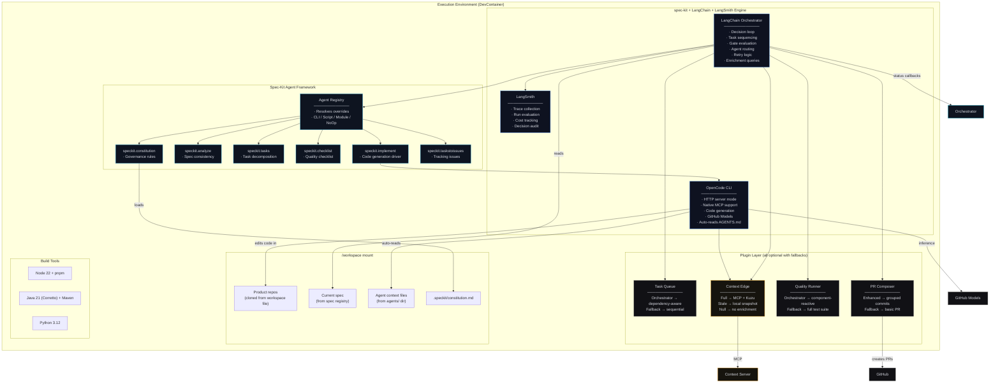
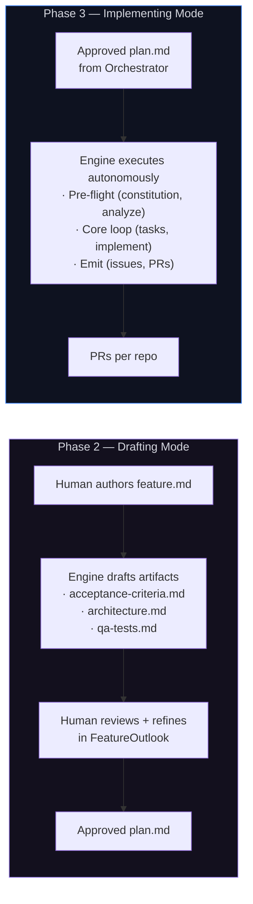
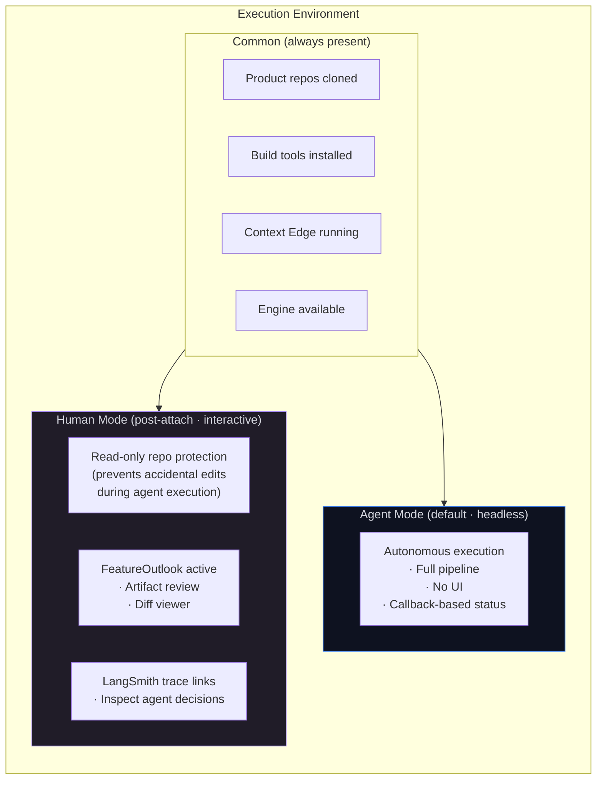
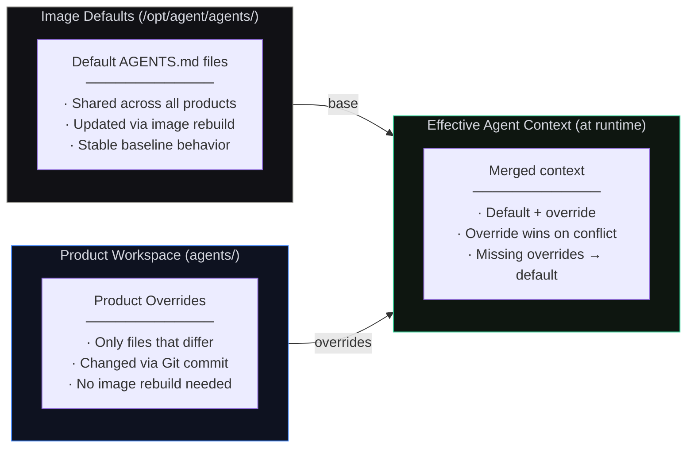
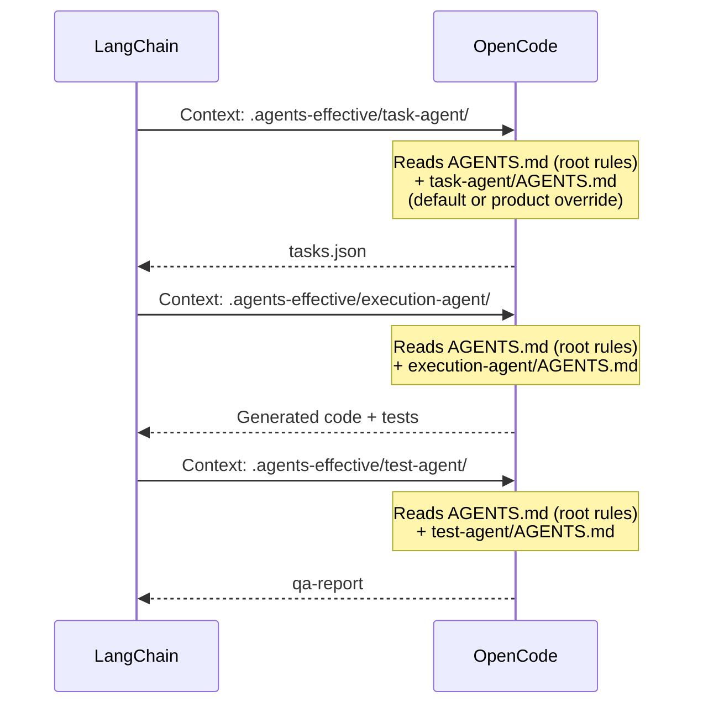

# Execution Environment (DevContainer) · Component Drill-Down

**Type:** Ephemeral container runtime — the component that does the work
**Technology:** DevContainer (Docker), Python, LangChain + LangSmith, spec-kit, OpenCode CLI, GitHub Models
**Lifecycle:** Ephemeral — provisioned per job, destroyed on completion or failure
**Deployment:** Instantiated from the Delivery Workspace's `.devcontainer/` definition
**Role:** Runs the spec-kit + LangChain + LangSmith engine to draft artifacts (Phase 2) and autonomously implement plans (Phase 3). Usable by both humans and agents.

[← Back to System Overview](../../README.md) · [Delivery Workspace (repo)](../delivery-workspace/README.md) · [Phase 3a flow context](../../phase-3-execution/phase-3a-agent-execution.md)

---

## Overview

The Execution Environment is the **DevContainer** — the ephemeral runtime that actually builds software. It is the real component; the [Delivery Workspace](../delivery-workspace/README.md) is its configuration.

When the Orchestrator dispatches a job, it provisions an Execution Environment by instantiating the DevContainer defined in the product's Delivery Workspace. The container clones the product's repos, starts the spec-kit + LangChain engine, and either assists a human (Phase 2 drafting) or runs autonomously (Phase 3 implementing).

### What Makes It a Component

The Execution Environment is not just "a Docker container." It is a governed, observable pipeline with:

- **spec-kit agent framework** — six overridable agents (constitution, analyze, tasks, checklist, implement, taskstoissues) that enforce governance at every stage
- **LangChain orchestrator** — decision loop for task sequencing, retry logic, gate evaluation, enrichment
- **LangSmith** — full observability: every agent invocation is a traceable run
- **OpenCode CLI** — code generation with native MCP support and GitHub Models
- **Plugin system** — pluggable task queue, PR tooling, quality runner, and Context Edge
- **Dual-audience modes** — same container serves agents (headless) and humans (interactive)

### Relationship to Delivery Workspace

```
Delivery Workspace (Git repo)          Execution Environment (DevContainer)
─────────────────────────────          ─────────────────────────────────────
Persistent                             Ephemeral per job
Stores: specs, config, agents,         Runs: engine, OpenCode, plugins,
  constitution, workspace file           Context Edge, build tools
Defines WHAT the product is            Does the WORK
Changed by: humans committing          Used by: agents executing, humans
  config updates                         reviewing and building
```

---

## L3 — Component Diagram

### Internal Architecture



---

## Dual Role: Drafting (Phase 2) + Implementing (Phase 3)

The same engine operates in two modes depending on the phase:



**Drafting Mode (Phase 2):**
The engine generates draft artifacts from `feature.md` — suggesting acceptance criteria, architectural patterns, test strategies. The human reviews, edits, and refines in FeatureOutlook. The engine assists but doesn't decide. Constitution rules constrain what the engine can suggest.

**Implementing Mode (Phase 3):**
The engine runs the full autonomous pipeline — pre-flight → core loop → emit. LangChain drives the decision loop. OpenCode generates code. LangSmith traces every invocation. The human only re-enters on escalation.

**Why one engine for both?** The artifacts an agent drafts in Phase 2 are the same artifacts it implements from in Phase 3. Using different engines would risk format drift. The shared engine ensures constitution rules, template formats, and validation logic are identical in both modes.

---

## Dual-Audience Modes

The same DevContainer serves agents (headless) and humans (interactive):



**Agent mode** is the default — the container starts, runs the pipeline, reports back, exits.

**Human mode** activates when someone attaches (VS Code Remote Containers or SSH). `post-attach.sh` enables read-only protection, activates FeatureOutlook, and exposes LangSmith traces. The human can also use the engine directly — running `specify` commands, invoking OpenCode, or building and testing code manually.

---

## L4 — Code Level

### Container Lifecycle

```mermaid
sequenceDiagram
    participant ORCH as Orchestrator
    participant EE as Execution Environment
    participant CE as Context Edge
    participant OC as OpenCode
    participant LC as LangChain

    ORCH->>EE: Provision (artifact bundle + job config)

    rect rgb(15, 18, 32)
    Note over EE: on-create.sh
    EE->>EE: Clone product repos (from workspace file)
    EE->>EE: Install dependencies (pnpm/maven)
    EE->>EE: Copy spec files to /workspace
    EE->>EE: Detect plugins (provision.sh)
    end

    rect rgb(30, 25, 15)
    Note over EE: post-start.sh
    EE->>CE: Start Context Edge (if available)
    CE->>CE: Pull tenant-scoped snapshot
    EE->>OC: Start OpenCode HTTP server (port 8484)
    EE->>EE: Generate MCP config
    end

    EE-->>ORCH: Heartbeat: READY

    rect rgb(15, 22, 16)
    Note over EE: Execution
    EE->>LC: Start main.py
    LC->>LC: Pre-flight → core loop → emit
    LC-->>ORCH: Status callbacks (per task)
    end

    rect rgb(25, 15, 15)
    Note over EE: teardown.sh
    LC->>CE: Flush write buffer
    CE->>CE: Push writes to Context Server
    EE->>EE: Move spec to completed/ or failed/
    EE->>EE: Commit spec registry update
    EE-->>ORCH: Final status + PR refs
    end
```



### spec-kit Agent Framework

Each spec-kit agent is individually overridable per product (configured in `agent-workspace.json`):

```mermaid
classDiagram
    class SpecKitAgentRegistry {
        +constitution: SpecKitAgent
        +analyze: SpecKitAgent
        +tasks: SpecKitAgent
        +checklist: SpecKitAgent
        +implement: SpecKitAgent
        +tasksToIssues: SpecKitAgent
        -resolve(name, config) SpecKitAgent
    }

    class SpecKitAgent {
        <<interface>>
        +run(context: AgentContext) AgentResult
        +name() String
    }

    class SpecKitCLIAgent {
        +run(context) AgentResult
    }
    class ScriptAgent {
        +run(context) AgentResult
    }
    class ModuleAgent {
        +run(context) AgentResult
    }
    class NoOpAgent {
        +run(context) AgentResult
    }

    SpecKitAgent <|.. SpecKitCLIAgent : default
    SpecKitAgent <|.. ScriptAgent : "type: script"
    SpecKitAgent <|.. ModuleAgent : "type: module"
    SpecKitAgent <|.. NoOpAgent : "type: skip"
    SpecKitAgentRegistry "1" --> "6" SpecKitAgent
```

Override config (`agent-workspace.json`):
```json
{
  "speckit": {
    "overrides": {
      "constitution": null,
      "analyze": { "type": "skip" },
      "tasks": { "type": "module", "module": "custom_agents.decomposer", "class": "JiraDecomposer" },
      "checklist": { "type": "module", "module": "custom_agents.compliance", "class": "SOC2Checklist" },
      "implement": null,
      "taskstoissues": { "type": "script", "path": "./scripts/tasks-to-jira.sh" }
    }
  }
}
```

### LangChain ↔ OpenCode Boundary

Clear separation of concerns:

| | LangChain (decides) | OpenCode (executes) |
|--|---------------------|---------------------|
| **Task routing** | Which task next, retry or advance | — |
| **Enrichment** | What context to request from Context Edge | — |
| **Prompt construction** | How to build the prompt from spec + enrichment | — |
| **Code generation** | — | Generates code from enriched prompt |
| **Live queries** | — | Calls Context Edge MCP tools mid-generation (own initiative) |
| **Agent context** | — | Auto-reads `AGENTS.md` for behavioral specialization |

### Plugin System

Every plugin has a fallback. The pipeline runs end-to-end even with no plugins installed.

```python
class PluginRegistry:
    def __init__(self, config: WorkerConfig):
        self.task_orchestrator = self._detect_task_orchestrator()
        self.pr_tooling = self._detect_pr_tooling()
        self.quality = self._detect_quality()
        self.context = self._detect_context(config)
        self._log_capability_matrix()
```

| Plugin | With | Without (fallback) |
|--------|------|-------------------|
| **Task Queue** | Dependency-aware topological ordering | Sequential (spec order) |
| **PR Composer** | Grouped commits, ticket validation, CODEOWNERS | Single commit, basic PR body |
| **Quality Runner** | Component-reactive test selection, diff review | Full suite (`npm test` / `mvn test`) |
| **Context Edge** | MCP enrichment + live queries + write-back | Spec-only prompts, no enrichment |

### Container Image

The image ships with **default agent context files** for all agent types. Product workspaces can override any agent by placing an `AGENTS.md` in the corresponding `agents/` directory.

```dockerfile
FROM ubuntu:24.04

# Runtime layer
RUN install node 22, python 3.12, java 21 (Corretto)
RUN install pnpm, maven

# Core tool layer (always present)
RUN pip install langchain langchain-openai langsmith
RUN pip install opencode-cli
RUN pip install specify-cli          # spec-kit agent framework

# Pluggable tool layer (optional)
RUN pip install kuzu fastapi uvicorn 2>/dev/null || true  # Context Edge

# Default agent context files (reusable across all products)
COPY agents/ /opt/agent/agents/

# Worker source
COPY src/ /opt/agent/src/
COPY context-edge/ /opt/agent/context-edge/
COPY scripts/ /opt/agent/scripts/

ENTRYPOINT ["/opt/agent/scripts/entrypoint.sh"]
```

Default agent context files baked into the image:

```
/opt/agent/agents/                     # Defaults (shipped with image)
├── AGENTS.md                          # Root — shared governance rules
├── task-agent/
│   └── AGENTS.md                      # Default task decomposition rules
├── execution-agent/
│   └── AGENTS.md                      # Default code generation rules
├── test-agent/
│   └── AGENTS.md                      # Default validation rules
├── validation-agent/
│   └── AGENTS.md                      # Default cross-repo E2E rules
└── review-agent/
    └── AGENTS.md                      # Default PR composition rules
```

### Agent Context: Defaults + Product Overrides

At runtime, the Execution Environment merges default agent context (from the image) with product-specific overrides (from the Delivery Workspace). Product overrides take precedence.



**Merge strategy at provision time (`on-create.sh`):**

```bash
# 1. Start with image defaults
cp -r /opt/agent/agents/ /workspace/.agents-effective/

# 2. Overlay product overrides (if any exist in workspace)
if [ -d /workspace/agents ]; then
    cp -r /workspace/agents/* /workspace/.agents-effective/
fi

# 3. OpenCode reads from the merged directory
export AGENTS_DIR=/workspace/.agents-effective
```

**Examples:**

| Scenario | What happens |
|----------|-------------|
| Product has no `agents/` dir | All defaults from image. Zero config needed. |
| Product overrides `execution-agent/AGENTS.md` | That agent gets product rules. All others use defaults. |
| Product adds `agents/AGENTS.md` root override | Root governance rules customized. Agent-type defaults still apply. |
| Product adds a new agent type `agents/deploy-agent/AGENTS.md` | New agent type available, all others unchanged. |

### Agent Routing

When LangChain dispatches to a sub-agent, it sets OpenCode's working context to the effective (merged) agent directory:



### Key Design Decisions

**Why is the DevContainer the component (not the workspace repo)?**
The repo stores configuration and history — it doesn't do anything. The DevContainer is the runtime that reads that configuration and executes. When you ask "what built this PR?" the answer is the Execution Environment, not the Git repo. The repo is the identity; the DevContainer is the capability.

**Why defaults in the image + overrides in the workspace?**
Default agent context files represent the platform's baseline behavior — they change rarely and should be consistent across all products. Baking them into the image means every product gets the same tested baseline without any setup. Product overrides are for customization — a payments product might tighten the execution-agent's security rules, while an internal tool might relax them. Overrides are Git commits in the workspace, no image rebuild needed.

**Why not the other way (all agents in workspace, none in image)?**
If the Delivery Workspace is a generated repo, every new product would need the full set of agent context files copied in at creation time. That's duplication. When the platform team improves a default agent (e.g., better test-agent rules), they'd have to push that change to every product workspace. With defaults in the image, the improvement ships to all products on the next image update. Only products with overrides are affected — and those overrides are intentional.

**Why ephemeral (not long-running)?**
Each job gets a clean environment — no state leakage between jobs, no dependency version drift, no leftover files from previous runs. The spec registry in the Delivery Workspace provides continuity across runs; the Execution Environment provides isolation within runs.

**Why one engine for drafting and implementing?**
The artifacts an agent drafts in Phase 2 are the same artifacts it implements from in Phase 3. The constitution rules that constrain drafting also constrain implementation. Using different engines would create format drift and governance gaps. The shared engine is the guarantee that what was designed is what gets built.

**Why multi-runtime (Node + Java + Python)?**
The engine is Python (LangChain). Target repos may be Node or Java. The container needs all runtimes to build and test. Image is ~3-5GB — acceptable for a 30-60 minute worker.
