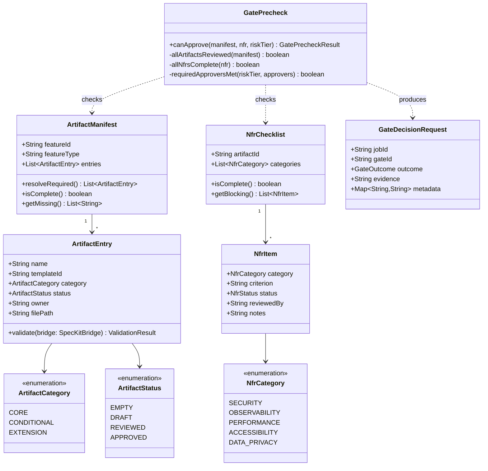
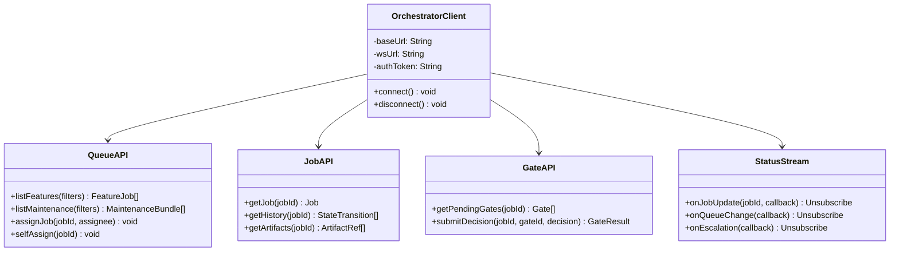

# FeatureOutlook · Component Drill-Down

**Type:** Developer tooling — dual interface
**Technology:** VS Code Extension (TypeScript) + TUI (Ink / TypeScript)
**Deployment:** Runs on developer machines (not server-side)
**Role:** Human review interface for artifact approval, gate sign-off, queue management, and risk tier override

[← Back to System Overview](../../README.md) · [Phase 2 flow context](../../phase-2-tech-design/README.md)

---

## Overview

FeatureOutlook is the **governance interface** — the tool through which humans review, approve, and sign off on artifacts before they enter autonomous execution. It exists as two interfaces backed by the same core logic:

- **VS Code Extension** — rich UI with side-by-side artifact editing, inline agent suggestions, NFR checklists, and approval panels. Integrates with the editor for a seamless review experience.
- **TUI (Terminal UI)** — keyboard-driven interface for the same workflows. Enables review and approval from any terminal, CI pipelines, or SSH sessions where VS Code isn't available.

Both interfaces are thin clients. All business logic — artifact validation, gate precondition checks, extension rule resolution — lives in a shared TypeScript core that both UIs import.

### Why Two Interfaces?

Not all governance actors work in VS Code. A Tech Lead SSH'd into a production box to investigate an incident should be able to approve a pending gate from the terminal. A CI pipeline should be able to validate artifacts without a GUI. The TUI ensures governance isn't locked to a single tool.

### Relationship to spec-kit

FeatureOutlook **extends** github/spec-kit — it does not replace it. spec-kit provides:
- Spec-driven templates (feature.md, acceptance-criteria.md, etc.)
- Extensions model (conditional artifacts by feature type)
- `specify` CLI (validation, template rendering)
- DevContainer base

FeatureOutlook adds:
- Queue management (view submitted featuresets, self-assign)
- Review workflows (NFR checklists, approval controls)
- Gate sign-off (with Orchestrator integration)
- Risk tier display and override

Teams that outgrow FeatureOutlook still have a standards-based artifact format via spec-kit.

---

## L3 — Component Diagram

### Internal Architecture

```mermaid
graph TB
    subgraph fo["FeatureOutlook"]
        direction TB

        subgraph interfaces["Interface Layer"]
            subgraph vscode["VS Code Extension"]
                EXTHOST["Extension Host\n─────────────\n· Activation events\n· Command registration\n· Configuration\n· Lifecycle management"]
                WEBVIEW["Webview Panels\n─────────────\n· Queue panel\n· Artifact review panel\n· NFR checklist panel\n· Gate approval panel"]
                EDITOR_INT["Editor Integration\n─────────────\n· Side-by-side diff\n· Inline diagnostics\n· CodeLens for artifacts\n· Hover hints"]
                TREE["Tree Views\n─────────────\n· Feature tree\n· Artifact tree\n· Gate status tree"]
            end

            subgraph tui["TUI (Ink)"]
                TUI_APP["TUI Application\n─────────────\n· Ink renderer\n· Screen routing\n· Keyboard bindings\n· Terminal detection"]
                TUI_QUEUE["Queue Screen\n─────────────\n· Feature list\n· Priority sorting\n· Assign action"]
                TUI_REVIEW["Review Screen\n─────────────\n· Artifact viewer\n· NFR checklist\n· Diff viewer"]
                TUI_GATE["Gate Screen\n─────────────\n· Approval controls\n· Evidence input\n· Confirmation"]
            end
        end

        subgraph core["Shared Core (TypeScript)"]
            ART_MGR["Artifact Manager\n─────────────\n· CRUD operations\n· Template instantiation\n· Validation pipeline\n· Dirty tracking"]
            EXT_ENGINE["Extension Engine\n─────────────\n· Feature type detection\n· Conditional artifact rules\n· Extension resolution\n· Manifest generation"]
            NFR_ENGINE["NFR Engine\n─────────────\n· Checklist definitions\n  per NFR category\n· Status tracking\n· Completeness check"]
            GATE_LOGIC["Gate Logic\n─────────────\n· Precondition evaluation\n· Approver role validation\n· Risk tier constraint check\n· Decision packaging"]
            SPECKIT_BRIDGE["spec-kit Bridge\n─────────────\n· specify CLI invocation\n· Template rendering\n· Constitution loading\n· Validation delegation"]
        end

        subgraph integration["Integration Layer"]
            ORCH_CLIENT["Orchestrator Client\n─────────────\n· REST API wrapper\n· WebSocket connection\n· Authentication\n· Retry + error handling"]
            GIT_OPS["Git Operations\n─────────────\n· Artifact branch mgmt\n· PR creation for plan.md\n· Commit formatting\n· Merge detection"]
            NOTIFY["Notification Bridge\n─────────────\n· VS Code notifications\n· TUI status bar\n· Badge counts"]
        end
    end

    %% VS Code → Core
    WEBVIEW --> ART_MGR
    WEBVIEW --> NFR_ENGINE
    WEBVIEW --> GATE_LOGIC
    EDITOR_INT --> ART_MGR
    TREE --> ORCH_CLIENT

    %% TUI → Core
    TUI_QUEUE --> ORCH_CLIENT
    TUI_REVIEW --> ART_MGR
    TUI_REVIEW --> NFR_ENGINE
    TUI_GATE --> GATE_LOGIC

    %% Core → Core
    ART_MGR --> EXT_ENGINE
    ART_MGR --> SPECKIT_BRIDGE
    GATE_LOGIC --> NFR_ENGINE
    GATE_LOGIC --> ORCH_CLIENT

    %% Core → External
    ORCH_CLIENT --> ORCH["Orchestrator API"]
    GIT_OPS --> GH["GitHub"]
    SPECKIT_BRIDGE --> SK_CLI["specify CLI"]

    style EXTHOST fill:#201c28,stroke:#a78bfa,color:#d4d6de
    style WEBVIEW fill:#201c28,stroke:#a78bfa,color:#d4d6de
    style EDITOR_INT fill:#201c28,stroke:#a78bfa,color:#d4d6de
    style TREE fill:#201c28,stroke:#a78bfa,color:#d4d6de
    style TUI_APP fill:#201c28,stroke:#c084fc,color:#d4d6de
    style TUI_QUEUE fill:#201c28,stroke:#c084fc,color:#d4d6de
    style TUI_REVIEW fill:#201c28,stroke:#c084fc,color:#d4d6de
    style TUI_GATE fill:#201c28,stroke:#c084fc,color:#d4d6de
    style ART_MGR fill:#13101e,stroke:#a78bfa,color:#d4d6de
    style EXT_ENGINE fill:#13101e,stroke:#a78bfa,color:#d4d6de
    style NFR_ENGINE fill:#13101e,stroke:#a78bfa,color:#d4d6de
    style GATE_LOGIC fill:#13101e,stroke:#a78bfa,color:#d4d6de
    style SPECKIT_BRIDGE fill:#13101e,stroke:#a78bfa,color:#d4d6de
    style ORCH_CLIENT fill:#13101e,stroke:#5b21b6,color:#d4d6de
    style GIT_OPS fill:#13101e,stroke:#5b21b6,color:#d4d6de
    style NOTIFY fill:#13101e,stroke:#5b21b6,color:#d4d6de
    style ORCH fill:#0e1420,stroke:#22d3ee,color:#d4d6de
    style GH fill:#111115,stroke:#888780,color:#d4d6de
    style SK_CLI fill:#111115,stroke:#888780,color:#d4d6de
```



### Package Structure

```
feature-outlook/
├── packages/
│   ├── core/                          # Shared core (published as @feature-outlook/core)
│   │   ├── src/
│   │   │   ├── artifacts/
│   │   │   │   ├── manager.ts         # Artifact CRUD + validation
│   │   │   │   ├── manifest.ts        # ArtifactManifest type + resolver
│   │   │   │   └── templates.ts       # Template instantiation
│   │   │   ├── extensions/
│   │   │   │   ├── engine.ts          # Feature type → artifact rules
│   │   │   │   └── rules.ts          # ExtensionRule definitions
│   │   │   ├── nfr/
│   │   │   │   ├── engine.ts          # NFR checklist logic
│   │   │   │   ├── categories.ts      # Security, Observability, etc.
│   │   │   │   └── types.ts
│   │   │   ├── gates/
│   │   │   │   ├── logic.ts           # Precondition evaluation
│   │   │   │   ├── approvers.ts       # Role validation
│   │   │   │   └── types.ts
│   │   │   ├── speckit/
│   │   │   │   └── bridge.ts          # specify CLI wrapper
│   │   │   └── client/
│   │   │       ├── orchestrator.ts    # REST + WebSocket client
│   │   │       └── types.ts           # API response types
│   │   └── package.json
│   │
│   ├── vscode/                        # VS Code extension
│   │   ├── src/
│   │   │   ├── extension.ts           # Activation + command registration
│   │   │   ├── panels/
│   │   │   │   ├── queue.ts           # Queue webview
│   │   │   │   ├── review.ts          # Artifact review webview
│   │   │   │   ├── nfr.ts             # NFR checklist webview
│   │   │   │   └── gate.ts            # Gate approval webview
│   │   │   ├── views/
│   │   │   │   ├── featureTree.ts     # Tree data provider
│   │   │   │   └── artifactTree.ts
│   │   │   ├── editor/
│   │   │   │   ├── diagnostics.ts     # Inline diagnostics
│   │   │   │   ├── codeLens.ts        # Artifact CodeLens
│   │   │   │   └── hover.ts           # Hover hints
│   │   │   └── commands/
│   │   │       ├── assign.ts
│   │   │       ├── approve.ts
│   │   │       └── override.ts
│   │   └── package.json               # contributes: commands, views, etc.
│   │
│   └── tui/                           # Terminal UI
│       ├── src/
│       │   ├── app.tsx                # Ink root component
│       │   ├── screens/
│       │   │   ├── Queue.tsx
│       │   │   ├── Review.tsx
│       │   │   └── Gate.tsx
│       │   ├── components/
│       │   │   ├── ArtifactViewer.tsx
│       │   │   ├── NfrChecklist.tsx
│       │   │   ├── DiffView.tsx
│       │   │   └── StatusBar.tsx
│       │   └── keybindings.ts
│       ├── bin/
│       │   └── fo.ts                  # CLI entry: `fo queue`, `fo review`, `fo approve`
│       └── package.json
│
├── package.json                       # Monorepo root (pnpm workspaces)
└── tsconfig.json
```

---

## L4 — Code Level

### Core Domain Model



### Orchestrator Client

The client wraps both REST (for CRUD/gates) and WebSocket (for real-time status) connections to the Orchestrator.



### Extension Engine — Conditional Artifact Resolution

```typescript
// Simplified — shows the resolution logic
interface ExtensionRule {
  featureType: string;
  requiredArtifacts: string[];
}

const EXTENSION_RULES: ExtensionRule[] = [
  { featureType: 'api-change',      requiredArtifacts: ['integration.md', 'security.md'] },
  { featureType: 'ui-component',    requiredArtifacts: ['accessibility.md'] },
  { featureType: 'data-migration',  requiredArtifacts: ['migration.md', 'performance.md'] },
  { featureType: 'infra-change',    requiredArtifacts: ['observability.md', 'security.md'] },
];

function resolveArtifacts(featureType: string): ArtifactEntry[] {
  const core = ['feature.md', 'acceptance-criteria.md', 'architecture.md', 'ux.md', 'qa-tests.md'];
  const conditional = EXTENSION_RULES
    .filter(r => r.featureType === featureType)
    .flatMap(r => r.requiredArtifacts);
  return [...core, ...conditional].map(name => createArtifactEntry(name));
}
```

### VS Code ↔ TUI Feature Parity

Both interfaces expose identical workflows. The shared core ensures logic consistency; only the rendering differs.

| Workflow | VS Code | TUI |
|----------|---------|-----|
| View queue | Webview panel with sort/filter | Table with `j/k` navigation |
| Self-assign | Click "Assign to me" | Press `a` on selected item |
| Review artifact | Side-by-side editor with diagnostics | Paged text viewer with diff highlighting |
| NFR checklist | Checkbox webview per category | Checkbox list with `space` to toggle |
| Approve gate | Button with confirmation dialog | `Enter` on approve + `y` to confirm |
| Risk tier override | Dropdown in review panel | Number selection (`1`=Low, `2`=Med, `3`=High) |
| Real-time updates | WebSocket → webview refresh | WebSocket → Ink re-render |

### Key Design Decisions

**Why a monorepo with shared core?**
The alternative — two separate projects with duplicated logic — would inevitably drift. A bug fixed in the VS Code gate logic might not get fixed in the TUI. The monorepo with a published `@feature-outlook/core` package ensures both interfaces run identical validation, gate prechecks, and API calls.

**Why Ink for the TUI (not blessed/ncurses)?**
Ink renders React components to the terminal. Since the VS Code webviews also use a React-like model, the component mental model is shared across both interfaces. Ink also handles terminal resize, color detection, and input focus automatically — avoiding the low-level terminal management that blessed requires.

**Why does FeatureOutlook not store state locally?**
All state lives in the Orchestrator (jobs, gates, queues). FeatureOutlook is a stateless client that reads from and writes to the Orchestrator API. This means a developer can switch between VS Code and TUI mid-review without state inconsistency. It also means FeatureOutlook doesn't need its own database or persistence layer.

**Why CodeLens and inline diagnostics in VS Code?**
When a Tech Lead opens `acceptance-criteria.md`, they should immediately see: which criteria are testable (green), which are ambiguous (yellow warning), and which reference undefined terms (red diagnostic). CodeLens on `plan.md` shows the current gate status inline. This reduces context-switching between the editor and the review panel.
