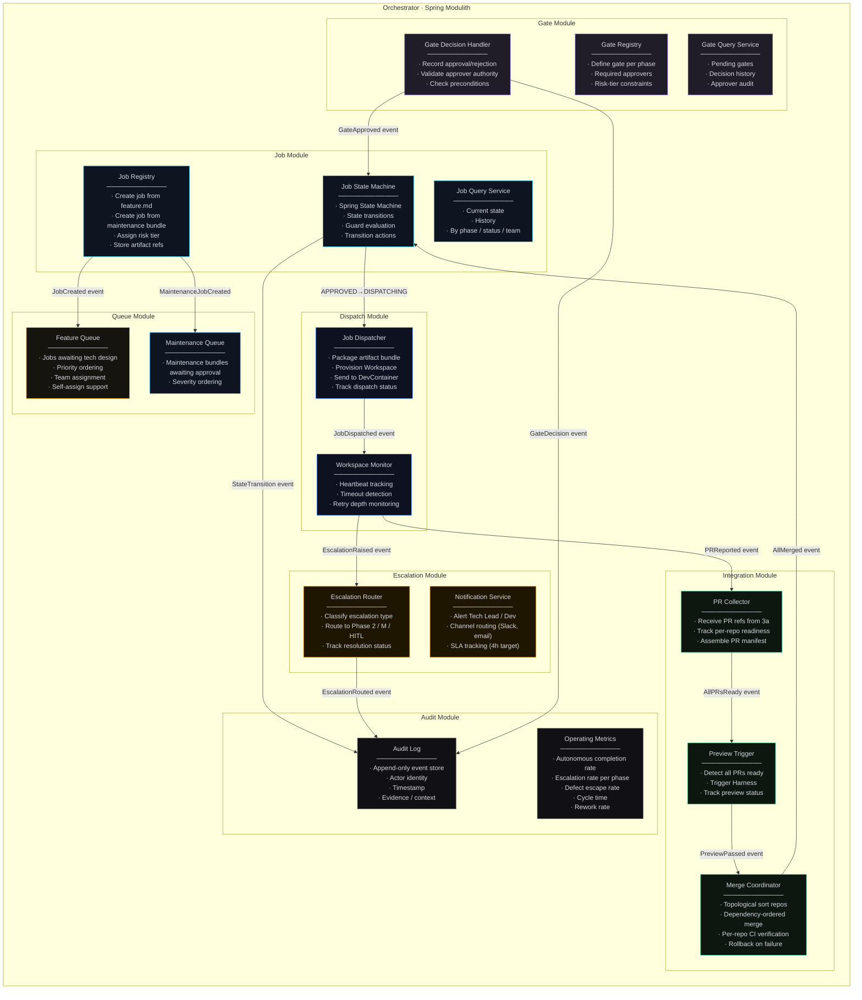
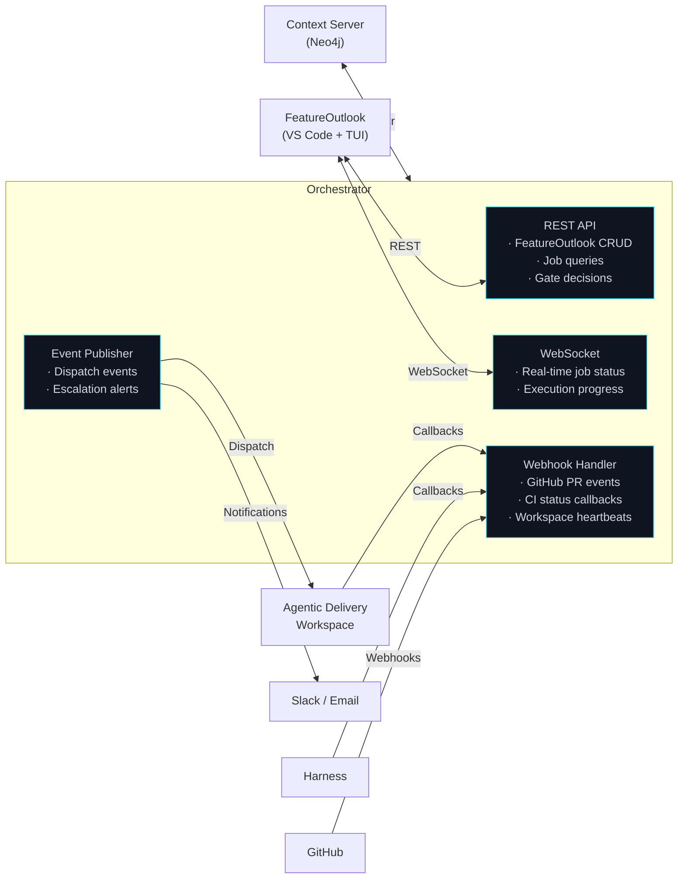
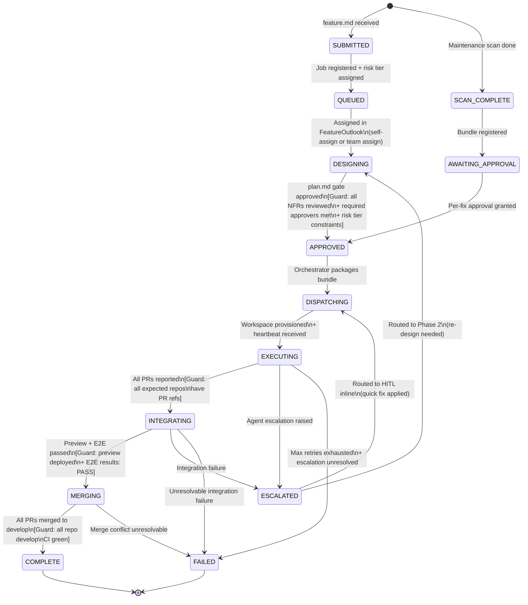
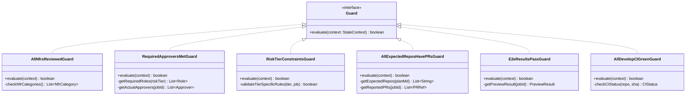
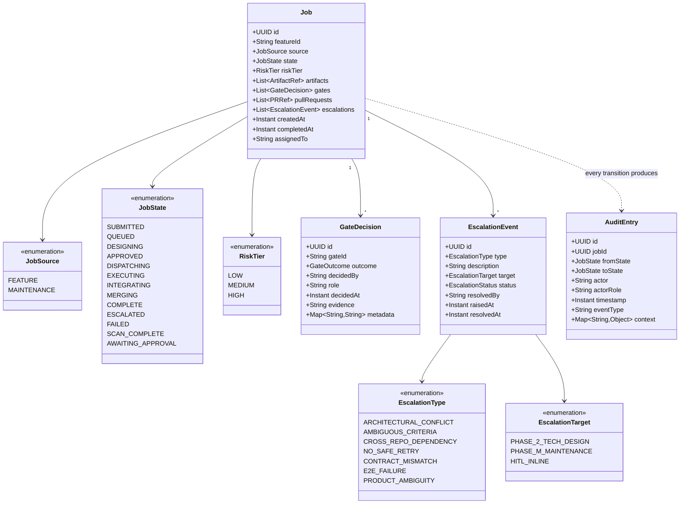
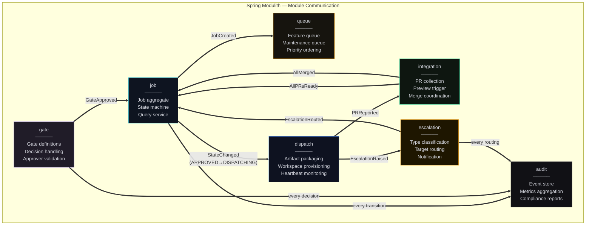

# Orchestrator · C4 Drill-Down

**System:** Central nervous system of the Governed Agentic Delivery Platform
**Technology:** Spring Boot 3.x · Spring Modulith · Spring State Machine
**Lifecycle:** Always-running service (not ephemeral)
**Role:** Job lifecycle management, state transitions, dispatch, escalation routing, audit trail

[← Back to System Overview](../../README.md)

---

## Overview

The Orchestrator is the only system that has visibility across all phases. It does not generate code, review artifacts, or execute tests — it **manages the lifecycle of jobs** as they flow from curated feature submission through merge to `develop`.

Every phase transition, every gate decision, every escalation, and every retry is mediated by the Orchestrator. This makes it the single source of truth for "what is the current state of this feature?" and the complete audit trail for "how did it get there?"

### Core Responsibilities

| Responsibility | Description |
|---------------|-------------|
| **Job registration** | Receives curated `feature.md` from Phase 1, creates job record, assigns initial risk tier |
| **Queue management** | Maintains queue of jobs awaiting tech design review in FeatureOutlook |
| **Gate enforcement** | Records gate decisions from FeatureOutlook, validates preconditions before state transitions |
| **Dispatch** | Sends approved artifact bundles to the Agentic Delivery Workspace for Phase 3 execution |
| **Execution monitoring** | Tracks Phase 3 progress, retry depth, escalation events |
| **PR collection** | Collects PR refs from Phase 3a, triggers Phase 3b when all PRs are ready |
| **Merge coordination** | Orchestrates dependency-ordered merge in Phase 3b |
| **Escalation routing** | Routes escalations to Phase 2, Phase M, or HITL inline based on escalation type |
| **Audit trail** | Append-only log of every state transition, gate decision, and actor identity |

### Why Spring Modulith?

The Orchestrator's responsibilities are logically distinct but data-coupled. All modules operate on the same core aggregates (`Job`, `Gate`, `Escalation`). Spring Modulith gives:

- **Module boundaries** with explicit inter-module APIs (events, not direct calls)
- **Single deployable** — one JAR, one database, one transaction scope
- **Module verification** — compile-time checks that modules only communicate through declared interfaces
- **Event publication** — modules react to events rather than calling each other directly

This avoids the operational overhead of microservices (separate deployments, distributed transactions, service discovery) while maintaining clean separation of concerns.

### Why Spring State Machine?

The job lifecycle has well-defined states, transitions, and guards. Spring State Machine provides:

- **Declarative state graph** — states and transitions defined in config, not scattered through business logic
- **Guards** — precondition checks before transitions (e.g., "all NFRs must be reviewed before APPROVED")
- **Actions** — side effects on transitions (e.g., "dispatch to Workspace on APPROVED → DISPATCHING")
- **Persistence** — state machine state persisted to PostgreSQL, survives restarts
- **Audit events** — every transition emits an event with actor, timestamp, and context

---

## L3 — Component Diagram

### Modulith Module Map



### External Integration Points



---

## L4 — Code Level

### Job State Machine

The job lifecycle is the heart of the Orchestrator. Every job follows this state graph, with transitions guarded by preconditions.



### State Machine Configuration (Spring State Machine)

```java
@Configuration
@EnableStateMachineFactory
public class JobStateMachineConfig
        extends EnumStateMachineConfigurerAdapter<JobState, JobEvent> {

    @Override
    public void configure(StateMachineStateConfigurer<JobState, JobEvent> states)
            throws Exception {
        states.withStates()
            .initial(JobState.SUBMITTED)
            .end(JobState.COMPLETE)
            .end(JobState.FAILED)
            .states(EnumSet.allOf(JobState.class));
    }

    @Override
    public void configure(StateMachineTransitionConfigurer<JobState, JobEvent> transitions)
            throws Exception {
        transitions
            // Feature path
            .withExternal()
                .source(SUBMITTED).target(QUEUED)
                .event(JOB_REGISTERED)
                .action(assignRiskTierAction())
                .and()
            .withExternal()
                .source(QUEUED).target(DESIGNING)
                .event(JOB_ASSIGNED)
                .and()
            .withExternal()
                .source(DESIGNING).target(APPROVED)
                .event(PLAN_APPROVED)
                .guard(allNfrsReviewedGuard())
                .guard(requiredApproversMetGuard())
                .guard(riskTierConstraintsGuard())
                .action(recordApprovalAction())
                .and()
            .withExternal()
                .source(APPROVED).target(DISPATCHING)
                .event(DISPATCH_TRIGGERED)
                .action(packageArtifactBundleAction())
                .and()
            .withExternal()
                .source(DISPATCHING).target(EXECUTING)
                .event(WORKSPACE_READY)
                .and()
            .withExternal()
                .source(EXECUTING).target(INTEGRATING)
                .event(ALL_PRS_READY)
                .guard(allExpectedReposHavePRsGuard())
                .action(assemblePRManifestAction())
                .and()
            .withExternal()
                .source(INTEGRATING).target(MERGING)
                .event(PREVIEW_PASSED)
                .guard(e2eResultsPassGuard())
                .and()
            .withExternal()
                .source(MERGING).target(COMPLETE)
                .event(ALL_MERGED)
                .guard(allDevelopCIGreenGuard())
                .action(recordCompletionAction())
                .and()

            // Escalation
            .withExternal()
                .source(EXECUTING).target(ESCALATED)
                .event(ESCALATION_RAISED)
                .action(routeEscalationAction())
                .and()
            .withExternal()
                .source(ESCALATED).target(DESIGNING)
                .event(REROUTED_TO_DESIGN)
                .and()
            .withExternal()
                .source(ESCALATED).target(DISPATCHING)
                .event(HITL_FIX_APPLIED)
                .action(repackageArtifactBundleAction())
                .and()

            // Maintenance path
            .withExternal()
                .source(SUBMITTED).target(SCAN_COMPLETE)
                .event(MAINTENANCE_SCAN_DONE)
                .and()
            .withExternal()
                .source(SCAN_COMPLETE).target(AWAITING_APPROVAL)
                .event(BUNDLE_REGISTERED)
                .and()
            .withExternal()
                .source(AWAITING_APPROVAL).target(APPROVED)
                .event(MAINTENANCE_APPROVED)
                .guard(perFixApprovalsCompleteGuard())
                .and()

            // Failure
            .withExternal()
                .source(EXECUTING).target(FAILED)
                .event(MAX_RETRIES_EXHAUSTED)
                .action(recordFailureAction());
    }
}
```

### Guard Implementations

Guards are precondition checks that must pass before a state transition is allowed.



### Core Domain Model



### Modulith Module Boundaries

Spring Modulith enforces that modules communicate only through events, not direct method calls.



### REST API Surface (FeatureOutlook Integration)

```
# Queue
GET    /api/queue/features              → List feature jobs (filterable)
GET    /api/queue/maintenance            → List maintenance bundles
POST   /api/queue/features/{id}/assign   → Self-assign or team-assign

# Jobs
GET    /api/jobs/{id}                    → Job detail + current state
GET    /api/jobs/{id}/history            → State transition history
GET    /api/jobs/{id}/artifacts          → Artifact refs

# Gates
GET    /api/jobs/{id}/gates              → Pending gates for this job
POST   /api/jobs/{id}/gates/{gateId}     → Submit gate decision
                                           Body: { outcome, evidence, metadata }

# Escalations
GET    /api/escalations?status=open      → Open escalations
POST   /api/escalations/{id}/resolve     → Mark resolved

# Metrics
GET    /api/metrics/completion-rate      → Autonomous completion rate
GET    /api/metrics/escalation-rate      → Escalation rate by phase
GET    /api/metrics/cycle-time           → Idea → develop cycle time
```

### Persistence

```
┌─────────────────────────────────────────────┐
│  PostgreSQL                                  │
│                                              │
│  jobs               → Job aggregate root     │
│  gate_decisions      → Gate decisions         │
│  escalation_events   → Escalation log         │
│  audit_entries       → Append-only audit trail │
│  pr_refs             → PR manifest per job    │
│  state_machine_ctx   → SSM persistence        │
│                                              │
│  Redis                                       │
│  queue:features      → Feature job queue      │
│  queue:maintenance   → Maintenance queue      │
│  locks:job:{id}      → Distributed lock       │
│  ws:sessions         → WebSocket sessions     │
└─────────────────────────────────────────────┘
```

### Key Design Decisions

**Why single JAR (Modulith) instead of microservices?**
The Orchestrator's modules share the `Job` aggregate. Splitting them into microservices would require distributed transactions or event sourcing for basic operations like "approve gate and advance state." A Modulith keeps ACID transactions local while enforcing clean module boundaries through Spring's `@ApplicationModuleTest` and event-based communication.

**Why Spring State Machine (not a custom state enum)?**
A custom state enum with switch statements would work for simple lifecycles. But the Orchestrator's lifecycle has 13 states, multiple transition paths (feature vs. maintenance), guarded transitions (NFR review, risk tier), and side effects (dispatch, notification). Spring State Machine makes these declarative, testable, and auditable. Each transition is logged automatically.

**Why append-only audit trail?**
Governed agentic delivery requires accountability. If a defect escapes to production, the audit trail must show: who approved the plan.md, what risk tier was assigned, whether any escalations were overridden, and exactly when each state transition occurred. Append-only ensures this trail cannot be tampered with after the fact.

**Why Redis for queues (not PostgreSQL)?**
Queues are hot-path operations — FeatureOutlook polls them frequently, and self-assignment needs to be fast with proper locking. Redis provides atomic queue operations and distributed locks that PostgreSQL can handle but with higher latency. The queue state is derived from job state in PostgreSQL, so Redis is a cache — if it fails, queues rebuild from the database.

### Operating Metrics

The Orchestrator tracks five key metrics that measure the health of the governed delivery model:

| Metric | Target | Source |
|--------|--------|--------|
| **Autonomous Completion Rate** | > 70% | Jobs that complete Phase 3 without HITL escalation |
| **Escalation Rate** | Track per phase | Percentage of jobs escalated at each phase boundary |
| **Defect Escape Rate** | < 5% | Defects found post-merge to `develop` |
| **Cycle Time** | Trend downward | Time from curated feature.md to merged to `develop` |
| **Rework Rate** | Trend downward | Jobs that return to Phase 2 from Phase 3 |
