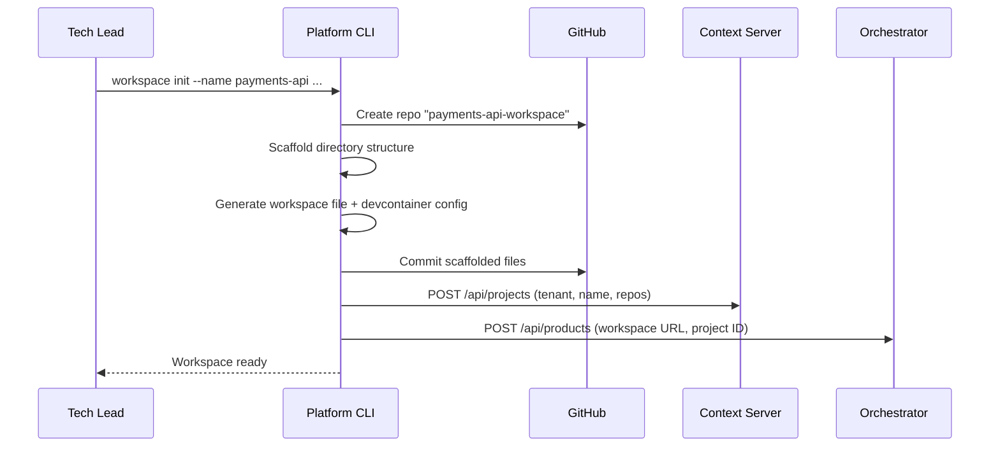
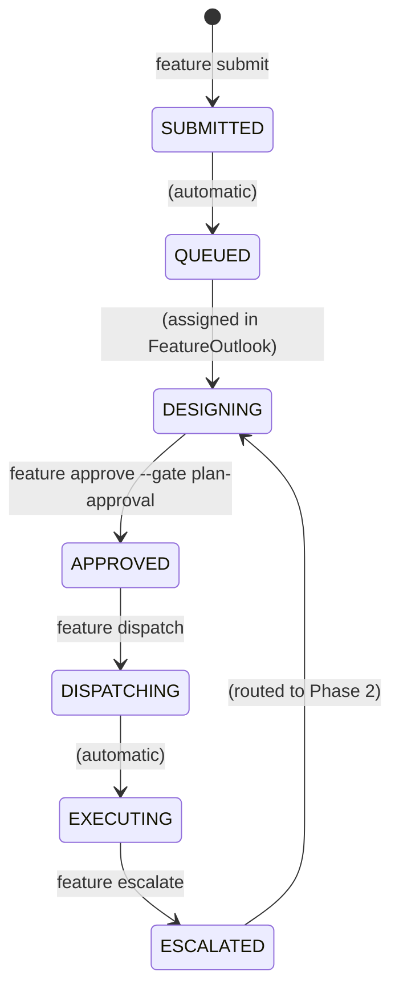

# Platform CLI · Component Drill-Down

**Type:** Standalone CLI tool — interactive platform management
**Technology:** TBD (CLI)
**Lifecycle:** Invoked on demand — runs command, exits
**Deployment:** Installed on developer machines; used by Tech Leads, Architects, and developers
**Role:** Unified interface for product workspace lifecycle, feature state transitions, and Harness pipeline management

[← Back to System Overview](../../README.md) · [Orchestrator](../orchestrator/README.md) · [Delivery Workspace](../delivery-workspace/README.md)

---

## Overview

The Platform CLI is the **interactive command-line interface** for the governed delivery platform. It consolidates three concerns into one tool:

| Command Group | Concern | What It Manages |
|--------------|---------|----------------|
| `workspace` | Product lifecycle | Create/configure product Delivery Workspaces, register products, manage repos and agent overrides |
| `feature` | Feature state | Submit features, approve gates, trigger dispatch, check status, raise escalations |
| `pipeline` | Harness CI/CD | Create/trigger/delete Harness pipelines for preview environments, E2E, and merge |

### Why One CLI?

These three command groups share:
- **Same auth** — Orchestrator API token, Harness API token, Context Server credentials
- **Same config** — `~/.platform-cli.json` with endpoint URLs and defaults
- **Same audience** — developers and Tech Leads working on features
- **Same context** — a product workspace

Three separate CLIs would mean three installs, three configs, three auth setups for the same person doing the same workflow.

### Platform CLI vs Other Tools

| Tool | Audience | Mode | Purpose |
|------|----------|------|---------|
| **Platform CLI** | Developers, Tech Leads | Interactive, on-demand | Workspace lifecycle, feature state, pipelines |
| **FeatureOutlook** | Tech Leads, Specialists | Interactive, rich UI | Artifact review, NFR checklists, detailed approvals |
| **[Maintenance Agent](../agent-maintenance/README.md)** | Schedulers, CI | Automated, unattended | Codebase scanning, triage, bundle generation |

FeatureOutlook and the Platform CLI are complementary — FeatureOutlook for deep review, CLI for quick actions and scripting.

---

## L3 — Component Diagram

```mermaid
graph TB
    subgraph cli["Platform CLI"]
        direction TB

        subgraph ws_cmds["workspace commands"]
            WS_INIT["workspace init\n─────────────\n· Create workspace repo\n· Scaffold structure\n· Register in Context Server"]
            WS_REPO["workspace add-repo\nworkspace remove-repo\n─────────────\n· Update workspace file\n· Update Context Server"]
            WS_AGENT["workspace override-agent\n─────────────\n· Scaffold agent override\n· Copy default as starting point"]
            WS_CONFIG["workspace configure\n─────────────\n· Set stack, BYOK, plugins\n· Update agent-workspace.json"]
            WS_STATUS["workspace status\n─────────────\n· Show product config\n· List repos + overrides"]
        end

        subgraph ft_cmds["feature commands"]
            FT_SUBMIT["feature submit\n─────────────\n· Submit curated feature.md\n· Register job with Orchestrator"]
            FT_APPROVE["feature approve\n─────────────\n· Approve a pending gate\n· Provide evidence\n· Advance state"]
            FT_DISPATCH["feature dispatch\n─────────────\n· Trigger Phase 3 execution"]
            FT_ESCALATE["feature escalate\n─────────────\n· Raise manual escalation\n· Route to Phase 2/M/HITL"]
            FT_STATUS["feature status\n─────────────\n· Current state\n· Pending gates\n· PR refs"]
            FT_LIST["feature list\n─────────────\n· By state / product / team"]
        end

        subgraph pl_cmds["pipeline commands"]
            PL_CREATE["pipeline create\n─────────────\n· Create Harness pipeline\n· Adapts to risk tier\n· Preview + E2E + merge stages"]
            PL_TRIGGER["pipeline trigger\n─────────────\n· Manually trigger stage\n· Re-run failed stage"]
            PL_STATUS["pipeline status\n─────────────\n· Pipeline state\n· Preview URL\n· Recent runs"]
            PL_DELETE["pipeline delete\n─────────────\n· Tear down pipeline\n· Clean up preview env"]
        end

        subgraph shared["Shared Infrastructure"]
            CONFIG["Config Manager\n─────────────\n· ~/.platform-cli.json\n· Endpoint URLs\n· Auth tokens\n· Default product"]
            ORCH_CLIENT["Orchestrator Client\n─────────────\n· REST API\n· State transitions\n· Gate decisions\n· Job queries"]
            HARNESS_CLIENT["Harness Client\n─────────────\n· Pipeline API\n· Create/trigger/delete\n· Stage configuration"]
            CS_CLIENT["Context Server Client\n─────────────\n· Register product/repos\n· Tenant association"]
            GIT_OPS["Git Operations\n─────────────\n· Create repo (GitHub API)\n· Commit scaffolded files"]
        end
    end

    WS_INIT & WS_CONFIG --> GIT_OPS
    WS_INIT & WS_REPO --> CS_CLIENT
    FT_SUBMIT & FT_APPROVE & FT_DISPATCH & FT_ESCALATE --> ORCH_CLIENT
    FT_STATUS & FT_LIST --> ORCH_CLIENT
    PL_CREATE & PL_TRIGGER & PL_DELETE --> HARNESS_CLIENT
    PL_STATUS --> HARNESS_CLIENT
    PL_STATUS --> ORCH_CLIENT

    GIT_OPS --> GH["GitHub"]
    ORCH_CLIENT --> ORCH["Orchestrator"]
    HARNESS_CLIENT --> HARNESS["Harness"]
    CS_CLIENT --> CS["Context Server"]

    style WS_INIT fill:#111115,stroke:#888780,color:#d4d6de
    style WS_REPO fill:#111115,stroke:#888780,color:#d4d6de
    style WS_AGENT fill:#111115,stroke:#888780,color:#d4d6de
    style WS_CONFIG fill:#111115,stroke:#888780,color:#d4d6de
    style WS_STATUS fill:#111115,stroke:#888780,color:#d4d6de
    style FT_SUBMIT fill:#0e1420,stroke:#38bdf8,color:#d4d6de
    style FT_APPROVE fill:#0e1420,stroke:#38bdf8,color:#d4d6de
    style FT_DISPATCH fill:#0e1420,stroke:#38bdf8,color:#d4d6de
    style FT_ESCALATE fill:#0e1420,stroke:#38bdf8,color:#d4d6de
    style FT_STATUS fill:#0e1420,stroke:#38bdf8,color:#d4d6de
    style FT_LIST fill:#0e1420,stroke:#38bdf8,color:#d4d6de
    style PL_CREATE fill:#0e1610,stroke:#34d399,color:#d4d6de
    style PL_TRIGGER fill:#0e1610,stroke:#34d399,color:#d4d6de
    style PL_STATUS fill:#0e1610,stroke:#34d399,color:#d4d6de
    style PL_DELETE fill:#0e1610,stroke:#34d399,color:#d4d6de
    style ORCH_CLIENT fill:#0e1420,stroke:#22d3ee,color:#d4d6de
    style HARNESS_CLIENT fill:#0e1610,stroke:#34d399,color:#d4d6de
    style CS_CLIENT fill:#16140e,stroke:#f59e0b,color:#d4d6de
    style GIT_OPS fill:#111115,stroke:#888780,color:#d4d6de
    style ORCH fill:#0e1420,stroke:#22d3ee,color:#d4d6de
    style HARNESS fill:#111115,stroke:#888780,color:#d4d6de
    style CS fill:#16140e,stroke:#f59e0b,color:#d4d6de
    style GH fill:#111115,stroke:#888780,color:#d4d6de
```



---

## L4 — Code Level

### Full Command Reference

```
<platform-cli> <group> <command> [options]

Workspace Commands:
  workspace init              Create a new product Delivery Workspace
  workspace add-repo          Add a repo to a workspace
  workspace remove-repo       Remove a repo from a workspace
  workspace override-agent    Scaffold an agent context override
  workspace configure         Update workspace configuration (stack, BYOK, plugins)
  workspace status            Show product workspace state

Feature Commands:
  feature submit              Submit curated feature.md to Orchestrator
  feature status              Show feature state + pending gates + PR refs
  feature approve             Approve a pending gate (with evidence)
  feature dispatch            Trigger Phase 3 execution
  feature escalate            Raise a manual escalation
  feature list                List features by state / product / team

Pipeline Commands:
  pipeline create             Create Harness pipeline for a feature
  pipeline status             Check pipeline state + preview URL
  pipeline trigger            Manually trigger a pipeline stage
  pipeline delete             Tear down pipeline + preview env

Global Options:
  --product <name>           Product workspace context
  --orchestrator <url>       Orchestrator API URL (or from config)
  --harness-token <tok>      Harness API token (or from config)
  --context-server <url>     Context Server URL (or from config)
  --output <format>          Output: text (default), json
  --config <path>            Config file (default: ~/.platform-cli.json)
```

### Configuration

```json
{
  "defaults": {
    "product": "payments-api",
    "orchestrator": "https://orchestrator.internal/api",
    "contextServer": "https://context.internal/api",
    "harnessAccountId": "acme-corp",
    "harnessOrgId": "engineering"
  },
  "auth": {
    "orchestratorToken": "${ORCH_TOKEN}",
    "harnessToken": "${HARNESS_API_TOKEN}",
    "contextServerToken": "${CS_TOKEN}",
    "githubToken": "${GITHUB_TOKEN}"
  }
}
```

---

### `workspace init` — Create Product Workspace

```
<platform-cli> workspace init \
  --name "payments-api" \
  --repos api-gateway,web-app,shared-lib \
  --stack node \
  --tenant acme-corp
```



Scaffolded structure:
```
payments-api-workspace/
├── .devcontainer/
│   ├── devcontainer.json
│   ├── Dockerfile
│   └── lifecycle/
├── specs/
│   ├── planned/
│   ├── in-progress/
│   ├── completed/
│   └── failed/
├── delivery.code-workspace
├── agent-workspace.json
├── .speckit/
│   ├── constitution.md
│   └── extensions.json
└── README.md
```

---

### `feature submit` + `feature approve` + `feature dispatch` — Feature Lifecycle

```
<platform-cli> feature submit --product payments-api --spec ./feature.md
<platform-cli> feature approve --feature feat-user-dashboard --gate plan-approval \
  --evidence "All NFRs reviewed, architecture approved by @architect"
<platform-cli> feature dispatch --feature feat-user-dashboard
```

These map directly to the Orchestrator's state machine:



---

### `pipeline create` — Harness Pipeline

```
<platform-cli> pipeline create \
  --product payments-api \
  --feature feat-user-dashboard
```

Creates a Harness pipeline adapted to the feature's **risk tier**:

| Aspect | Low Risk | Medium Risk | High Risk |
|--------|----------|-------------|-----------|
| Preview window | Auto-merge after E2E | 24h preview before merge | Manual merge approval |
| E2E depth | Standard suite | Standard + security scans | Full + penetration hooks |
| Notifications | PR comment | + Slack | + email to Architect |

Pipeline stages:
1. Checkout all feature branches
2. Build combined stack
3. Deploy preview environment
4. Run cross-repo E2E
5. Report results to Orchestrator

---

### `workspace override-agent` — Agent Customization

```
<platform-cli> workspace override-agent --agent execution-agent
```

Copies the default `execution-agent/AGENTS.md` from the Execution Environment image into the workspace's `agents/` directory as a starting point for customization. The team then edits the file and commits.

---

### Typical Workflow

```bash
# 1. Platform engineer onboards a new product
platform-cli workspace init --name payments-api --repos api-gateway,web-app --stack node

# 2. Tech Lead customizes agent behavior for this product
platform-cli workspace override-agent --agent execution-agent
# Edit agents/execution-agent/AGENTS.md → "always use functional React components"
git commit -am "customize execution-agent for payments-api"

# 3. Developer submits a feature
platform-cli feature submit --product payments-api --spec ./feature.md

# 4. Tech Lead reviews in FeatureOutlook, then approves via CLI
platform-cli feature approve --feature feat-dashboard --gate plan-approval \
  --evidence "Architecture reviewed, NFRs complete"

# 5. Tech Lead creates the Harness pipeline and dispatches
platform-cli pipeline create --feature feat-dashboard
platform-cli feature dispatch --feature feat-dashboard

# 6. Monitor progress
platform-cli feature status --feature feat-dashboard
platform-cli pipeline status --feature feat-dashboard

# 7. After merge, clean up
platform-cli pipeline delete --feature feat-dashboard
```

---

### Key Design Decisions

**Why one CLI with command groups (not three separate CLIs)?**
`workspace`, `feature`, and `pipeline` commands share auth, config, and audience. A Tech Lead creating a workspace today will be submitting features and creating pipelines tomorrow. One install, one config file, one auth setup.

**Why a CLI alongside FeatureOutlook?**
FeatureOutlook excels at detailed review — side-by-side artifact comparison, NFR checklists, interactive approval. The CLI excels at quick actions — "submit this feature.md," "check status," "trigger dispatch." They complement each other. The CLI also enables CI integration — a GitHub Action can call `feature submit` after the Planning Agent produces a curated feature.md.

**Why is the Maintenance Agent separate (not a command group here)?**
The Maintenance Agent runs unattended on schedulers — different deployment target, different audience, different execution model. Bundling it here would mean CI runners that only need to scan codebases also install workspace provisioning and feature lifecycle commands. See [Maintenance Agent](../agent-maintenance/README.md).

**Why does `pipeline create` adapt to risk tier?**
A low-risk feature doesn't need a 24-hour preview window or penetration test hooks. A high-risk feature (payments, auth) needs all of them. The CLI reads the risk tier from the Orchestrator and generates the appropriate Harness pipeline template — governance intensity matches risk automatically.

**Why `feature approve` via CLI (when FeatureOutlook exists)?**
Not every approval needs a deep review session. If a Tech Lead has already reviewed artifacts in FeatureOutlook and just needs to record the approval, `feature approve --evidence "..."` is faster than opening the extension. The CLI records the same gate decision in the Orchestrator's audit trail.
