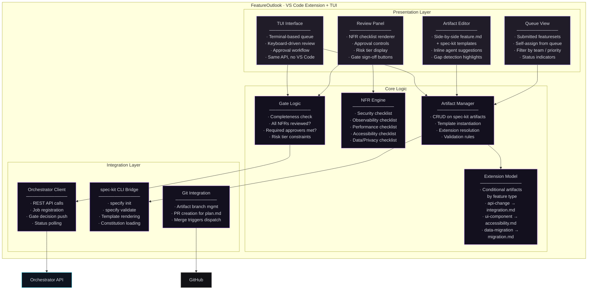
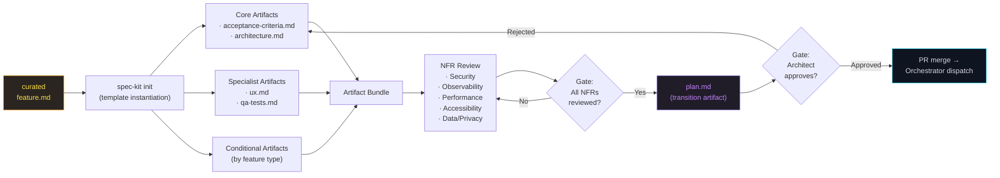
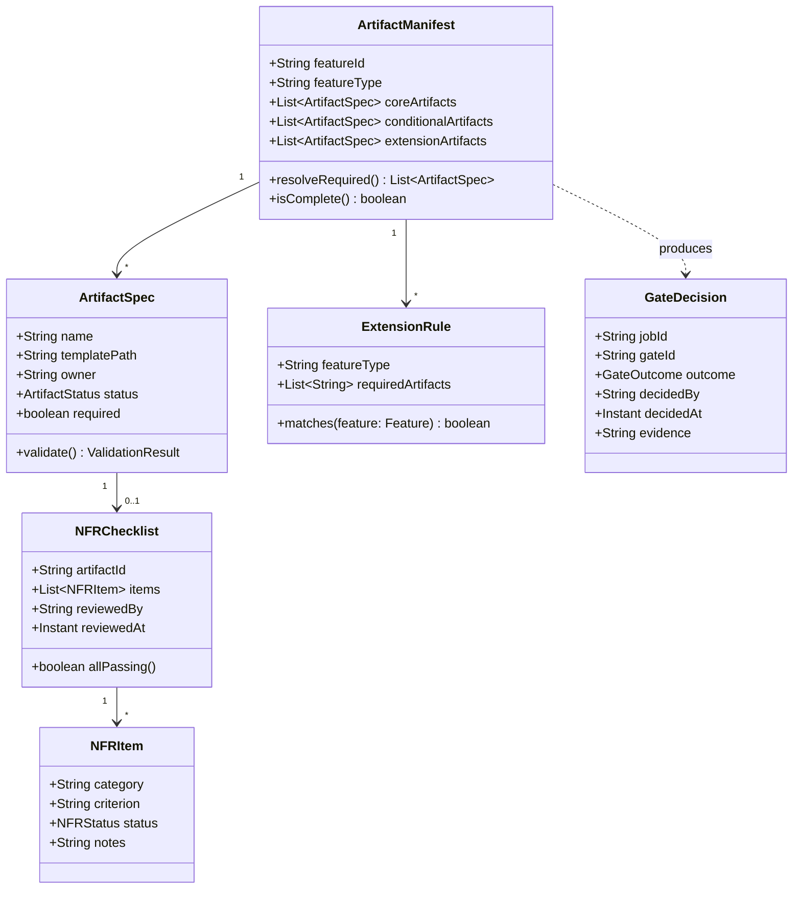
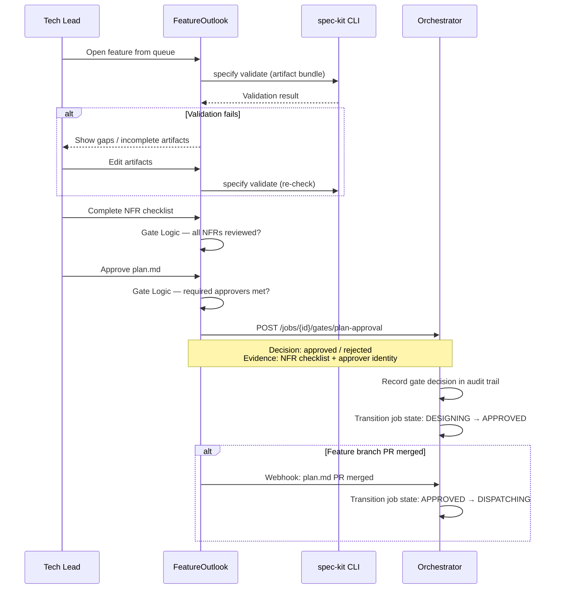

# Phase 2 — Tech Design · C4 Drill-Down

**Phase:** Human-led, agent-assisted
**Owner:** Tech Lead / Architect + Specialists (UX, QA)
**Trigger:** Curated `feature.md` submitted from Phase 1
**Output:** Approved `plan.md` (execution-safe transition artifact)

[← Back to System Overview](../README.md)

---

## Overview

Phase 2 transforms a curated feature description into a set of execution-safe artifacts that autonomous agents can act on without ambiguity. This is where **meaning becomes structure** — human experts decompose intent into testable criteria, architectural boundaries, and scoped tasks.

The phase is built on three systems:
- **github/spec-kit** — the open-source foundation providing spec-driven templates, an extensions model, the `specify` CLI, and a devcontainer base
- **FeatureOutlook** — an internal VS Code extension + TUI that extends spec-kit with review workflows, NFR checklists, gate approvals, and queue management
- **Execution engine (drafting mode)** — the same spec-kit + LangChain + LangSmith engine that implements plans in Phase 3 also operates in Phase 2 to **draft artifacts** from `feature.md`. It generates suggested acceptance criteria, architectural patterns, and test strategies that humans then review and refine. See [Delivery Workspace → Execution Engine](../components/delivery-workspace/README.md#execution-engine-spec-kit--langchain--langsmith) for the dual-mode architecture.

### Why This Phase Exists

Autonomous agents are excellent executors but poor arbiters of product intent. Phase 2 exists to eliminate the class of failures where an agent builds the wrong thing correctly. By requiring human sign-off on testable acceptance criteria, architectural boundaries, and quality checklists before any code is generated, the system trades upfront human time for dramatically reduced rework in Phase 3.

### Phase 2 Stages

| Stage | Name | Owner | Output |
|-------|------|-------|--------|
| 04a | Tech Design — Core Artifacts | Tech Lead, Architect | `feature.md` (curated), `acceptance-criteria.md`, `architecture.md` |
| 04b | Specialists | UX Designer, QA Engineer | `ux.md`, `qa-tests.md` |
| 05 | Spec Review | Tech Lead, Architect | NFR-reviewed, approved artifact bundle |
| 06 | Plan Generation | Tech Lead, Architect | `plan.md` (transition artifact — triggers Phase 3) |

---

## L3 — Component Diagram

### FeatureOutlook Internals

### Artifact Flow Through Phase 2

---

## L4 — Code Level

### FeatureOutlook Extension Model

The extension model determines which artifacts are required for a given feature. Core artifacts are always required. Conditional artifacts are activated based on feature type tags in the `feature.md` frontmatter.

### Extension Rules — Conditional Artifacts by Feature Type

| Feature Type | Additional Required Artifacts |
|-------------|------------------------------|
| `api-change` | `integration.md`, `security.md` |
| `ui-component` | `ux.md` (already core), `accessibility.md` |
| `data-migration` | `migration.md`, `performance.md` |
| `infra-change` | `observability.md`, `security.md` |

Extension candidates that any organization can add: `ops.md`, `change-control.md`, plus org-specific artifacts.

### Gate Approval Sequence

### Key Design Decisions

**Why VS Code Extension AND TUI?**
Not all reviewers use VS Code. The TUI provides the same artifact review and approval workflow in a terminal, backed by the same Orchestrator API. Both UIs are thin clients — the gate logic and artifact validation live in shared core modules.

**Why spec-kit as foundation?**
spec-kit provides an open-source standard for spec-driven development: templates, extensions model, CLI, and devcontainer base. FeatureOutlook extends it rather than replacing it, meaning teams that outgrow FeatureOutlook still have a standards-based artifact format. The `specify` CLI can validate artifacts in CI without FeatureOutlook installed.

**Why NFR review before plan.md generation?**
Plan.md is the transition artifact that triggers autonomous execution. If NFRs (security, observability, performance, accessibility, data/privacy) aren't reviewed before plan.md is approved, the agents may generate code that passes functional tests but violates non-functional requirements. Catching this in Phase 2 is dramatically cheaper than catching it in Phase 3 (where the fix requires re-specification, not just re-generation).

**Why is the risk tier overridable by Tech Lead?**
The Orchestrator's automated risk scoring uses heuristics (repo criticality, data surface, etc.) that can't capture organizational context. A Tech Lead might know that a seemingly low-risk change to an internal tool actually touches a shared library used by payments. The override is logged in the audit trail as a human judgment call.
