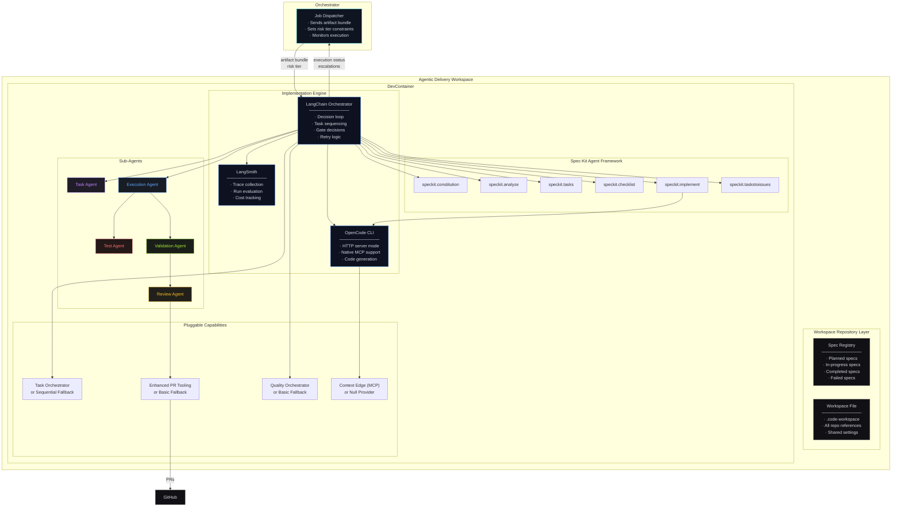
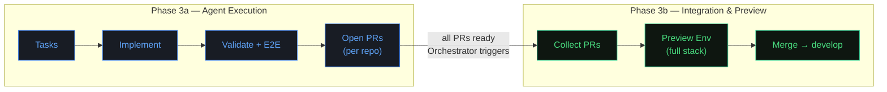
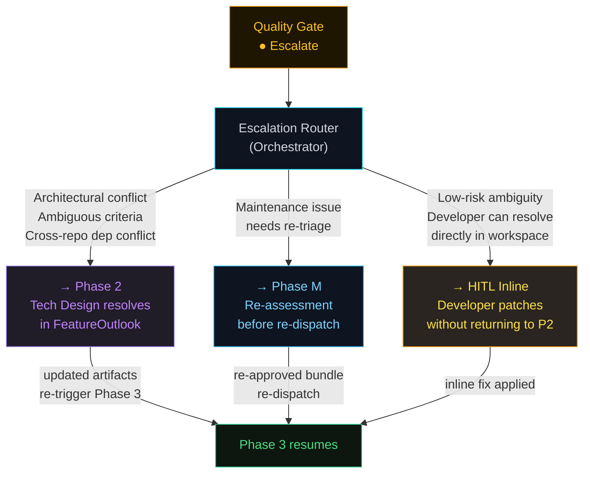

# Phase 3 — Autonomous Execution · C4 Drill-Down

**Phase:** Automated · Agents govern within approved scope
**Owner:** Agent system (Orchestrator dispatches, agents execute)
**Trigger:** Approved `plan.md` or `maintenance-plan.md` dispatched by Orchestrator
**Output:** PRs merged to `develop` across all affected repos

[← Back to System Overview](../README.md) · [Phase 3a Detail](./phase-3a-agent-execution.md) · [Phase 3b Detail](./phase-3b-integration.md)

---

## Overview

Phase 3 is where autonomous agents take approved, execution-safe artifacts and turn them into working code, tested and merged to `develop`. It is divided into two sub-phases:

- **Phase 3a — Agent Execution:** Per-repo task decomposition, code generation, validation, and PR creation. Runs inside the Agentic Delivery Workspace's DevContainer using the spec-kit wrapped LangChain + LangSmith engine.
- **Phase 3b — Integration & Preview:** Cross-repo PR collection, combined full-stack preview environment, E2E validation, and coordinated merge to `develop`.

### The Agentic Delivery Workspace

The Agentic Delivery Workspace is not just a container — it is a **Git repository** that serves as the persistent record and execution environment for all agentic work.

**Repository contents:**
- **Spec registry** — list of all specifications: planned, in-progress, completed, failed
- **Workspace file** (`.code-workspace`) — multi-root VS Code workspace referencing all repos in scope
- **DevContainer** — primes the environment for two audiences:
  - **Stakeholders** reviewing autonomously curated artifacts (read-only context, review tools, artifact viewers)
  - **Implementation agents** executing the full pipeline (LangChain, OpenCode, spec-kit, build tools)
- **Implementation engine** — spec-kit wrapped LangChain orchestrator + LangSmith observability

### Entry / Exit Criteria

| Entry Criteria | Exit Criteria |
|---------------|---------------|
| Approved `plan.md` — spec-kit validated | All PRs open and linked to job |
| Repos scoped — cross-repo graph built | E2E tests passed across all repos |
| Acceptance criteria present + testable | Preview environment validated |
| Risk tier assigned — gate intensity set | All PRs merged to `develop` |
| NFR checklist cleared | No unresolved escalations |

### Sub-Agent Roles

Phase 3 uses specialized sub-agents within the Team Agent Workspace. Each agent's behavior is defined by `AGENTS.md` context files that OpenCode auto-reads — see [Delivery Workspace → Agent Type Context Files](../components/delivery-workspace/README.md#agent-type-context-files) for the full specialization model.

| Agent | Context File | Responsibility |
|-------|-------------|---------------|
| **Task Agent** | `agents/task-agent/AGENTS.md` | Decomposes plan.md into scoped tasks per repo, maps cross-repo dependencies |
| **Execution Agent** | `agents/execution-agent/AGENTS.md` | Generates code via spec-kit wrapped LangChain + OpenCode, handles enrichment |
| **Test Agent** | `agents/test-agent/AGENTS.md` | Runs validation — unit tests, build verification, type checking |
| **Validation Agent** | `agents/validation-agent/AGENTS.md` | Cross-repo contract validation, E2E test orchestration |
| **Review Agent** | `agents/review-agent/AGENTS.md` | Diff review, quality assessment, PR composition |

### Gate System

Every stage in Phase 3 has a three-outcome quality gate:

```
┌──────────────┐     ┌──────────────┐     ┌──────────────┐
│  ● Continue  │     │ ● Auto-refine│     │  ● Escalate  │
│              │     │              │     │              │
│ Output meets │     │ Agent self-  │     │ Human must   │
│ criteria     │     │ corrects     │     │ re-enter     │
│              │     │ (max 3       │     │              │
│ Advance to   │     │  retries per │     │ Routes to    │
│ next stage   │     │  stage)      │     │ Phase 2 / M  │
└──────────────┘     └──────────────┘     └──────────────┘
```

---

## L3 — Component Diagram (Phase 3 Overview)



### Phase 3a → 3b Transition



### Escalation Routing

When a quality gate results in **Escalate**, the pipeline pauses and routes the issue back to the appropriate phase:



### Key Design Decisions

**Why a single Team Agent Workspace (not one container per repo)?**
Cross-repo features require coordinated changes. If each repo has its own isolated container, there's no shared context for things like: "the API contract in `api-gateway` must match the client in `web-app`." A single workspace with all repos cloned gives sub-agents full cross-repo visibility. The workspace file (`.code-workspace`) makes this multi-root context available to both agents and human reviewers.

**Why spec-kit wrapping around LangChain?**
Raw LangChain gives you a decision loop but no governance. Spec-kit agents (constitution, analyze, tasks, checklist, implement, taskstoissues) inject governance at each pipeline stage — ensuring the agent operates within the approved spec's boundaries, validates against the constitution, and produces traceable outputs. Each agent is individually overridable, so organizations can swap in custom implementations (Jira integration, SOC 2 checklists, etc.) without replacing the pipeline.

**Why does the DevContainer serve two audiences?**
The same workspace that agents use for execution is also where stakeholders review the agent's work. By sharing the same environment, you eliminate the "it works on my machine" gap between agent execution and human review. Stakeholders get the same file tree, the same cross-repo context, and the same build tools.

**Why is scope explicitly bounded at merge to develop?**
Release management, production rollout, rollback, and compliance approvals are fundamentally different governance domains. Mixing them with the build pipeline would create an unwieldy state machine and unclear accountability boundaries. By stopping at `develop`, the system has a clean handoff point to existing release processes.

---

## Drill-Down

- **[Phase 3a — Agent Execution](./phase-3a-agent-execution.md):** LangChain orchestrator internals, spec-kit agent lifecycle, per-task execution loop, plugin architecture, Context Edge integration
- **[Phase 3b — Integration & Preview](./phase-3b-integration.md):** PR collection strategy, preview environment provisioning, cross-repo E2E, merge coordination
