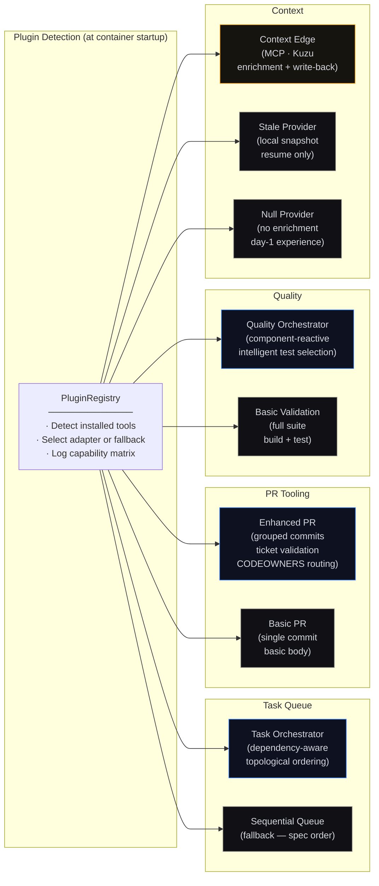
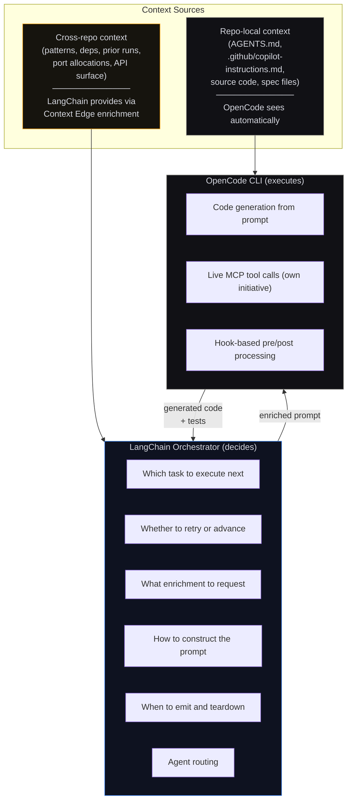
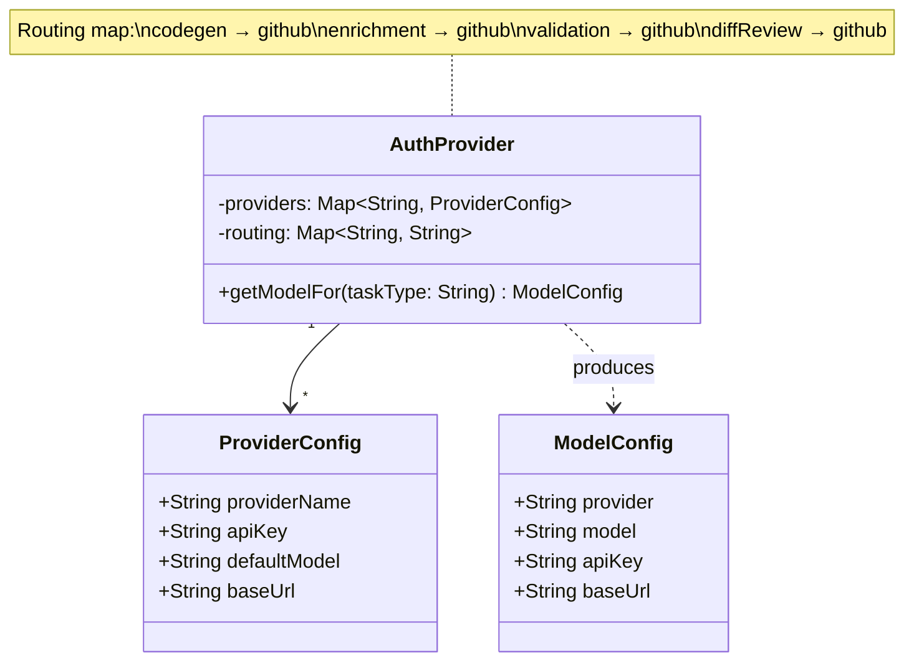

# Phase 3a — Agent Execution · C4 Drill-Down

**Sub-phase:** Per-repo task decomposition → code generation → validation → PR creation
**Actor:** Implementation agents within the Agentic Delivery Workspace DevContainer
**Trigger:** Orchestrator dispatches approved artifact bundle
**Output:** PRs per affected repo, all linked to feature job

[← Back to Phase 3 Overview](./README.md) · [Phase 3b →](./phase-3b-integration.md)

---

## Overview

Phase 3a is the core execution loop. The LangChain orchestrator — wrapped in spec-kit governance agents — decomposes the approved plan into tasks, generates code for each task using OpenCode CLI, validates the output, and opens PRs. This all runs inside the Agentic Delivery Workspace's DevContainer.

### Stages

| Stage | Name | Sub-Agent | Quality Gate | Output |
|-------|------|-----------|-------------|--------|
| 01 | Tasks | Task Agent | Continue / Auto-refine / Escalate | `tasks.json` (all repos) |
| 02 | Implement | Execution Agent | Continue / Auto-refine / Escalate | Diffs across all repos |
| 03 | Validate + E2E | Test Agent + Validation Agent | Continue / Auto-refine / Escalate | `qa-report` + `review-notes` |
| 04 | Open PRs | Review Agent | Open PRs / Auto-refine / Escalate | PRs per affected repo |

---

## L3 — Component Diagram

### LangChain Orchestrator + Spec-Kit Pipeline

```mermaid
graph TB
    subgraph preflight["Pre-flight (runs once per job)"]
        direction LR
        CONST["speckit.constitution\n─────────────\n· Load governance rules\n· Seed Context Edge\n· Validate spec structure"]
        ANALYZE["speckit.analyze\n─────────────\n· Spec ↔ plan consistency\n· Blocking issue detection\n· Dependency validation"]
        SKTASKS["speckit.tasks\n─────────────\n· Generate ordered task list\n· Scope tasks per repo\n· Map cross-repo deps"]
        SKCHECKLIST["speckit.checklist\n─────────────\n· Quality checklist per task\n· Supplements qa-tests.md\n· NFR-derived checks"]

        CONST --> ANALYZE --> SKTASKS --> SKCHECKLIST
    end

    subgraph core_loop["Core Loop (per task)"]
        direction TB

        ENRICH["Context Enrichment\n─────────────\n· Context Edge MCP Read #1\n· Cross-repo patterns\n· Dependency edges\n· Prior run results"]

        SKIMPL["speckit.implement\n─────────────\n· Constructs enriched prompt\n· Drives OpenCode\n· Spec-aware context injection"]

        OCODE["OpenCode CLI\n─────────────\n· HTTP server mode\n· Code generation\n· MCP live queries (Read #2)\n· Returns generated code + tests"]

        VALIDATE_TASK["Validation\n─────────────\n· Build verification\n· Type checking\n· Unit tests\n· Diff review (LLM)\n· Checklist verification"]

        GATE{"Quality\nGate"}

        ENRICH --> SKIMPL --> OCODE --> VALIDATE_TASK --> GATE

        GATE -->|"● Continue"| WRITEBACK["Context Write-back\n· Task result\n· Patterns discovered\n· RunState update"]
        GATE -->|"● Auto-refine\n(≤3 retries)"| ENRICH
        GATE -->|"● Escalate"| ESC["Escalation\n→ Orchestrator"]
    end

    subgraph emit["Emit (runs once per job)"]
        direction LR
        SKISSUES["speckit.taskstoissues\n─────────────\n· Create tracking issues\n· Link to completed tasks"]
        PRCOMPOSE["PR Composition\n─────────────\n· Enhanced PR or basic\n· Grouped commits\n· Linked issues\n· Structured body"]
        FLUSH["Context Flush\n─────────────\n· Write buffer → Context Server\n· LangSmith trace flush"]

        SKISSUES --> PRCOMPOSE --> FLUSH
    end

    SKCHECKLIST --> ENRICH
    WRITEBACK --> ENRICH
    WRITEBACK -.->|"all tasks done"| SKISSUES

    style CONST fill:#0e1420,stroke:#38bdf8,color:#d4d6de
    style ANALYZE fill:#0e1420,stroke:#38bdf8,color:#d4d6de
    style SKTASKS fill:#0e1420,stroke:#38bdf8,color:#d4d6de
    style SKCHECKLIST fill:#0e1420,stroke:#38bdf8,color:#d4d6de
    style ENRICH fill:#16140e,stroke:#f59e0b,color:#d4d6de
    style SKIMPL fill:#0e1220,stroke:#3b82f6,color:#d4d6de
    style OCODE fill:#0e1220,stroke:#3b82f6,color:#d4d6de
    style VALIDATE_TASK fill:#0e1610,stroke:#34d399,color:#d4d6de
    style GATE fill:#1e1600,stroke:#f59e0b,color:#fbbf24
    style ESC fill:#241818,stroke:#f87171,color:#f87171
    style WRITEBACK fill:#16140e,stroke:#f59e0b,color:#d4d6de
    style SKISSUES fill:#0e1420,stroke:#38bdf8,color:#d4d6de
    style PRCOMPOSE fill:#201c28,stroke:#a78bfa,color:#d4d6de
    style FLUSH fill:#16140e,stroke:#f59e0b,color:#d4d6de
```



### Plugin Detection + Fallback Strategy



### Context Edge — Three Touchpoints

The Context Edge provides cross-repo intelligence at three runtime moments:

```mermaid
sequenceDiagram
    participant LC as LangChain Orchestrator
    participant SK as speckit.implement
    participant OC as OpenCode CLI
    participant CE as Context Edge (MCP)
    participant CS as Context Server (Neo4j)

    Note over CE: Startup: snapshot pulled from Context Server

    rect rgb(30, 25, 15)
    Note right of LC: Read #1 — Enrichment (LangChain initiative)
    LC->>CE: MCP query: patterns, deps, prior runs for task
    CE-->>LC: Cross-repo patterns, dependency edges, prior run results
    LC->>SK: Build enriched prompt (spec + enrichment)
    end

    rect rgb(15, 18, 32)
    Note right of OC: Read #2 — Live Query (OpenCode initiative)
    SK->>OC: Send enriched prompt
    OC->>CE: MCP query: port allocations, API surface
    CE-->>OC: Live cross-repo data
    OC-->>LC: Generated code + tests
    end

    rect rgb(15, 22, 16)
    Note right of LC: Write #3 — Write-back (LangChain initiative)
    LC->>CE: Write: task result, discovered patterns, RunState
    CE->>CE: Buffer write locally
    Note over CE: Teardown: flush buffer to Context Server
    CE->>CS: Flush buffered writes
    end
```



---

## L4 — Code Level

### Spec-Kit Agent Registry

Each spec-kit agent is individually overridable. The registry resolves the correct implementation at startup.

```mermaid
classDiagram
    class SpecKitAgentRegistry {
        +SpecKitAgent constitution
        +SpecKitAgent analyze
        +SpecKitAgent tasks
        +SpecKitAgent checklist
        +SpecKitAgent implement
        +SpecKitAgent tasksToIssues
        -resolve(name: String, config: SpecKitConfig) SpecKitAgent
    }

    class SpecKitAgent {
        <<interface>>
        +run(context: AgentContext) AgentResult
        +name() String
    }

    class SpecKitCLIAgent {
        +run(context) AgentResult
        -invokeSpecifyCLI(args) Output
    }

    class ScriptAgent {
        +run(context) AgentResult
        -executeScript(path: String) Output
    }

    class ModuleAgent {
        +run(context) AgentResult
        -loadPythonModule(module, cls) Object
    }

    class NoOpAgent {
        +run(context) AgentResult
    }

    SpecKitAgent <|.. SpecKitCLIAgent : default
    SpecKitAgent <|.. ScriptAgent : "type: script"
    SpecKitAgent <|.. ModuleAgent : "type: module"
    SpecKitAgent <|.. NoOpAgent : "type: skip"
    SpecKitAgentRegistry "1" --> "6" SpecKitAgent
```

### Override Configuration

```json
{
  "speckit": {
    "overrides": {
      "constitution": null,
      "analyze": { "type": "skip" },
      "tasks": { "type": "module", "module": "custom_agents.decomposer", "class": "JiraDecomposer" },
      "checklist": { "type": "module", "module": "custom_agents.compliance", "class": "SOC2Checklist" },
      "implement": null,
      "taskstoissues": { "type": "script", "path": "./scripts/tasks-to-jira.sh" }
    }
  }
}
```

### LangChain ↔ OpenCode Boundary

These two systems have distinct, non-overlapping responsibilities:



### Core Execution Loop (Pseudo-Code)

```python
class AgentOrchestrator:
    def __init__(self, config):
        self.auth = AuthProvider(config.auth)           # BYOK resolution
        self.plugins = PluginRegistry(config)            # Detect installed tools
        self.speckit = SpecKitAgentRegistry(config)      # Resolve agent overrides
        self.opencode = OpenCodeClient(config.opencode_url)
        self.langsmith = LangSmithClient(config) if config.langsmith else None

    async def run(self, spec_path, test_path):
        # ── Pre-flight ──
        constitution = await self.speckit.constitution.run(spec_path)
        analysis = await self.speckit.analyze.run(spec_path)
        if analysis.has_blocking_issues:
            raise SpecInconsistencyError(analysis.blocking_issues)

        tasks = await self.speckit.tasks.run(spec_path)
        checklist = await self.speckit.checklist.run(spec_path)
        queue = self.plugins.task_orchestrator.create_queue(tasks)

        # ── Resume (if RunState exists) ──
        run_state = await self.plugins.context.read_run_state()
        if run_state and run_state.task_index > 0:
            self.plugins.task_orchestrator.skip_to(queue, run_state.task_index)

        # ── Core Loop ──
        while (task := self.plugins.task_orchestrator.advance(queue)):
            result = await self.execute_task(task, checklist)
            if result.passed:
                await self.plugins.context.write("task_complete", task.to_dict())
                await self.save_run_state(queue, retry_count=0)
            elif queue.retry_count < self.config.max_retries:
                await self.save_run_state(queue, retry_count=queue.retry_count + 1)
                self.plugins.task_orchestrator.retry(queue, error=result.error)
            else:
                await self.escalate(task, result.error)  # → Orchestrator
                return

        # ── Emit ──
        await self.emit(queue)

    async def execute_task(self, task, checklist):
        # Enrichment (Read #1) — if Context Edge available
        if self.plugins.context.is_available():
            enrichment = await self.plugins.context.query("enrichment", task.scope)
            prompt = build_enriched_prompt(task, enrichment)
        else:
            prompt = build_spec_only_prompt(task)

        # Code generation via spec-kit → OpenCode
        gen_result = await self.speckit.implement.run(
            task=task, prompt=prompt,
            opencode=self.opencode,
            model=self.auth.get_model_for("codegen")
        )

        # Validation
        criteria = checklist.for_task(task)
        val_result = await self.plugins.quality.validate(
            gen_result.files, criteria,
            self.auth.get_model_for("validation")
        )

        return TaskResult(
            passed=val_result.passed,
            error=val_result.error,
            files=gen_result.files,
            checks=val_result.checks
        )
```

### Auto-Refine vs. Escalate Decision

The gate logic determines whether a failure is self-correctable or requires human intervention:

| Failure Type | Gate Decision | Rationale |
|-------------|---------------|-----------|
| Missing test coverage | Auto-refine | Agent can generate additional tests |
| Failing lint / type errors | Auto-refine | Agent can fix syntax and type issues |
| Build failure (retryable) | Auto-refine | Likely missing import or dependency |
| Incomplete API stub | Auto-refine | Agent can query Context Edge for API surface |
| Architectural conflict | Escalate | Agent cannot resolve design disagreements |
| Ambiguous acceptance criteria | Escalate | Requires product/tech lead clarification |
| Cross-repo dependency conflict | Escalate | Requires coordinated human decision |
| No safe retry path (max 3) | Escalate | Exhausted self-correction budget |

### BYOK Authentication

Users bring their own API keys. The auth provider routes requests to the configured provider per task type.



### Key Design Decisions

**Why LangChain (not a custom orchestration loop)?**
LangChain provides the agent routing, tool calling, and chain composition primitives that the pipeline needs. Combined with LangSmith for observability, it gives you traceable decision paths — you can audit why the agent chose to retry vs. escalate on any given task. Building this from scratch would duplicate existing infrastructure.

**Why OpenCode CLI in HTTP server mode?**
OpenCode has native MCP support, meaning it can independently query the Context Edge during code generation (Read #2) without LangChain mediating. This keeps the LangChain↔OpenCode boundary clean: LangChain decides what to do, OpenCode decides how to generate code. HTTP mode also enables health checks and restart on instability.

**Why are all plugins optional with fallbacks?**
Day-1 experience matters. A team should be able to run the pipeline with nothing but LangChain, OpenCode, and an LLM API key. The fallbacks (sequential queue, basic PR, basic validation, no enrichment) produce a working pipeline — less capable, but functional. Teams adopt plugins incrementally as their tooling matures.
