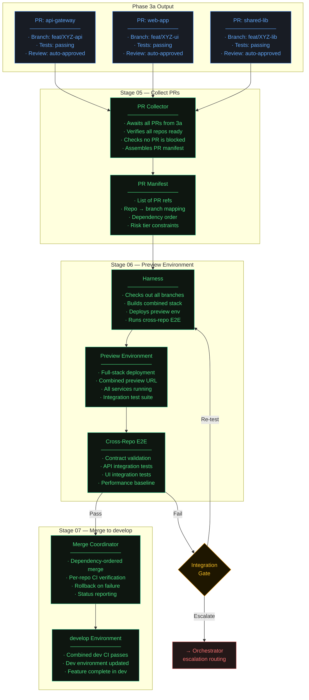
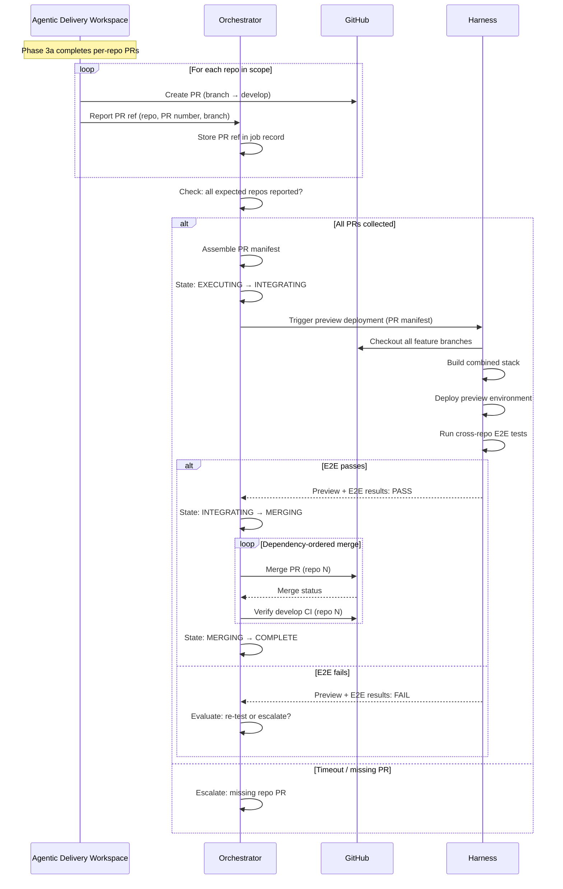
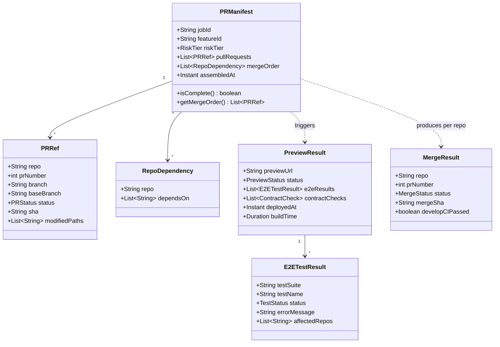
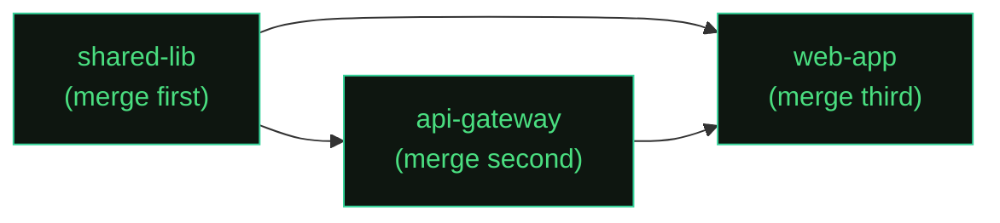

# Phase 3b — Integration & Preview · C4 Drill-Down

**Sub-phase:** Cross-repo PR collection → combined preview → E2E validation → merge to develop
**Actor:** Orchestrator (coordination) + [Harness](https://www.harness.io/) (CI/CD execution)
**Trigger:** All Phase 3a PRs ready (Orchestrator detects via PR refs collection)
**Output:** All PRs merged to `develop`, combined dev environment updated

[← Back to Phase 3 Overview](./README.md) · [← Phase 3a](./phase-3a-agent-execution.md)

---

## Overview

Phase 3b is the integration layer. While 3a produces per-repo PRs independently, 3b assembles them into a coherent whole — verifying that cross-repo changes work together before merging anything.

This is fundamentally an **Orchestrator-driven** phase. The Agentic Delivery Workspace produced the PRs; now the Orchestrator coordinates their integration, preview, and merge.

### Stages

| Stage | Name | Actor | Gate | Output |
|-------|------|-------|------|--------|
| 05 | Collect PRs | Orchestrator | Integration gate | PR manifest (all repos verified ready) |
| 06 | Preview Env | Harness | Integration gate | `preview-dev` — full-stack combined preview |
| 07 | Merge → develop | Orchestrator + CI | End of scope | All PRs merged, `develop` CI green |

### Why Phase 3b Exists

Per-repo PRs can individually pass all tests but fail together. Common cross-repo failure modes:

- **Contract mismatch:** API gateway expects `userId: string`, backend returns `userId: number`
- **Port collision:** Two services claim the same port in the preview environment
- **Dependency version conflict:** Shared library upgraded in one repo but not another
- **Feature flag inconsistency:** Frontend checks `enableNewDashboard`, backend checks `new_dashboard_enabled`

Phase 3b catches these by assembling all PRs into a combined preview and running cross-repo E2E tests.

---

## L3 — Component Diagram

### Integration Pipeline

### PR Collection Strategy

---

## L4 — Code Level

### PR Manifest

The PR manifest is the data structure that bridges Phase 3a and 3b. It captures everything the Harness needs to build a combined preview.

### Merge Ordering

PRs must merge in dependency order. If `web-app` depends on `shared-lib`, the shared library PR must merge first so that `web-app`'s develop CI picks up the new version.

The merge coordinator performs a topological sort on the repo dependency graph to determine order. If a merge fails (develop CI breaks), it stops and escalates rather than continuing with downstream repos.

### Integration Gate Decisions

| Failure Type | Gate Decision | Action |
|-------------|---------------|--------|
| Flaky test (known flaky suite) | Re-test | Retry E2E with same preview |
| Contract mismatch between repos | Escalate | Route to Phase 2 — API spec needs revision |
| Build failure in combined stack | Re-test (once) then Escalate | May be transient; if persistent, needs human investigation |
| Preview deployment timeout | Re-test | Infrastructure issue, retry |
| E2E failure with no safe fix | Escalate | Fundamental integration issue |
| Product ambiguity revealed late | Escalate | Route to Phase 2 — spec refinement needed |
| Merge conflict on develop | Escalate | Another change landed; needs human resolution |

### Risk Tier Effect on Phase 3b

| Aspect | Low Risk | Medium Risk | High Risk |
|--------|----------|-------------|-----------|
| Preview window | Standard (auto-merge after E2E pass) | Extended (24h preview before merge) | Manual merge approval required |
| E2E depth | Standard suite | Standard + security scans | Full suite + penetration test hooks |
| Merge authorization | Automated | Automated with extra reviewer | Architect + Tech Lead sign-off |
| Rollback plan | Automated revert PR | Automated with notification | Manual rollback with incident review |

### Key Design Decisions

**Why does the Orchestrator (not the Workspace) coordinate Phase 3b?**
The Workspace is ephemeral — it exists for the duration of a job. Phase 3b may span multiple hours (preview deployment, E2E suite, human review for high-risk). The Orchestrator is the persistent system that can wait for CI callbacks, handle timeouts, and coordinate merge ordering across repos. The Workspace's job is done once PRs are created.

**Why dependency-ordered merge (not simultaneous)?**
Simultaneous merge of multiple PRs to `develop` creates race conditions in CI. If `shared-lib` and `web-app` merge at the same time, `web-app`'s CI might run against the old `shared-lib` version. Sequential, dependency-ordered merge ensures each repo's CI runs against the correct versions of its dependencies.

**Why preview environment (not just CI tests)?**
CI tests verify functional correctness. Preview environments verify integration — can the services actually talk to each other? Do the ports line up? Does the UI render correctly against the new API responses? For cross-repo features, the combined preview catches classes of bugs that per-repo CI cannot.

**Why is scope bounded at merge to develop?**
Release to production involves different governance: change control boards, production readiness reviews, canary deployments, rollback procedures. These are organizational processes that vary widely between teams. By stopping at `develop`, the agentic delivery model has a clean handoff point and doesn't need to model every organization's release process.
