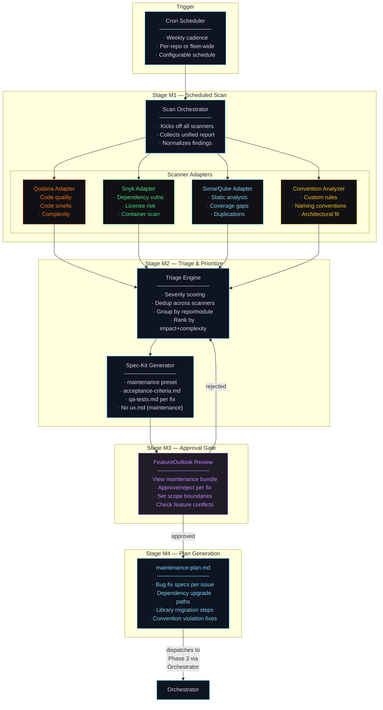
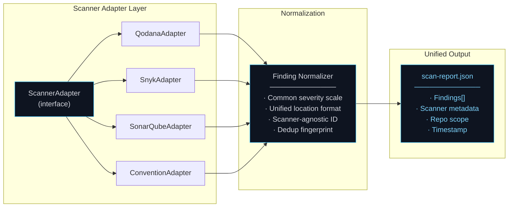
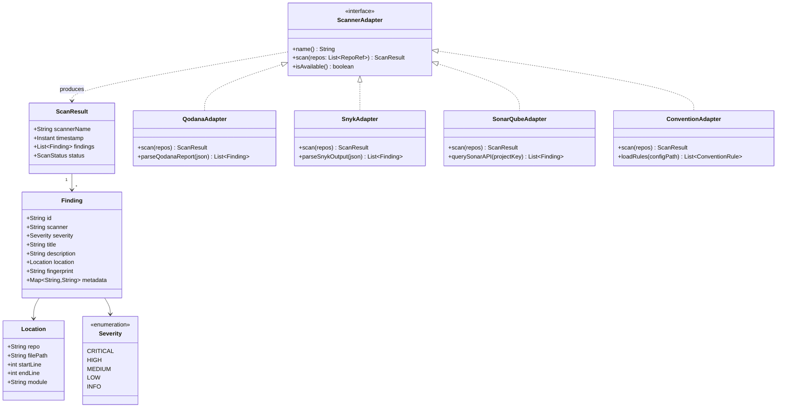
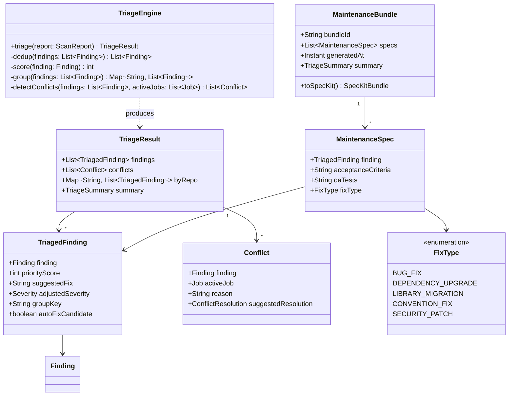
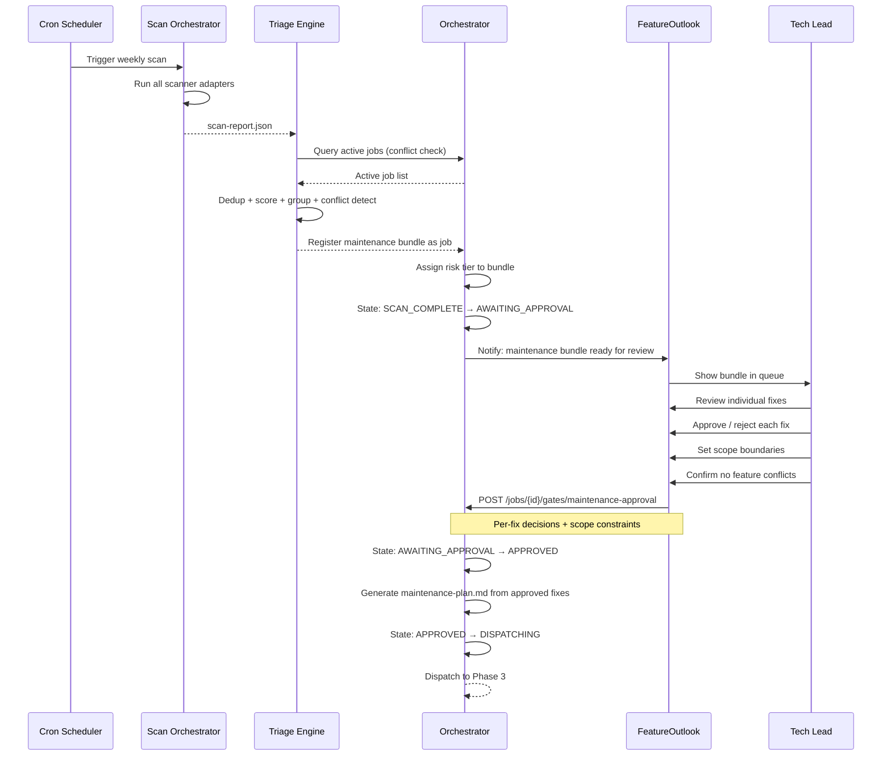

# Phase M — Maintenance · C4 Drill-Down

**Phase:** Agent-driven, HITL-gated
**Owner:** Maintenance Agent (automated) · Tech Lead (approval gate)
**Trigger:** Cron schedule (weekly cadence)
**Output:** Approved `maintenance-plan.md` (transition artifact → dispatched to Phase 3)

[← Back to System Overview](../README.md) · [Maintenance Agent component](../components/agent-maintenance/README.md)

---

## Overview

Phase M runs in parallel with the feature delivery pipeline (Phases 2→3). It is the system's **immune system** — continuously scanning the codebase for code health issues, security vulnerabilities, dependency risks, and convention violations, then packaging approved fixes for autonomous execution.

The key governance constraint: the Maintenance Agent can **discover and propose** freely, but it cannot **execute** without human approval. The HITL gate at Stage M3 ensures that maintenance fixes don't conflict with in-progress feature work and that automated triage aligns with human judgment about priority and scope.

### Phase M Stages

| Stage | Name | Actor | Output |
|-------|------|-------|--------|
| M1 | Scheduled Scan | Agent (cron) | `scan-report.json` |
| M2 | Triage & Prioritize | Agent | spec-kit bundle (maintenance preset) |
| M3 | Maintenance Approval Gate | Human (Tech Lead) | Approved / rejected individual fixes |
| M4 | Plan Generation | Agent | `maintenance-plan.md` (transition artifact) |

### SLA by Severity

| Severity | Response SLA | Routing |
|----------|-------------|---------|
| Critical | 48 hours | Immediate escalation to Tech Lead |
| High | 5 business days | Next available maintenance window |
| Medium | Next sprint | Queued for batch processing |
| Low | Backlog | Tracked, no SLA |

---

## L3 — Component Diagram

### Maintenance Pipeline

### Scanner Integration Architecture

---

## L4 — Code Level

### Scanner Adapter Interface

All scanners implement the same interface. This allows adding new scanners (e.g., Trivy, Semgrep) without changing the orchestration logic.

### Triage Engine

The triage engine deduplicates findings across scanners, groups them by repo/module, and produces a ranked list of actionable fixes.

### Maintenance Approval Flow

### Key Design Decisions

**Why spec-kit maintenance preset (not full artifact set)?**
Maintenance fixes don't need `ux.md` or `architecture.md` — they're scoped changes to existing code. The maintenance preset includes only `acceptance-criteria.md` and `qa-tests.md`, which are sufficient for the agent to know what to fix and how to verify the fix. This reduces the approval burden on Tech Leads.

**Why dedup across scanners?**
Multiple scanners often flag the same issue. Qodana and SonarQube may both flag code complexity; Snyk and the Convention Analyzer may both flag an outdated dependency. Without dedup, the maintenance bundle would contain duplicate work orders, wasting agent execution time and human review time.

**Why conflict detection against active jobs?**
If a feature job is actively modifying `auth-service/src/middleware.ts` and a maintenance scan flags a security issue in the same file, the maintenance fix could create a merge conflict or invalidate the feature work. The triage engine detects these overlaps and flags them as conflicts, letting the Tech Lead decide whether to defer the maintenance fix or coordinate with the feature team.

**Why per-fix approval (not bulk)?**
Bulk approval is faster but riskier. A maintenance bundle might contain 15 findings: 3 critical security patches, 5 medium convention fixes, and 7 low-priority style issues. The Tech Lead should be able to approve the critical patches immediately, defer the convention fixes to the next sprint, and reject the style issues entirely. Per-fix granularity respects this judgment.

### Maintenance → Phase 3 Convergence

The maintenance pipeline's output (`maintenance-plan.md`) is structurally identical to Phase 2's output (`plan.md`) from the Orchestrator's perspective. Both are spec-kit validated artifact bundles that the Orchestrator dispatches to Phase 3 through the same state machine transitions. The only differences:

| Aspect | Feature (Phase 2) | Maintenance (Phase M) |
|--------|-------------------|----------------------|
| Trigger | Human submits curated feature.md | Cron-triggered scan |
| Artifact set | Full (core + conditional + extensions) | Maintenance preset (acceptance-criteria + qa-tests) |
| Approval depth | Full NFR review | Per-fix approval with scope boundaries |
| Risk tier | Full scoring (repo criticality, customer impact, etc.) | Typically Low/Medium unless security-critical |
| Phase 3 execution | Same pipeline | Same pipeline |
