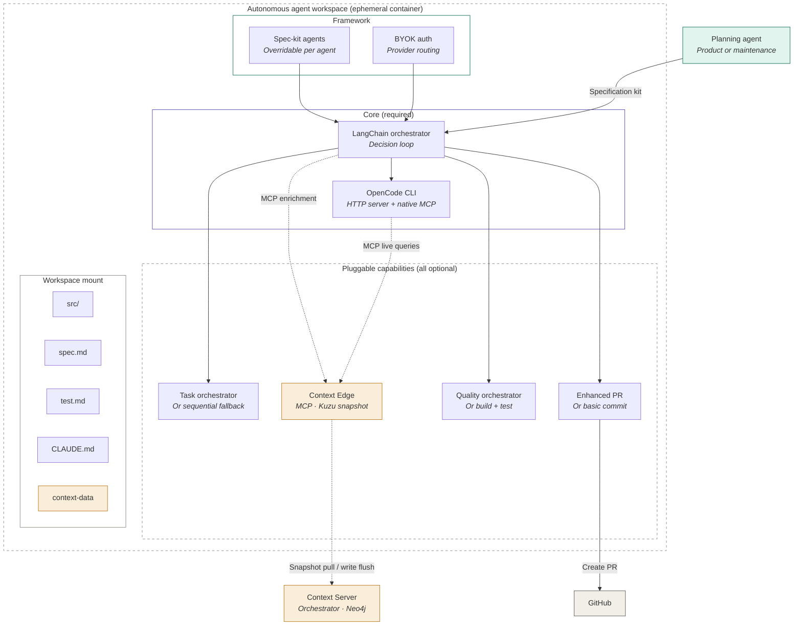
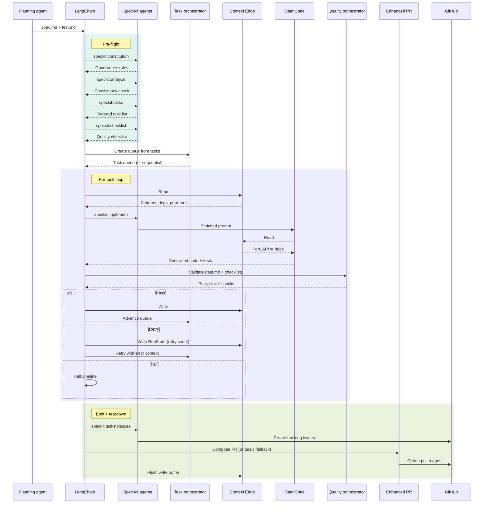

# PRD: Autonomous Agent Workspace

**Author:** Edwin · **Version:** 3.0 · **March 2026**
**Status:** Draft · **Priority:** High

---

## 1. Problem statement

AI-assisted code generation today requires developers to manually orchestrate multiple tools — a code generation model, a test runner, a linter, a PR tool — in a local environment that varies between machines. There is no reproducible, self-contained execution environment that can accept a specification, generate code, validate it, and emit a PR without human intervention.

## 2. Solution overview

The Autonomous Agent Workspace is a Docker-based ephemeral execution environment that accepts a specification kit from a product agent or maintenance agent and runs the full Plan → Generate → Validate → Emit pipeline autonomously.

The architecture has two layers:

- **LangChain orchestrator** — the outer decision loop. Owns task sequencing, retry logic, gate decisions, and agent routing. Calls the Context Edge for enrichment data. Drives OpenCode for code generation.
- **OpenCode CLI** — the inner execution engine. Runs in HTTP server mode with native MCP support. Receives enriched prompts from LangChain, generates code, and can independently call Context Edge MCP tools mid-generation for live queries.

**Task orchestrator**, **enhanced PR and commit creation**, **quality orchestrator**, and **Context Edge** are all pluggable capabilities — the pipeline has built-in fallbacks that work without them, enabling incremental adoption as these tools are developed.

Users bring their own API keys (BYOK) for LLM providers, configuring which models to use for code generation and validation via a provider-agnostic auth system.

Spec-kit agents (`speckit.constitution`, `speckit.analyze`, `speckit.tasks`, `speckit.checklist`, `speckit.implement`, `speckit.taskstoissues`) are integrated into the pipeline lifecycle and individually overridable.

## 3. Goals and non-goals

### Goals

- Fully reproducible execution environment defined by `.devcontainer.json` + Dockerfile
- Autonomous pipeline from `spec.md` input to GitHub PR output
- **BYOK auth** — users configure their own API keys and model preferences for any supported provider
- **Pluggable task orchestrator** — works with or without a task orchestrator; falls back to sequential execution
- **Pluggable enhanced PR and commit creation** — works with or without enhanced PR tooling; falls back to basic `git` commits and GitHub API PR creation
- **Pluggable quality orchestrator** — works with or without a quality orchestrator; falls back to standard build and test commands
- **Pluggable Context Edge** — works with or without graph intelligence; falls back to spec-only prompts
- **Overridable spec-kit agents** — each spec-kit agent invocation individually replaceable via config
- Context Edge active at three runtime nodes via MCP (enrichment, live query, write-back) when available
- Container resume via persistent `RunState` when Context Edge is available
- Retry loop with error-informed re-enrichment
- LangSmith observability (optional, degrades gracefully)
- Support for both Node (React/Next.js) and Java (Spring Boot) targets
- Works with specification kits from any planning agent (product agent, maintenance agent, or future agents)
- Clean LangChain↔OpenCode boundary: LangChain decides, OpenCode executes

### Non-goals

- The DevContainer does not host the Context Server — that is the orchestrator's responsibility
- The DevContainer does not generate specs — that is the planning agents' job
- The DevContainer does not manage fleet-level orchestration — that is external (CI/CD, cron)
- The DevContainer is not a general-purpose development environment — it is a worker
- The DevContainer does not host a UI — it is headless
- IDE integration (VS Code Remote Containers) is a future enhancement, not v1

## 4. User stories

| ID | As a... | I want to... | So that... |
|---|---|---|---|
| W-1 | Developer | Trigger a DevContainer with a `spec.md` | The pipeline runs autonomously and produces a PR |
| W-2 | CI system | Spawn a DevContainer from a GitHub Action | Maintenance specs execute on a schedule |
| W-3 | Developer | Resume a failed container run | I don't lose progress from completed tasks |
| W-4 | Developer | Use my own Anthropic/OpenAI/local model API key | I control costs and model selection |
| W-5 | Developer | Run the worker without a task orchestrator | The pipeline works with sequential task execution |
| W-6 | Developer | Run the worker without enhanced PR tooling | I still get a PR with basic commits |
| W-7 | Developer | Run the worker without the Context Edge | The pipeline works from spec only, no enrichment |
| W-8 | Developer | Run the worker without a quality orchestrator | Validation still runs via standard build and test commands |
| W-9 | Developer | Override speckit.taskstoissues with our Jira integration | Tasks route to our issue tracker instead of GitHub Issues |
| W-9 | Developer | Run the worker without the orchestrator available | The pipeline works with a stale graph snapshot |

## 5. Architecture

### Component overview



### Execution sequence



### 5.1 LangChain ↔ OpenCode boundary

LangChain and OpenCode have distinct, non-overlapping responsibilities:

**LangChain orchestrator decides:**

- Which task to execute next (via task orchestrator or sequential fallback)
- Whether to retry or advance (gate logic after validation)
- What enrichment context to request from Context Edge (Read #1)
- How to construct the prompt from enriched context
- When to emit and teardown
- Agent routing (planning → code gen → validation)

**OpenCode executes:**

- Code generation from the enriched prompt LangChain provides
- Live MCP tool calls mid-generation (Read #2 — OpenCode's own initiative via native MCP support)
- Hook-based pre/post processing configured per task

**Interaction flow:**

```
LangChain orchestrator
  │
  ├── Runs spec-kit pre-flight (constitution, analyze)
  ├── Generates task queue (speckit.tasks → task orchestrator)
  ├── Generates quality checklist (speckit.checklist)
  │
  ├── For each task:
  │   ├── Calls Context Edge MCP → enrichment (Read #1) — if available
  │   ├── Invokes speckit.implement → constructs prompt
  │   ├── Sends prompt to OpenCode HTTP API
  │   │       │
  │   │       └── OpenCode executes autonomously
  │   │           ├── Generates code
  │   │           ├── Calls Context Edge MCP live (Read #2) — own initiative
  │   │           └── Returns result
  │   │
  │   ├── Receives result from OpenCode
  │   ├── Runs validation agent (test.md + checklist)
  │   ├── Gate: pass → write-back + advance, fail → retry
  │   └── Writes to Context Edge MCP (Write #3) — buffered
  │
  ├── speckit.taskstoissues → create tracking issues
  ├── Enhanced PR composition (or basic fallback)
  └── Context Edge write buffer flush
```

**Context awareness — what OpenCode already sees vs what LangChain adds:**

OpenCode operates against the workspace mount (`/workspace/src`) and automatically reads repo-local context files (`CLAUDE.md`, `AGENTS.md`, `.github/copilot-instructions.md`, `.speckit/constitution.md`, existing source code, and the spec files themselves). LangChain's enrichment prompt should not restate what's already in the repo — it should be strictly additive, providing only the cross-repo intelligence that OpenCode cannot access from the local filesystem.

| Context source | OpenCode sees it? | LangChain provides it? |
|---|---|---|
| Repo source code | Yes (workspace mount) | No |
| `CLAUDE.md` / `AGENTS.md` | Yes (auto-read) | No |
| `spec.md` / `test.md` | Yes (workspace mount) | No — but LangChain parses them for task routing |
| `.speckit/constitution.md` | Yes (if in repo) | Only graph-stored rules not in repo |
| Code patterns from other repos | No | Yes (Context Edge Read #1) |
| Dependency edges across repos | No | Yes (Context Edge Read #1) |
| Prior run results | No | Yes (Context Edge Read #1) |
| Port allocations across services | No | Yes (Context Edge Read #2 live) |
| API surface of upstream modules | No | Yes (Context Edge Read #2 live) |

This means the enriched prompt is a thin layer of cross-repo intelligence on top of what OpenCode already knows from the repo itself. When the Context Edge is unavailable, OpenCode still has full access to repo-local context — the pipeline degrades in cross-repo awareness, not in local understanding.

### 5.2 BYOK authentication

The worker uses a provider-agnostic auth system. Users bring their own API keys for whichever LLM providers they have subscriptions to.

**Provider configuration (`agent-workspace.json`):**

```json
{
  "auth": {
    "providers": {
      "anthropic": { "apiKey": "${ANTHROPIC_API_KEY}", "defaultModel": "claude-sonnet-4-20250514" },
      "openai": { "apiKey": "${OPENAI_API_KEY}", "defaultModel": "gpt-4o" },
      "local": { "baseUrl": "http://localhost:11434", "defaultModel": "qwen3-coder" }
    },
    "routing": {
      "codegen": "anthropic",
      "enrichment": "anthropic",
      "validation": "anthropic",
      "diffReview": "anthropic"
    }
  }
}
```

**Supported providers (v1):**

| Provider | Auth mechanism | Use case |
|---|---|---|
| Anthropic | API key (`ANTHROPIC_API_KEY`) | Primary: codegen, enrichment, validation |
| OpenAI | API key (`OPENAI_API_KEY`) | Alternative codegen |
| Local (Ollama) | Base URL, no key | Cost-free for simple tasks |
| OpenRouter | API key (`OPENROUTER_API_KEY`) | Multi-model access via single key |

### 5.3 Pluggable components

Task orchestrator, enhanced PR tooling, and the Context Edge are all pluggable capabilities. The worker defines interfaces for each and ships built-in fallbacks. The pipeline runs end-to-end even when none of these are available — the core loop only requires LangChain, OpenCode, and an LLM provider.

**Plugin detection at startup:**

```python
class PluginRegistry:
    def __init__(self, config: WorkerConfig):
        self.task_orchestrator = self._detect_task_orchestrator()
        self.pr_tooling = self._detect_pr_tooling()
        self.quality = self._detect_quality()
        self.context = self._detect_context(config)
    
    def _detect_task_orchestrator(self) -> TaskQueueProvider:
        # Detects any installed task orchestrator CLI
        if shutil.which("taskmaster"):
            log.info("Task orchestrator detected — dependency-aware queue")
            return TaskOrchestratorAdapter()
        else:
            log.info("Task orchestrator not found — sequential fallback")
            return SequentialQueue()
    
    def _detect_pr_tooling(self) -> PRComposer:
        # Detects any installed enhanced PR tool
        if shutil.which("pritty"):
            log.info("Enhanced PR tooling detected — grouped commits + ticket validation")
            return EnhancedPRAdapter()
        else:
            log.info("Enhanced PR tooling not found — basic PR fallback")
            return BasicPRComposer()
    
    def _detect_quality(self) -> QualityOrchestrator:
        # Detects any installed quality orchestrator
        if shutil.which("verifly"):
            log.info("Quality orchestrator detected — component-reactive testing")
            return QualityOrchestratorAdapter()
        else:
            log.info("Quality orchestrator not found — basic validation fallback")
            return BasicQualityRunner()
    
    def _detect_context(self, config: WorkerConfig) -> ContextProvider:
        edge_port = config.context_edge_port
        data_path = config.context_data_path
        if data_path and self._context_edge_available(edge_port):
            log.info("Context Edge detected — enrichment + live queries + write-back")
            return ContextEdgeAdapter(port=edge_port)
        elif data_path and Path(data_path).exists():
            log.info("Context Edge not running — stale snapshot for resume only")
            return StaleContextProvider(data_path)
        else:
            log.info("No context available — running without enrichment")
            return NullContextProvider()
```

#### Pluggable task orchestrator

**Interface:**

```python
class TaskQueueProvider(ABC):
    @abstractmethod
    def create_queue(self, tasks: list[Task]) -> TaskQueue: ...
    @abstractmethod
    def advance(self, queue: TaskQueue) -> Task | None: ...
    @abstractmethod
    def retry(self, queue: TaskQueue, error: str) -> Task: ...
    @abstractmethod
    def skip_to(self, queue: TaskQueue, index: int) -> None: ...
```

**With task orchestrator:** Dependency-aware topological ordering, subtask expansion, parallel task detection, full RunState management.

**Without task orchestrator (`SequentialQueue`):** Tasks execute in spec.md order, no dependency ordering, basic index tracking for resume, retry loops to same task with error context.

#### Pluggable enhanced PR and commit creation

**Interface:**

```python
class PRComposer(ABC):
    @abstractmethod
    async def compose(self, files: list[ChangedFile], spec: Spec,
                      test_results: list[TestResult]) -> PullRequest: ...
```

**With enhanced PR tooling:** Grouped commits, ticket validation (JIRA/GitHub Issues), CODEOWNERS-based reviewer assignment, structured PR body.

**Without enhanced PR tooling (`BasicPRComposer`):** Single conventional commit, basic PR body, no ticket validation, relies on repo CODEOWNERS.

#### Pluggable quality orchestrator

The quality orchestrator runs validation checks against generated code. When an enhanced quality orchestrator is available, it provides component-reactive testing, intelligent test selection, and dependency-aware validation. Without one, the worker falls back to standard build and test commands.

**Interface:**

```python
class QualityOrchestrator(ABC):
    @abstractmethod
    async def validate(self, files: list[ChangedFile], criteria: ValidationCriteria,
                       model_config: ModelConfig) -> ValidationResult: ...
```

**With quality orchestrator:** Component-reactive test selection (only tests affected components), dependency-aware validation ordering, intelligent mocking of unaffected dependencies, re-scan checks for maintenance specs (scanner finding must disappear), LLM-powered diff review.

**Without quality orchestrator (`BasicQualityRunner`):** Runs `npm run build` / `mvn package`, runs `tsc --noEmit`, runs full test suite (`npm test` / `mvn test`), no component-reactive selection, no diff review.

#### Pluggable Context Edge

The Context Edge provides cross-repo intelligence to the worker via an MCP interface. When available, it is backed by a Kuzu embedded database containing a snapshot of the relevant graph data pulled from the orchestrator's Context Server (the fleet-wide source of truth, backed by Neo4j). When unavailable, the pipeline runs from spec only.

| | Context Server (orchestrator) | Context Edge (worker) |
|---|---|---|
| **Location** | Always running | Inside DevContainer, per-run lifecycle |
| **Backend** | Neo4j | Kuzu embedded (ephemeral) |
| **Data scope** | Full fleet graph | Snapshot scoped to this spec's repos |
| **Writes** | Immediate | Buffered locally, flushed at teardown |
| **MCP tools** | Full set | Identical interface, scoped data |

At provision, the Context Edge pulls a scoped snapshot from the Context Server. At teardown, buffered writes flush back. If the Context Server is unreachable, the worker uses a stale snapshot from the `context-data` volume — enrichment is slightly outdated but the pipeline doesn't break.

**Interface:**

```python
class ContextProvider(ABC):
    @abstractmethod
    async def query(self, tool: str, params: dict) -> dict | None: ...
    @abstractmethod
    async def write(self, tool: str, params: dict) -> bool: ...
    @abstractmethod
    async def read_run_state(self) -> RunState | None: ...
    @abstractmethod
    async def flush(self, target_url: str | None) -> bool: ...
    @abstractmethod
    def is_available(self) -> bool: ...
```

**With Context Edge (`ContextEdgeAdapter`):** Full MCP tool access, snapshot from Context Server, write buffer flush at teardown, RunState dual-write, OpenCode configured with MCP tools.

**With stale data (`StaleContextProvider`):** RunState from local file (resume works), no enrichment queries, writes buffer locally.

**Without any context (`NullContextProvider`):** No enrichment, no live queries, no write-back, no resume. Day-1 experience.

### 5.4 Overridable spec-kit agents

Each spec-kit agent invocation is individually overridable. The default calls the spec-kit CLI; users can replace any agent via config.

**Spec-kit agents used by the worker:**

| Spec-kit agent | Worker phase | Purpose |
|---|---|---|
| `speckit.constitution` | Pre-flight | Load/validate governance rules; seed Context Edge |
| `speckit.analyze` | Pre-flight | Validate consistency between spec, plan, and tasks |
| `speckit.tasks` | Queue creation | Generate dependency-ordered task list; feeds task orchestrator |
| `speckit.checklist` | Validation setup | Produce quality checklist per task; supplements test.md |
| `speckit.implement` | Core loop | Execute each task — drives OpenCode with spec-aware context |
| `speckit.taskstoissues` | Emit | Convert completed/failed tasks into tracking issues |

Agents not used by the worker (`speckit.specify`, `speckit.clarify`, `speckit.plan`) are planning-phase agents that run before the worker.

**Override types:**

| Type | Description | Use case |
|---|---|---|
| `"script"` | Run a custom shell script | Custom task decomposition or Jira integration |
| `"module"` | Load a Python class implementing the interface | SOC 2 compliance checklist, custom issue tracker |
| `"skip"` | Skip agent entirely (returns empty/passthrough) | Skip `speckit.analyze` in CI |
| *(default)* | Invoke spec-kit CLI | Standard behavior |

**Configuration (`agent-workspace.json`):**

```json
{
  "speckit": {
    "overrides": {
      "constitution": null,
      "analyze": { "type": "skip" },
      "tasks": { "type": "module", "module": "custom_agents.decomposer", "class": "JiraDecomposer" },
      "checklist": { "type": "module", "module": "custom_agents.compliance", "class": "SOC2Checklist" },
      "implement": null,
      "taskstoissues": { "type": "script", "path": "./scripts/tasks-to-jira.sh" }
    }
  }
}
```

**Agent registry:**

```python
class SpecKitAgentRegistry:
    def __init__(self, config: SpecKitConfig):
        self.constitution = self._resolve("constitution", config)
        self.analyze = self._resolve("analyze", config)
        self.tasks = self._resolve("tasks", config)
        self.checklist = self._resolve("checklist", config)
        self.implement = self._resolve("implement", config)
        self.tasks_to_issues = self._resolve("taskstoissues", config)
    
    def _resolve(self, agent_name: str, config):
        override = config.overrides.get(agent_name)
        if override and override.get("type") == "script":
            return ScriptAgent(agent_name, override["path"])
        elif override and override.get("type") == "module":
            return self._load_module(override["module"], override["class"])
        elif override and override.get("type") == "skip":
            return NoOpAgent(agent_name)
        else:
            return SpecKitCLIAgent(agent_name)
```

### 5.5 Container image layers

```dockerfile
FROM ubuntu:24.04

# Runtime layer
RUN install node 22, python 3.12, java 21 (Corretto)
RUN install pnpm, maven

# Core tool layer (always present — minimum viable pipeline)
RUN pip install opencode-cli langchain langsmith
RUN pip install specify-cli  # spec-kit agent framework

# Pluggable tool layer (all optional — detected at runtime)
# RUN npm install -g <task-orchestrator-package> 2>/dev/null || true
# RUN npm install -g <enhanced-pr-package> 2>/dev/null || true
RUN pip install kuzu fastapi uvicorn 2>/dev/null || true  # Context Edge backend

# Worker source
COPY src/ /opt/agent/src/
COPY context-edge/ /opt/agent/context-edge/
COPY scripts/ /opt/agent/scripts/

ENTRYPOINT ["/opt/agent/scripts/entrypoint.sh"]
```

### 5.6 Full directory structure

```
agent-workspace/
├── .devcontainer/
│   ├── devcontainer.json
│   └── Dockerfile
├── src/                                      # Worker source (main process)
│   ├── main.py                               # Entrypoint — LangChain task loop
│   ├── auth/
│   │   ├── provider.py                       # BYOK auth resolution
│   │   ├── config.py
│   │   └── models.py
│   ├── speckit/
│   │   ├── interfaces.py                     # ABCs per agent (overridable)
│   │   ├── registry.py                       # SpecKitAgentRegistry
│   │   ├── cli_agent.py                      # Default: spec-kit CLI
│   │   ├── script_agent.py                   # Override: custom script
│   │   ├── noop_agent.py                     # Override: skip
│   │   └── types.py
│   ├── plugins/
│   │   ├── registry.py                       # Plugin detection
│   │   ├── task_orchestrator/
│   │   │   ├── interface.py
│   │   │   ├── adapter.py
│   │   │   └── sequential.py
│   │   ├── pr_tooling/
│   │   │   ├── interface.py
│   │   │   ├── adapter.py
│   │   │   └── basic.py
│   │   ├── quality/
│   │   │   ├── interface.py                  # QualityOrchestrator ABC
│   │   │   ├── adapter.py                    # Quality orchestrator adapter
│   │   │   └── basic.py                      # Basic validation fallback
│   │   └── context/
│   │       ├── interface.py
│   │       ├── edge_adapter.py
│   │       ├── stale.py
│   │       └── null.py
│   ├── chains/
│   │   ├── planning.py
│   │   ├── codegen.py
│   │   └── validation.py
│   ├── agents/
│   │   ├── planning_agent.py
│   │   ├── codegen_agent.py
│   │   └── validation_agent.py
│   ├── tools/
│   │   ├── opencode.py
│   │   └── build.py
│   └── config/
│       └── prompts/
├── context-edge/                             # Context Edge (separate process)
│   ├── server.py
│   ├── sync/
│   ├── backend/
│   ├── tools/
│   ├── buffer/
│   ├── schema/
│   └── seed.py
├── scripts/
│   ├── entrypoint.sh
│   ├── provision.sh
│   └── teardown.sh
├── docker-compose.yml
├── Dockerfile
└── README.md
```

### 5.7 Runtime lifecycle

#### Phase 1: Provision

```bash
#!/bin/bash
required_vars=(GITHUB_TOKEN SPEC_PATH)
for var in "${required_vars[@]}"; do
  [[ -z "${!var}" ]] && echo "ERROR: $var not set" && exit 1
done

if [[ -z "$ANTHROPIC_API_KEY" && -z "$OPENAI_API_KEY" && -z "$OPENROUTER_API_KEY" ]]; then
  echo "ERROR: No LLM provider configured." && exit 1
fi

echo "Detecting plugins..."
command -v taskmaster &>/dev/null && echo "  ✓ Task orchestrator" || echo "  ○ Task orchestrator (sequential fallback)"
command -v pritty &>/dev/null && echo "  ✓ Enhanced PR tooling" || echo "  ○ Enhanced PR tooling (basic fallback)"
command -v verifly &>/dev/null && echo "  ✓ Quality orchestrator" || echo "  ○ Quality orchestrator (basic validation fallback)"
python -c "import kuzu" 2>/dev/null && KUZU_AVAILABLE=true || KUZU_AVAILABLE=false

if [[ "$KUZU_AVAILABLE" == "true" && -n "$CONTEXT_DATA_PATH" ]]; then
  echo "  ✓ Context Edge"
  [[ -n "$CONTEXT_SERVER_URL" ]] && python /opt/agent/context-edge/sync/pull.py \
    --server "$CONTEXT_SERVER_URL" --db "$CONTEXT_DATA_PATH" --spec "$SPEC_PATH" \
    || echo "WARN: Context Server unreachable"
  [[ ! -f "$CONTEXT_DATA_PATH/.initialized" ]] && \
    python /opt/agent/context-edge/seed.py --db "$CONTEXT_DATA_PATH" --repo /workspace/src && \
    touch "$CONTEXT_DATA_PATH/.initialized"
  python /opt/agent/context-edge/server.py --db "$CONTEXT_DATA_PATH" --port "${CONTEXT_EDGE_PORT:-8585}" &
  wait_for_http localhost:${CONTEXT_EDGE_PORT:-8585} 30
else
  echo "  ○ Context Edge (running without enrichment)"
fi

python /opt/agent/src/tools/generate_mcp_config.py
opencode serve --port 8484 --mcp-config /opt/agent/mcp-config.json &
wait_for_http localhost:8484 30
echo "Provision complete"
```

#### Phase 2: Execute

```python
# src/main.py
class AgentOrchestrator:
    def __init__(self, config):
        self.auth = AuthProvider(config.auth)
        self.plugins = PluginRegistry(config)
        self.speckit = SpecKitAgentRegistry(config.speckit)
        self.queue_provider = self.plugins.task_orchestrator
        self.pr_composer = self.plugins.pr_tooling
        self.context = self.plugins.context
        self.opencode = OpenCodeClient(config.opencode_url)
        
    async def run(self, spec_path, test_path):
        # Pre-flight
        constitution = await self.speckit.constitution.run(spec_path)
        if self.context.is_available():
            await self.context.write("context_write_constitution", constitution.to_dict())
        analysis = await self.speckit.analyze.run(spec_path)
        if analysis.has_blocking_issues:
            raise SpecInconsistencyError(analysis.blocking_issues)
        
        # Queue creation
        tasks = await self.speckit.tasks.run(spec_path)
        checklist = await self.speckit.checklist.run(spec_path)
        tests = parse_tests(test_path)
        queue = self.queue_provider.create_queue(tasks)
        
        # Resume
        run_state = await self.context.read_run_state()
        if run_state and run_state.get("task_index", 0) > 0:
            self.queue_provider.skip_to(queue, run_state["task_index"])
        
        # Core loop
        while True:
            task = self.queue_provider.advance(queue)
            if task is None: break
            result = await self.execute_task(task, tests, checklist)
            if result.passed:
                await self.context.write("context_write_task", task.to_dict())
                await self.context.write("context_write_run_state",
                    {"task_index": queue.current_index + 1, "retry_count": 0})
            elif queue.retry_count < self.config.max_retries:
                await self.context.write("context_write_run_state",
                    {"task_index": queue.current_index, "retry_count": queue.retry_count + 1})
                self.queue_provider.retry(queue, error=result.error)
                continue
            else:
                raise PipelineFailure(task, result.error)
        
        await self.emit(PipelineResult(queue))
    
    async def execute_task(self, task, tests, checklist):
        if self.context.is_available():
            enriched = await self.codegen_agent.enrich_context(task)
            prompt = self.codegen_agent.build_prompt(enriched)
        else:
            prompt = self.codegen_agent.build_prompt_from_spec(task)
        
        gen_result = await self.speckit.implement.run(
            task=task, enriched_prompt=prompt,
            opencode=self.opencode, model=self.auth.get_model_for("codegen"))
        
        combined = tests.criteria_for(task).merge(checklist.for_task(task))
        val_result = await self.validation_agent.validate(
            gen_result, combined, self.auth.get_model_for("validation"))
        
        return TaskResult(passed=val_result.passed, error=val_result.error,
                         files=gen_result.files, checks=val_result.checks)
```

#### Phase 3: Emit + teardown

```python
async def emit(self, result):
    issues = await self.speckit.tasks_to_issues.run(result.completed_tasks, result.task_results)
    for issue in issues:
        await self.github.create_issue(issue)
    
    pr = await self.pr_composer.compose(
        files=result.all_files, spec=self.spec, test_results=result.all_test_results)
    pr.linked_issues = [i.url for i in issues]
    pr_url = await self.github.create_pr(pr)
    
    if self.langsmith:
        self.langsmith.flush(status="success", pr_url=pr_url)
    
    if os.environ.get("CONTEXT_SERVER_URL"):
        await self.context.flush(os.environ["CONTEXT_SERVER_URL"])
```

### 5.8 Graph schema (Context Edge, Kuzu)

```cypher
CREATE NODE TABLE Module(name STRING, repo STRING, stack STRING, PRIMARY KEY(name));
CREATE NODE TABLE Pattern(id STRING, content STRING, confidence FLOAT, PRIMARY KEY(id));
CREATE NODE TABLE Task(id STRING, type STRING, title STRING, status STRING, PRIMARY KEY(id));
CREATE NODE TABLE Run(id STRING, timestamp TIMESTAMP, status STRING, duration INT64, PRIMARY KEY(id));
CREATE NODE TABLE Constitution(rule STRING, priority INT64, PRIMARY KEY(rule));
CREATE NODE TABLE RunState(id STRING, task_index INT64, retry_count INT64, PRIMARY KEY(id));
CREATE NODE TABLE Dependency(name STRING, version STRING, PRIMARY KEY(name));

CREATE REL TABLE DEPENDS_ON(FROM Module, TO Module);
CREATE REL TABLE APPLIES_TO(FROM Pattern, TO Module);
CREATE REL TABLE EXECUTED(FROM Run, TO Task);
CREATE REL TABLE USES(FROM Module, TO Dependency);
CREATE REL TABLE DISCOVERED(FROM Run, TO Pattern);
```

### 5.9 Trigger mechanisms

**Local CLI:**
```bash
docker run -v $(pwd):/workspace/src \
  -v context-data:/workspace/context-data \
  -e ANTHROPIC_API_KEY=$ANTHROPIC_API_KEY \
  -e GITHUB_TOKEN=$GITHUB_TOKEN \
  ghcr.io/agent/workspace:latest \
  --spec ./specs/current/spec.md --test ./specs/current/test.md
```

**GitHub Actions:**
```yaml
name: Autonomous Agent Workspace
on:
  workflow_dispatch:
    inputs:
      spec_path: { description: "Path to spec.md", required: true }
  schedule:
    - cron: "0 2 * * 1"
jobs:
  execute:
    runs-on: ubuntu-latest
    steps:
      - uses: actions/checkout@v4
      - name: Run maintenance sweep
        if: github.event_name == 'schedule'
        run: npx maintenance-agent sweep --output ./specs/maintenance/
      - name: Run Autonomous Agent Workspace
        uses: docker://ghcr.io/agent/workspace:latest
        with:
          args: --spec ./specs/maintenance/spec.md --test ./specs/maintenance/test.md
        env:
          ANTHROPIC_API_KEY: ${{ secrets.ANTHROPIC_API_KEY }}
          GITHUB_TOKEN: ${{ secrets.GITHUB_TOKEN }}
          CONTEXT_SERVER_URL: ${{ secrets.CONTEXT_SERVER_URL }}
```

## 6. Implementation phases

### Phase 1: Container foundation + BYOK
**Effort:** Low — scaffolding and integration wiring

Dockerfile, `devcontainer.json`, BYOK auth, entrypoint lifecycle, spec parser, OpenCode HTTP integration, single-task execution, basic PR fallback, basic quality validation fallback.

**Deliverable:** Minimum viable pipeline — works without task orchestrator, enhanced PR tooling, quality orchestrator, and Context Edge. This is the baseline that everything else builds on.

### Phase 2: LangChain orchestrator + spec-kit agents
**Effort:** Medium — core pipeline logic and agent framework

LangChain agent routing. Spec-kit agent integration with `SpecKitAgentRegistry` and override support. Sequential queue fallback. Retry loop with error-informed re-enrichment. Plugin detection framework.

**Deliverable:** Multi-task pipeline with spec-kit pre-flight, quality checklists, and overridable agents.

### Phase 3: Context Edge integration
**Effort:** High — MCP server, graph schema, sync protocol

Context Edge MCP server (Kuzu). Graph schema and seeding. Snapshot pull/flush protocol with Context Server. Three-touchpoint integration (Read #1, Read #2, Write #3). Resume via RunState. NullContextProvider and StaleContextProvider fallbacks.

**Deliverable:** Full Context Edge with graceful degradation when unavailable.

### Phase 4: Plugin adapters + emit
**Effort:** Medium — adapter interfaces and integration testing

Task orchestrator adapter. Enhanced PR adapter. Quality orchestrator adapter. `speckit.taskstoissues` integration. LangSmith trace. Write buffer flush to Context Server.

**Deliverable:** Full pipeline with all pluggable components wired and tested.

### Phase 5: Production hardening
**Effort:** Medium — operational readiness

GitHub Actions workflow. Timeout management. Graceful shutdown with partial flush. Docker image publish. Integration test suite. Operational runbook.

## 7. Configuration

### Environment variables

| Variable | Required | Description |
|---|---|---|
| `ANTHROPIC_API_KEY` | One LLM key required | Anthropic API key |
| `OPENAI_API_KEY` | One LLM key required | OpenAI API key |
| `OPENROUTER_API_KEY` | One LLM key required | OpenRouter API key |
| `GITHUB_TOKEN` | Yes | GitHub PAT |
| `CONTEXT_SERVER_URL` | No | Context Server for snapshot + flush |
| `CONTEXT_DATA_PATH` | No | Context Edge data directory |
| `LANGSMITH_API_KEY` | No | LangSmith trace/eval |
| `SPEC_PATH` | Yes | Path to spec.md |
| `TEST_PATH` | Yes | Path to test.md |
| `MAX_RETRIES` | No | Max retries per task (default: 3) |

### Worker config file (`agent-workspace.json`)

```json
{
  "auth": {
    "providers": {
      "anthropic": { "apiKey": "${ANTHROPIC_API_KEY}", "defaultModel": "claude-sonnet-4-20250514" },
      "openai": { "apiKey": "${OPENAI_API_KEY}", "defaultModel": "gpt-4o" },
      "local": { "baseUrl": "http://localhost:11434", "defaultModel": "qwen3-coder" }
    },
    "routing": { "codegen": "anthropic", "enrichment": "anthropic", "validation": "anthropic" }
  },
  "runtime": { "maxRetries": 3, "taskTimeout": 300, "pipelineTimeout": 3600 },
  "plugins": { "taskOrchestrator": "auto", "enhancedPR": "auto", "qualityOrchestrator": "auto", "contextEdge": "auto" },
  "speckit": {
    "overrides": {
      "constitution": null, "analyze": null, "tasks": null,
      "checklist": null, "implement": null, "taskstoissues": null
    }
  },
  "emit": { "createPR": true, "prDraft": false, "langsmith": true },
  "validation": { "requireBuild": true, "requireTypeCheck": true, "requireTests": true, "requireDiffReview": true }
}
```

## 8. Success metrics

| Metric | Target |
|---|---|
| Provision time (cold) | < 60s |
| Provision time (warm) | < 15s |
| Single task execution | < 5 min |
| Full spec (10 tasks) | < 45 min |
| Success rate (first attempt) | > 60% |
| Success rate (with retries) | > 85% |
| Resume accuracy | 100% |
| Fallback mode (all plugins absent) fully functional | 100% |
| PR quality (approval without edits) | > 50% |

## 9. Risks and mitigations

| Risk | Mitigation |
|---|---|
| No LLM key configured | Validate at provision; clear error |
| Context Server unreachable | Stale snapshot; warn |
| Write buffer flush fails | Persist on volume; retry next run |
| OpenCode instability | Health check + restart; timeout |
| Kuzu corruption | WAL recovery; RunState dual-write |
| Image too large | Multi-stage build |
| Spec-kit override fails | Fall back to default CLI agent |

## 10. Open questions

1. Should Context Edge support GPU passthrough for local models?
2. Incremental or full snapshot pull?
3. Git operations — direct commit or branch?
4. Dry-run mode?
5. Image size budget (~3-5GB for multi-runtime)?
6. Per-task model overrides in BYOK?
7. Plugin detection — once at startup or before each use?
8. `agent-workspace init` scaffolding CLI?
9. Async module loading for remote spec-kit overrides?
